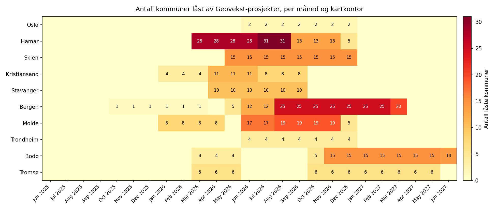

# Kvalitetsheving av FKB-TraktorvegSti før implementering i NVDB

**Forfatter:** Lotte Picard

**Studiepoeng:**

**Veileder:**

**Antall sider:**

**Antall ord:**

Molde, innleveringsdato

---

## Obligatorisk egenerklæring

Den enkelte student er selv ansvarlig for å sette seg inn i hva som er lovlige hjelpemidler, retningslinjer for bruk av disse og regler om kildebruk. Erklæringen skal bevisstgjøre studentene på deres ansvar og hvilke konsekvenser fusk kan medføre. Manglende erklæring fritar ikke studentene fra sitt ansvar.

### Personvern

Har oppgaven vært vurdert av NSD? Nei

Jeg erklærer at oppgaven ikke omfattes av Personopplysningsloven.

### Helseforskningsloven

Har oppgaven vært til behandling hos REK? Nei

### Publiseringsavtale

Forfatter(ne) har opphavsrett til oppgaven. Det betyr blant annet enerett til å gjøre verket tilgjengelig for allmennheten (Åndsverkloven. §2). Alle oppgaver som fyller kriteriene vil bli registrert og publisert i Brage HiM med forfatter(ne)s godkjennelse.

Jeg gir herved Høgskolen i Molde en vederlagsfri rett til å gjøre oppgaven tilgjengelig for elektronisk publisering: ja/nei

Er oppgaven båndlagt (konfidensiell)? ja/nei

---

## Sammendrag


---

## Abstract


---

## Innhold

- [1.0 Innledning](#10-innledning)
  - [1.1 Problemstilling](#11-problemstilling)
  - [1.2 Delproblemer](#12-delproblemer)
  - [1.3 Avgrensinger](#13-avgrensinger)
  - [1.4 Antagelser](#14-antagelser)
- [2.0 Litteratur](#20-litteratur)
- [3.0 Teori](#30-teori)
- [4.0 Casebeskrivelse](#40-casebeskrivelse)
- [5.0 Metode og data](#50-metode-og-data)
  - [5.1 Metode](#51-metode)
  - [5.2 Data](#52-data)
- [6.0 Modellering](#60-modellering)
- [7.0 Analyse](#70-analyse)
- [8.0 Resultat](#80-resultat)
- [9.0 Diskusjon](#90-diskusjon)
- [10.0 Konklusjon](#100-konklusjon)
- [11.0 Bibliografi](#110-bibliografi)
- [12.0 Vedlegg](#120-vedlegg)

---

# 1.0 Innledning

Statens Kartverk forvalter Felles Kartdatabase (FKB), et nasjonalt geodatagrunnlag som blant annet inkluderer datasettet FKB-TraktorvegSti. Datasettet inneholder traktorveger, stier og stitrapp i hele Norge med senterlinjegeometri og er noen av de mest detaljerte dataene Norge har om denne typen småveger og stier. For at traktorveger og stier skal inngå sammen med øvrige veger i et komplett samferdselsnettverk for kjørende, gående og syklende, må FKB-TraktorvegSti kvalitetsheves og deretter overføres til Nasjonal vegdatabank (NVDB), som forvaltes av Statens vegvesen.

Kartverkets ti fylkeskartkontor utfører kvalitetshevingen kommunevis: hvert kontor har ansvar for kommunene i sitt fylke, og hver kommune behandles som en udelelig enhet med kontroll av topologi, stedfesting, fjerning av ikke-gjenfinnbare objekter og tilpasning av attributter til NVDB-formatet. Kapasiteten varierer fra 22 til 52 ukesverk per år mellom kontorene, og arbeidsmengden per kommune varierer med en faktor på over 350 mellom de minste og største kommunene. Etter kvalitetsheving klarmeldes dataene videre til samferdselsavdelingen i Kartverket, som benytter en FME-automatisert prosess der 80–90 % av lenkene legges inn maskinelt og resterende 10–20 % må håndteres manuelt av en dedikert bemanning på 0,5 årsverk.

Per april 2026 er 62 av 357 kommuner ferdig kvalitetshevet, 48 er påbegynt og 247 er ikke startet. Ingen kommuner er ennå overført til NVDB. Samtidig pågår ordinære Geovekst-kartleggingsprosjekter som låser 152 kommuner i deler av perioden 2026–2027 og hindrer TraktorvegSti-arbeid mens kartleggingen pågår. Sammenstillingen — heterogene ressurser, heterogene jobber, eksterne tidsvinduer og en nedstrøms flaskehals — gjør dette til et klassisk ressursallokerings- og produksjonsplanleggingsproblem der riktig fordeling og rekkefølge har vesentlig betydning for total prosjektvarighet.

Denne oppgaven utvikler et planleggingsgrunnlag for kvalitetshevingen og bruker en hybrid analysemodell som kombinerer en regelbasert heuristikk, en MIP-formulering og Monte Carlo-simulering. Målet er å gi Kartverket et tallfestet beslutningsgrunnlag for ressursallokering, sekvensering og forventet totalvarighet under usikkerhet, samt å peke ut hvor i produksjonskjeden en eventuell innsats vil ha størst effekt.

Rapporten er strukturert som følger: kapittel 2 oppsummerer relevant litteratur og kapittel 3 utdyper det teoretiske grunnlaget. Kapittel 4 beskriver casen og kapittel 5 dokumenterer metode og data. Kapittel 6 utvikler modellene, mens kapittel 7 og 8 presenterer analyse og resultater. Kapittel 9 drøfter funnene og deres begrensninger, og kapittel 10 konkluderer.

## 1.1 Problemstilling

Hovedproblemstillingen for prosjektet er:

> *Hvordan bør kvalitetshevingen av FKB-TraktorvegSti planlegges og fordeles mellom Kartverkets ti fylkeskartkontor slik at hele datasettet er kvalitetshevet og overført til NVDB med kortest mulig total varighet, gitt heterogen kontorkapasitet, varierende arbeidsmengde per kommune, eksterne Geovekst-låseperioder og en nedstrøms NVDB-overføring med begrenset manuell bemanning?*

Problemstillingen er operasjonell. Den ber ikke bare om en beskrivelse av arbeidet, men om et tallfestet plangrunnlag som Kartverket kan bruke som beslutningsstøtte for prioritering, kapasitetsdisponering og forventningsstyring overfor egne avdelinger og samarbeidspartnere.

## 1.2 Delproblemer

Hovedproblemstillingen brytes ned i fire delproblemer som strukturerer analysen:

1. **Fordeling og sekvensering.** Hvordan bør de 295 gjenstående kommunene fordeles og sekvenseres mellom kartkontorene for å minimere total prosjektvarighet, gitt dagens geografiske tildeling som baseline og full omfordelingsfrihet som alternativ?

2. **Robusthet mot usikkerhet.** Hvor robust er en gitt plan mot usikkerhet i sentrale parametre — særlig FME-automasjonsgrad i NVDB-overføringen, manuell produksjonstakt og tidsbruk per kommune?

3. **Flaskehalsidentifisering.** Bestemmes total varighet av kartkontor-fasen, NVDB-overføringen, eller en kombinasjon — og hvordan endrer dette seg under ulike scenarioer for FME-automasjon og kapasitetsforstyrrelser?

4. **Effekt av tiltak.** Hvilke tiltak gir størst effekt på total varighet — balansering mellom kartkontorene, økt manuell NVDB-bemanning eller videre FME-utvikling?

## 1.3 Avgrensinger

Følgende er bevisst avgrenset bort fra prosjektet:

- **Selve NVDB-innleggingen** ligger formelt utenfor fylkeskartkontorenes ansvarsområde og dermed utenfor prosjektets primære omfang. NVDB-overføringen er likevel modellert som nedstrøms ressurs i analysen, ettersom den har vesentlig effekt på når kvalitetshevet data faktisk er tilgjengelig i NVDB. Resultatene fra NVDB-modelleringen er ment som beslutningsgrunnlag, ikke som detaljplan for samferdselsavdelingens egne aktiviteter.

- **Individuell effektivitet** mellom saksbehandlere innen samme kontor modelleres ikke. Kapasitet aggregeres på kontor- og avdelingsnivå.

- **Endringer i Geovekst-prosjekter underveis.** Låseperiodene behandles som faste i analysen. Vesentlige endringer som måtte komme i 2026 eller 2027 vil kreve en ny kjøring av modellen med oppdaterte data.

- **Selve produksjonsløypen for kvalitetsheving.** Hvilke trinn som inngår i kvalitetshevingsarbeidet, og hvordan disse utføres, antas gitt og uendret. Prosjektet adresserer planlegging av arbeidet, ikke utforming av selve arbeidsprosessen.

- **Kostnadsanalyse i kroner.** Prosjektet måler varighet og ressursbruk i tid (timer, ukesverk, år), ikke i økonomi. Forretningscaset er begrunnet i effektivisering av tidsbruk, ikke i direkte økonomisk gevinstmåling.

## 1.4 Antagelser

Modellen bygger på følgende sentrale antagelser, som er nærmere dokumentert i kapittel 5 og 6:

- **Kommunevis bearbeiding.** Hver kommune behandles som en udelelig enhet og må ferdigstilles før den klarmeldes til NVDB-overføring. Dette samsvarer med Kartverkets faktiske arbeidsmodell.

- **Konstant årlig kapasitet.** `Kapasitet_Ukesverk` for hvert kartkontor representerer nominell brutto kapasitet for TraktorvegSti-prosjektet i 2026 og antas tilsvarende for senere år. Tallet er gitt i ukesverk uten ferieuttak (én ukesverk = 37,5 timer); de effektive 245 produktive arbeidsdagene per år modelleres separat via skaleringsfaktoren 245/260 (se 5.1.2). Sykefravær og konkurrerende oppgaver antas allerede trukket fra i kontorenes oppgitte tall.

- **245 effektive arbeidsdager per år (kartkontor).** Simuleringen kjører 260 mandag-fredag-dager, men kontorene har bare ca. 245 faktiske produktive dager fordi personalet tar ferie spredt utover året (sommervikarer bidrar med produksjon i sommerukene, men kompenserer ikke fullt ut). Daglig og månedlig kapasitet skaleres derfor med faktoren 245/260 ≈ 0,9423. Ett ukesverk tilsvarer 37,5 timer. NVDB-overføringen beholder sin egen kalenderkonvensjon (se 5.1.2).

- **Tidsbruk-formel som punktestimat.** Beregnet tidsbruk per kommune følger formelen `Ber_Tidbruk_Min = Km_Kurve × 0,9035 + ArealLand_Km² × 0,6510` med koeffisienter avledet fra 58 historiske kartbladmålinger. Empirisk spredning i tidsbruk per km (std 0,55 min/km) inngår som stokastisk kilde i Monte Carlo-analysen.

- **NVDB-overføring som ren flaskehals nedstrøms kartkontor-arbeidet.** FME-prosessen antas uendelig rask, slik at manuell etterbehandling alene bestemmer NVDB-throughput. Bemanning på 0,5 årsverk og manuell takt på 300 lenker per person per dag holdes konstant, mens FME-automasjonsgrad varieres scenariomessig (85 %, 90 %, 96 %).

- **Konstant Geovekst-låseperiode.** Låste kommuner blir tilgjengelige umiddelbart etter låseperiodens slutt og forblir tilgjengelige i resten av planhorisonten.


---

# 2.0 Litteratur

Problemstillingen i denne oppgaven kombinerer flere etablerte fagområder: ressursallokering og scheduling med tidsvinduer, hybride løsningsmetoder som kombinerer heuristikk og eksakt optimering, samt usikkerhetsanalyse basert på Monte Carlo-simulering og bootstrap. Dette kapittelet presenterer sentrale referanser som danner det metodiske grunnlaget for analysen.

## 2.1 Scheduling og ressursallokering med tidsvinduer

Pinedo (2016) er et standardverk innen scheduling-teori og dekker både klassiske formuleringer – parallelle maskiner, release- og due-datoer – og utvidelser som tidsvinduer og ressursbegrensninger. Verket gir det teoretiske rammeverket for å formulere TraktorvegSti-problemet som et ressursallokerings- og sekvenseringsproblem der de 10 kartkontorene tilsvarer parallelle ressurser med varierende kapasitet.

Hartmann og Briskorn (2010) gir en oversiktsartikkel over det ressursbegrensede prosjektplanleggingsproblemet (Resource-Constrained Project Scheduling Problem, RCPSP) og dets utvidelser. Artikkelen etablerer en klassifikasjon som er direkte overførbar til Kartverkets problemstilling: kommuner som aktiviteter, kartkontor som ressurser, Geovekst-låsninger som tidsvinduer, og NVDB-overføringen som en nedstrøms kapasitetsbegrensning.

## 2.2 Hybride løsningsmetoder

Puchinger og Raidl (2005) presenterer en taksonomi over kombinasjoner av metaheuristikker og eksakte algoritmer i kombinatorisk optimering. Forfatterne beskriver ulike måter heuristiske og eksakte metoder kan utfylle hverandre, for eksempel ved at en heuristikk genererer en baseline-løsning som videre forbedres av en eksakt metode. Denne tilnærmingen ligger til grunn for metodevalget i oppgaven, der en regelbasert heuristikk gir en baseline som sammenlignes med en MIP-modell med full omfordelingsfrihet.

## 2.3 Monte Carlo-simulering og usikkerhetsanalyse

Vose (2008) er et bredt brukt standardverk for kvantitativ risikoanalyse og dekker Monte Carlo-metoden anvendt i planleggingskontekst. Boken omhandler valg av sannsynlighetsfordelinger, sampling-strategier, hensiktsmessig antall iterasjoner, samt tolkning av persentiler og konfidensintervall – alle aspekter som er relevante for usikkerhetsanalysen i denne oppgaven.

## 2.4 Bootstrap og empirisk resampling

Efron og Tibshirani (1993) presenterer bootstrap-metoden som en statistisk teknikk for å estimere usikkerhet basert på empiriske fordelinger. Verket begrunner resampling med tilbakelegging som en gyldig metode når underliggende sannsynlighetsfordeling er ukjent. I denne oppgaven anvendes prinsippet ved å trekke verdier for tidsbruk per kilometer TVS-lenke fra en empirisk fordeling basert på 58 historiske kartbladmålinger, heller enn å forutsette en parametrisk fordelingsform.

---

# 3.0 Teori


---

# 4.0 Casebeskrivelse

## 4.1 FKB-TraktorvegSti og kvalitetsheving

FKB-TraktorvegSti (TVS) er et nasjonalt datasett som inneholder traktorveger og stier i hele Norge. Datasettet forvaltes av Statens Kartverk og er en del av Felles Kartdatabase (FKB). Etter kvalitetsheving skal datasettet implementeres i NVDB (Nasjonal vegdatabank), slik at traktorveger og stier inngår sammen med øvrige veger i et nasjonalt vegnettverk for kjørende, gående og syklende.

Kvalitetshevingen innebærer manuell redigering av hver enkelt kommune: kontroll av topologi, stedfesting, fjerning av ikke-gjenfinnbare objekter og tilpasning av attributter slik at dataene møter NVDB-kravene. Arbeidet utføres av fylkeskartkontorene.

## 4.2 Produksjonskjeden

Produksjonen har to sekvensielle steg:

```
Kartkontor (kvalitetsheving) ──► Samferdselsavdelingen (NVDB-overføring via FME)
```

**Steg 1 – Kvalitetsheving:** Utføres ved 10 fylkeskartkontor. Hver kommune behandles som en udelelig enhet og må ferdigstilles før den kan sendes videre. Kapasiteten varierer mellom kontorene (se figur 1 og 2).

**Steg 2 – NVDB-overføring:** Utføres av to personer i 25 % stillingsandel hver (0,5 årsverk) i samferdselsavdelingen. 80–90 % av objektene legges inn automatisk via FME-rutiner, mens resterende 10–20 % må håndteres manuelt. Manuell produksjonstakt er ca. 300 lenker per person per dag (samferdselsavdelingens punktestimat, kalibrert 2026-04-20).

## 4.3 De 10 fylkeskartkontorene

Kartverket har 10 fylkeskartkontor som hver i dag har ansvar for sine fylker, og hver kommune kvalitetsheves av sitt ansvarlige kartkontor. Denne geografiske tildelingen er prosjektets utgangspunkt, men ikke en fastlåst begrensning: ett av hovedspørsmålene i analysen er om total varighet kan reduseres ved å omfordele kommuner mellom kontor, slik at kontor med god kapasitet avlaster kontor med høy arbeidsbelastning.


*Figur 1 Fylkeskartkontorenes ansvarsområder og antall kommuner per kontor*

Kontorene har svært ulik arbeidsbelastning og kapasitet. Oslo har 52 kommuner under sitt ansvar, mens Stavanger og Skien har 23 hver. Årlig kapasitet (uttrykt i ukesverk disponibelt for TVS-prosjektet i 2026) varierer fra 22 ukesverk (Bodø) til 52 ukesverk (Trondheim). Figur 2 (venstre) sammenligner årlig kapasitet i timer med estimert total arbeidsmengde per kontor, mens høyre panel viser estimert varighet i år ved full kapasitetsutnyttelse uten Geovekst-låsning. Mismatchen mellom kapasitet og arbeid er en hovedmotivasjon for å vurdere omfordeling av kommuner mellom kontor.


*Figur 2 Årlig kapasitet vs. estimert arbeidsmengde og estimert varighet per kartkontor*

## 4.4 Fremdrift per april 2026

Av 357 kommuner er 62 ferdig kvalitetshevet, 48 påbegynt og 247 ikke startet. Ingen kommuner er ennå overført til NVDB. Fremdriften er ulikt fordelt mellom kontorene: figur 3 viser antall kommuner per status for hvert kartkontor.


*Figur 3 Fremdriftsstatus per kartkontor per april 2026*

## 4.5 Geovekst-låsing

Parallelt med TVS-prosjektet pågår ordinære Geovekst-kartleggingsprosjekter i flere kommuner. Under kartleggingsperiodene er kommunene låst for TVS-kvalitetsheving fordi dataene er under endring. I april 2026 er 152 kommuner berørt av slike låsninger, og låseperiodene strekker seg fra mars 2026 til mars 2027. Heatmap-cellen i figur 5 angir antall unike kommuner under hvert kontor som er i aktiv låseperiode den aktuelle måneden. De fleste låsningene er konsentrert om sommer og høst 2026, med enkelte prosjekter som fortsetter inn i 2027. Planleggingen må hensynta at låste kommuner ikke kan behandles før låseperioden er over.



*Figur 5 Antall kommuner låst av Geovekst-prosjekter per måned og kartkontor*

## 4.6 Hvorfor dette er et planleggingsproblem

Problemet kombinerer klassiske elementer fra ressursallokering og produksjonsplanlegging:

- **Heterogene ressurser:** Kontorene har ulik kapasitet og ulike tidsestimater per kommune.
- **Heterogene jobber:** Kommunene varierer sterkt i størrelse (fra under 100 til over 35 000 lenker, se figur 6).
- **Tidsvinduer:** Geovekst-låsninger gjør deler av arbeidet utilgjengelig i perioder.
- **Nedstrøms flaskehals:** NVDB-overføringen har lav manuell kapasitet og blir trolig flaskehalsen i kjeden.
- **Målkonflikter:** Minimere total varighet, utnytte kapasitet, og unngå arbeid i låseperioder – disse kan trekke i ulike retninger.

Figur 6 (venstre) viser et histogram over antall lenker per kommune, med markert median og gjennomsnitt. Median er betydelig lavere enn snittet, noe som bekrefter en høyreskjev fordeling. Pareto-kurven (høyre) viser at arbeidet er moderat konsentrert: de største 54 % av kommunene står for 80 % av de samlede lenkene. Fordelingen er høyreskjev, men ikke ekstrem (Pareto-konsentrasjonen er svakere enn klassisk 80/20). Dette har likevel betydning for prioritering i heuristikken – å starte med de største kommunene kan gi rask reduksjon i gjenstående arbeid.


*Figur 6 Fordeling av arbeidsmengde per kommune og Pareto-kurve for arbeidskonsentrasjon*

---

# 5.0 Metode og data

## 5.1 Metode

Problemet er et kombinert *ressursallokeringsproblem* (tilordne 295 aktive kommuner til 10 kartkontor) og *produksjonsplanleggingsproblem* (bestemme rekkefølge og timing over en flerårsperiode), med eksterne tidsvinduer fra Geovekst-kartleggingsprosjekter. Løsningsmetoden er bevisst tredelt for å balansere tre behov: implementerbar baseline, matematisk garantert optimalitet, og kvantifisert usikkerhet.

### 5.1.1 Tredelt hybrid tilnærming

**Steg 1 — Regelbasert heuristikk** (`heuristikk.py`). Simulerer prosessen dag-for-dag med deterministiske prioriteringsregler (størst først innen hvert kontor, låste kommuner sist) og gir en rask, tolkbar baseline. Samme simulator brukes både for baseline-resultater og som motor for Monte Carlo.

**Steg 2 — MIP-optimering** (`mip_modell.py`). Formulerer problemet som et blandet heltallsproblem med månedlig tidsdiskretisering og løser det med CBC-solveren (open source). MIP har full frihet til omfordeling mellom kontor og gir en beviselig nær-optimal løsning på makespan. MIP-modellen brukes ikke bare som konkurrent til heuristikken, men som en *uavhengig verifikasjon* — samsvar mellom to helt ulike metoder er en styrke for modellens validitet.

**Steg 3 — Monte Carlo-analyse** (`monte_carlo.py`, `monte_carlo_mip.py`). Kvantifiserer hvordan usikkerhet i sentrale parametre propageres til totalvarighet. 500 iterasjoner × tre NVDB-scenarioer × to plantyper (heuristikk og MIP) gir 3 000 simulerte prosjektforløp, der hver iterasjon trekker uavhengige verdier fra tre stokastiske kilder (se 5.1.6).

Valget av ML-basert metode (regresjon på ferdigtid per kommune) ble tidlig vurdert og forkastet, primært fordi kun 62 av 357 kommuner har fullført kartkontor-fasen, og fordi faktisk tidsbruk ikke er registrert for disse. Treningsgrunnlaget er for lite og for usikkert til å gi meningsfylte prediksjoner på 295 uferdige kommuner. De 62 ferdige brukes i stedet til sanity-sjekk av den deterministiske formelen for beregnet tidsbruk (5.2.3).

### 5.1.2 Kalenderkonvensjon og kapasitet

Simuleringen kjører 260 mandag-fredag-dager per år. Kartkontorene har imidlertid bare ca. 245 effektive arbeidsdager/år: personalet tar ferie spredt utover året, og selv om sommervikarer bidrar med noe produksjon i sommerukene, kompenserer de ikke fullt ut. Kartkontor-kapasitet skaleres derfor med faktoren 245/260 ≈ 0,9423. Heuristikken bruker daglig kapasitet $\kappa_j = K_j \cdot 37{,}5 \cdot (245/260) / 260$ timer, og MIP månedlig kapasitet $K_j \cdot 37{,}5 \cdot (245/260) / 12$. `Kapasitet_Ukesverk` tolkes som nominell årlig kapasitet (uten ferieuttak), og 245-faktoren bringer total levert arbeid per år til $K_j \cdot 37{,}5 \cdot (245/260)$ timer.

Konvensjonen ble låst i to trinn etter intern review og avklaring med oppdragsgiver. Først (2026-04-22) ble et skjult kapasitets-overbruk på 13 % korrigert: en tidligere versjon simulerte 260 dager/år men dividerte på 230 ved daglig kapasitet (260/230 = 1,130). Deretter (2026-04-24) ble 260-tallet erstattet med 245 etter avklaring fra oppdragsgiver om at faktiske produktive dager er ca. 245. Samlet effekt: makespan uendret i alle tre NVDB-scenarioer (NVDB dominerer flaskehalsen). Kartkontor-fasen forlenges marginalt: heuristikkens deterministiske siste-ferdigdato forskyves ~3 dager (fra 2027-09-13 til 2027-09-16), og medianvarigheten i Monte Carlo går fra 503 til 510 dager (+1,4 %). Den matematiske minimumsgrensen Min_Kartkontor_Mnd øker tilsvarende kapasitetskuttet (6,8 → 7,2 mnd, +5,9 %), men låseperiodene fra Geovekst-prosjektene absorberer mye av kuttet i de faktiske simuleringene.

NVDB-overføringen beholder modellens 260-dagers kalenderkonvensjon ($\mu = \text{throughput per dag} \cdot 260/12$ lenker per måned i MIP). Samferdselsavdelingen opererer selv med 240 arbeidsdager/år i sin egen regnestykke, og det dokumenterte 240/260-gapet (modell 6,72 år vs samferdsels 7,22 år for Middels_90; ren skalering gir 7,22 × 240/260 ≈ 6,67, og modellens 6,72 ligger 0,05 år over dette pga. pre-ferdige kommuner og oppstart) er beholdt som drøftelsespoeng. Modellens relative resultater — sammenligning mellom scenarioer, sensitivitet på kapasitet, usikkerhetsbånd — er upåvirket av denne kalenderkonvensjonen; kun absolutt NVDB-varighet skifter proporsjonalt og er kjent.

### 5.1.3 MIP-modellens målfunksjon

MIP-modellen har en vektet lex-opt-målfunksjon med tre nivåer:

$$\min\; W_1 \cdot \text{makespan} + W_2 \cdot \text{kartkontor-ferdigtid} + \text{inertia}$$

der $W_1 \gg W_2 \cdot \max(\text{kartkontor-ferdigtid}) + \max(\text{inertia})$ og $W_2 \gg \max(\text{inertia})$. Prioritet 1 er total varighet (NVDB-fasen), prioritet 2 er komprimering av kartkontor-fasen, prioritet 3 er å beholde ansvarskontor-tildeling ved like løsninger. Dette gir en enkeltpass-løsning som kombinerer effektivitet med matematisk korrekthet. Metoden er raskere og mer stabil enn sekvensiell lex-opt, og gir identiske makespan-resultater. Inertia-termen er essensiell for å hindre MIP i å omfordele kommuner "gratis" som ikke bidrar til målfunksjonen.

### 5.1.4 NVDB-throughput-formel og dens struktur

Daglig NVDB-kapasitet modelleres som

$$\mu = \frac{\text{årsverk} \cdot \text{manuell takt}}{1 - \text{automasjonsgrad}}$$

Formelen hviler på antagelsen at FME-prosessen er uendelig rask og at den manuelle etterbehandlingen er eneste flaskehals. Formelens struktur gir stor følsomhet nær automasjonsgrad = 1 (f.eks. 1 000 vs. 15 000 lenker/dag ved 85 % vs. 99 %). Dette betyr at konklusjonen "automasjonsgrad er dominerende usikkerhetskilde" delvis følger *analytisk* fra formelen, ikke bare empirisk. Følgevirkningen er behandlet i 9.0 Diskusjon.

Manuell takt er satt til **300 lenker/person/dag** etter kalibrering mot samferdselsavdelingens eksplisitte regnestykke (2026-04-20). Monte Carlo-modellen sampler rundt 300 med ±25 (Uniform 275–325) som representerer måleusikkerhet. Stillingsbemanning er 0,5 årsverk (2 personer × 25 % stillingsandel) og holdes konstant på tvers av scenarioer.

### 5.1.5 Scenariodesign

Tre NVDB-scenarioer undersøkes, differensiert på FME-automasjonsgrad som er den viktigste usikre variabelen:

| Scenario | Auto | Total/dag (lenker) | Rasjonale |
|----------|:---:|:---:|---|
| Basis_85 | 85 % | 1 000 | Konservativ midtverdi fra samferdselsavdelingens oppgitte intervall 80–90 % |
| Middels_90 | 90 % | 1 500 | Samferdselsavdelingens eksplisitte regnestykke (kalibreringspunkt) |
| Samferdsel_96 | 96 % | 3 750 | Optimistisk øvre grense, bakoverregnet for å treffe et 2-års-mål |

Samferdselsavdelingen opererer selv kun med 80–90 %. Samferdsel_96 er dermed ikke deres tall, men en hypotetisk målsetning for å kvantifisere hva FME-automasjon på "toppkvalitet" ville kreve. Dette gir Kartverket et argument for FME-investering: å nå fra 85 % til 96 % automasjonsgrad halverer total prosjektvarighet.

### 5.1.6 Monte Carlo-modellen

Tre stokastiske kilder samples per iterasjon:

1. **MIN/KM per kommune** — bootstrap med tilbakelegging fra empirisk fordeling av 58 kartbladmålinger (MIN/KM = 0,10–3,44, gjennomsnitt 0,9035, std 0,55). Sampling er uavhengig mellom kommuner; reell geografisk korrelasjon (topografi, terreng) er ikke modellert, noe som overestimerer per-kontor-variansen og underestimerer aggregert nivå (dette er en bevisst forenkling, drøftet i 9.0).

2. **Manuell takt** — Uniform(275, 325), sentrert på samferdselsavdelingens punktestimat 300. Representerer måleusikkerhet, ikke reell spredning i erfaringsdata.

3. **Automasjonsgrad** — Normal(scenariopunkt, std = 0,03), klippet til [0,5; 0,99]. Standardavviket 0,03 (3 prosentpoeng) reflekterer realistisk måleusikkerhet på FME-automasjon ved ulike kommunegeografier. Den tidligere verdien std = 0,01 ga scenarioer som ikke overlappet hverandre, og dette var et *designvalg*, ikke et empirisk funn.

Grunnpakke-tillegget (0,6510 min/km²) holdes konstant i Monte Carlo. Areal-koeffisienten er ikke identifiserbar fra kalibreringsdataene — alle 58 kartblader har identisk areal (7,68 km²) — og har dermed ingen empirisk spredning å bootstrape fra. Konsekvensen er at usikkerhetsintervallene i Monte Carlo representerer måleusikkerhet i MIN/KM, manuell NVDB-takt og automasjonsgrad, men ikke usikkerhet knyttet til grunnpakke-leddet. Dette drøftes som forbehold i 9.2. Kartkontor-kapasitet og Geovekst-låseperioder holdes også konstante i Monte Carlo-kjøringen.


## 5.2 Data

### 5.2.1 Datakilder

Rådataene er hentet fra fire hovedkilder:

| Fil | Kilde | Innhold |
|-----|-------|---------|
| `data.csv` | Samferdselsavdelingens PowerBI-rapport | Fremdriftsstatus per kommune (Ferdig / Påbegynt / Ikke påbegynt) |
| `Antall objekter per kommune.csv` | Kartverket | Arbeidsmengde i antall lenker per kommune (355 kommuner) |
| `20250903StatistikkTraktorvegSti.xlsx` | Kartverket grunndata | Kommunemapping, kilometer kurve, beregnet tidsbruk og dagsverk (359 kommuner) |
| `Datainnsamling_TraktorvegSti.xlsx` | 10 fylkeskartkontor | Kapasitet (ukesverk), min/maks tidsbruk per kommune, og Geovekst-prosjekter med låseperioder |

Datainnsamlingen fra kartkontorene ble samlet inn våren 2026 via et felles Excel-skjema med ett ark per kontor. Kristiansand-arket var tomt; disse dataene ble hentet fra separate CSV-filer (`Agder_prosjekter.csv`, `Rogaland_prosjekter.csv`) som supplement.

### 5.2.2 Datarensing

Rådataene hadde flere kvalitetsproblemer som måtte håndteres:

- **Feil fylkesinformasjon:** Feltet `fylkesnr` i `20250903StatistikkTraktorvegSti.xlsx` var forskjøvet og inkonsistent. Fylkestilhørighet utledes derfor fra de to første sifrene i kommunenummeret.
- **Ulike formater på låseperioder:** Tekstverdiene varierte fra datorange (f.eks. "august 2026 – mars 2027") til antall måneder ("7"). Alle standardiseres til start- og sluttdato, og ukjente formater tildeles perioden mai–desember 2026 som konservativt estimat.
- **Arbeidsmengde i ulike enheter:** Arbeidsmengde angis som antall lenker (ikke kilometer), ettersom produksjonstakten oppgis i lenker per person per dag.
- **Manuelle justeringer av kapasitetsdata:** Oslo-kontorets opprinnelige oppgitte kapasitet (20 ukesverk, 20–60 timer per kommune) ble vurdert som urealistisk lav sammenlignet med kontorets størrelse og øvrige kontorers nivå. Etter dialog ble verdiene justert til 30 ukesverk og 30–90 timer per kommune.

Datarensingen er implementert i `004 data/scripts/vask_og_strukturer.py` og produserer seks behandlede datasett.

### 5.2.3 Formel for beregnet tidsbruk per kommune

Den beregnede tidsbruken per kommune (`Ber_Tidbruk_Min` i rådatasettet) er ikke en empirisk måling, men en avledet størrelse beregnet ved følgende lineære formel:

$$
\text{Ber\_Tidbruk\_Min} = \text{Km\_Kurve} \times 0{,}9035 + \text{ArealLand\_Km}^2 \times 0{,}6510
$$

Koeffisientene kommer fra fanen `Tidbruk` i `20250903StatistikkTraktorvegSti.xlsx` og dokumenterer hvordan Kartverket estimerer ressursbehov for kvalitetsheving av TVS-data:

- **0,9035 min/km lenke:** empirisk gjennomsnitt av målt tidsbruk per kilometer TVS-lenke, utledet fra registreringer av faktisk tidsbruk på 58 kartblader.
- **0,6510 min/km² landareal:** standardtillegg for kommunens landareal ("grunnpakke"), som fanger opp arbeid som ikke skalerer direkte med lenkelengde (nettverkskontroll, topologisk kontroll, arkivarbeid m.m.).

Formelen er verifisert numerisk ved at det rekalkulerte Ber_Tidbruk_Min avviker med median 0,2 minutter og maksimalt 0,5 minutter fra oppgitt verdi for alle 357 kommuner. De 58 kartbladmålingene viser samtidig betydelig spredning i MIN/KM: fra 0,10 til 3,44 med standardavvik 0,55 – omtrent 60 % av gjennomsnittet. Dette betyr at `Ber_Tidbruk_Min` er et punktestimat basert på en gjennomsnittssats, og reell tidsbruk per kommune kan avvike betydelig. Denne empiriske variasjonen danner grunnlag for usikkerhetsvurdering i modellen.

### 5.2.4 Behandlede datasett

| Fil | Rader | Innhold |
|-----|-------|---------|
| `master_kommuner.csv` | 357 | Én rad per kommune: kommunenr, kartkontor, status, antall lenker, gjenstående lenker, beregnet tidsbruk, Geovekst-status |
| `kapasitet_kontorer.csv` | 10 | Én rad per kartkontor: årlig kapasitet (ukesverk), min/maks tidsbruk per kommune, aggregerte nøkkeltall |
| `geovekst_prosjekter.csv` | 173 | Én rad per kommune-prosjekt-par: prosjektkode, kommune, kartkontor, status, låseperiode (start/slutt) |
| `nvdb_overfoering.csv` | 3 | Tre scenarioer for NVDB-overføring med varierende automasjonsgrad (85 %, 90 %, 96 %) |
| `tidbruk_kalibrering.csv` | 58 | Én rad per kartblad med faktisk målt tidsbruk (MIN, LENGTH, MIN/KM, MIN/KM²) |
| `tidbruk_konstanter.csv` | 2 | Koeffisientene 0,9035 min/km og 0,6510 min/km² som brukes i formelen for Ber_Tidbruk_Min |

### 5.2.5 Nøkkeltall og deskriptiv statistikk

| Størrelse | Verdi |
|-----------|-------|
| Antall kommuner | 357 |
| Antall kartkontor | 10 |
| Totalt antall lenker | 2 630 964 |
| Gjenstående lenker (april 2026) | 2 138 104 |
| Total årlig kapasitet kartkontor | 327 ukesverk (12 262 timer) |
| Kommuner låst av Geovekst | 152 |
| Geovekst kommune-prosjekt-par | 173 |

Fordelingen av antall lenker per kommune er sterkt høyreskjev (figur 6): medianen er langt lavere enn gjennomsnittet, og noen få store kommuner (f.eks. Oslo, Bergen, Trondheim) inneholder en uforholdsmessig stor andel av totalen. Dette har betydning for modelleringen, ettersom små og store kommuner bør behandles ulikt i prioriteringen.

Arbeidsbelastningen varierer sterkt mellom kontorene, og også innad i hvert enkelt kontor. I figur 4 representerer hver horisontal søyle ett kontors samlede gjenstående arbeid, og hvert segment er én kommune sortert fra størst til minst. Enkelte kontor (som Oslo, Hamar og Bergen) har et fåtall svært store kommuner som dominerer arbeidsmengden, mens andre (som Molde og Bodø) har en jevnere fordeling av små og mellomstore kommuner.


*Figur 4 Lastfordeling per kartkontor, hvert segment er én kommune*

### 5.2.6 Antagelser og begrensninger

- Kapasitet oppgitt i ukesverk for 2026 antas å gjelde også for etterfølgende år i modellen.
- Individuell effektivitet per saksbehandler er ikke modellert; kapasiteten behandles som en aggregert ressurs per kontor.
- Samferdselsavdelingens eksplisitte regnestykke (300 lenker/dag/person manuelt, 0,5 årsverk, 240 arbeidsdager/år, 90 % automasjon) gir en estimert varighet på 7,22 år. Kalibreringen mot disse tallene (2026-04-20) fastsetter manuell takt til 300 lenker/dag og gir Middels_90-scenarioet som referansepunkt. Avvik mellom 80 % og 96 % automasjon håndteres via scenarioanalyse; måleusikkerhet innad i hvert scenario via Monte Carlo.
- Kommune-til-kontor-tildelingen er en beslutningsvariabel i optimeringsmodellen. Kolonnen `Kartkontor` i `master_kommuner.csv` angir dagens geografiske tildeling og brukes som baseline som den optimerte omfordelingen sammenlignes mot.

---

# 6.0 Modellering

## 6.1 Heuristikk

Den regelbaserte heuristikken tjener som baseline og som validert simuleringsmotor for Monte Carlo-analyse og MIP-evaluering. Den simulerer dag-for-dag (mandag-fredag, 260 kalenderdager per år, hvorav 245 er produktive — se 5.1.2) over STARTDATO 1. mai 2026.

**Steg 1: Initiell tilstand.** For hver kommune *i* beregnes gjenværende timebehov som

$$t_i = \frac{\tau_i}{60} \cdot \frac{\ell^{\text{rest}}_i}{\ell_i}$$

der $\tau_i$ er beregnet tidsbruk i minutter (fra formel 5.2.3), $\ell^{\text{rest}}_i$ er gjenstående lenker og $\ell_i$ er totale lenker. Kommuner med status "Ferdig" (62 stk.) plasseres direkte i NVDB-kø fra STARTDATO.

**Steg 2: Prioriteringskø per kontor.** Kommuner tildeles ansvarlig kartkontor basert på fylkestilhørighet (baseline — omfordeling utforskes i MIP). Innenfor hvert kontor sorteres kommuner etter:

1. Låst på STARTDATO → plasseres sist
2. Ikke-låste → størst først (flest gjenværende timer)
3. Låste → tidligste opplåsingsdato først

Regel 2 er en Longest Processing Time-heuristikk (Graham, 1969), som for parallell scheduling uten bibetingelser har en verste-tilfelle-garanti på 4/3 av optimum. Låseperioder fra Geovekst-prosjekter gir ytterligere tidsvindu-bibetingelser som teoretisk kan svekke denne garantien, men MIP-resultatene i 7.1 bekrefter at heuristikken er nær-optimal i praksis (<2,2 % fra MIP på makespan).

**Steg 3: Dag-for-dag-simulering.** For hver arbeidsdag:

- Hvert kontor arbeider på første ikke-låste kommune i køen med daglig kapasitet $\kappa_j = K_j \cdot 37{,}5 \cdot (245/260) / 260$ timer (der $K_j$ er oppgitt kapasitet i ukesverk, 260 er antall mandag-fredag-dager per år, og 245/260-faktoren reflekterer at kontorene har ca. 245 effektive arbeidsdager pga ferieuttak — se 5.1.2). Når en kommune når 0 gjenværende timer, flyttes den til NVDB-køen.
- Hvis dagen er etter NVDB-startdato, drenerer NVDB-køen med scenariets kapasitet (1 000 / 1 500 / 3 750 lenker/dag for hhv. Basis_85 / Middels_90 / Samferdsel_96 etter kalibrering mot samferdselsavdelingens tall, jf. 5.1.4).

**Bevisste forenklinger.** Heuristikken modellerer ikke ferier/pauser, individuell effektivitet eller oppstartskostnad ved kommuneskifte. Ansvarskontor-tildelingen er status quo (baseline) — omfordeling er en kjernebeslutning som undersøkes i MIP. Prioritetskøen fastsettes én gang ved simuleringsstart og revurderes ikke når låseperioder utløper; dette er en bevisst myopisk forenkling som MIP-modellen ikke deler, fordi MIP ser over hele horisonten. NVDB-køen bygges i rekkefølgen kommunene blir ferdige på kartkontoret (FCFS) — store kommuner tar lengst tid og havner dermed implisitt bakerst i NVDB-overføringen. Samferdselsavdelingen kan teoretisk prioritere annerledes, men reell NVDB-rekkefølge er utenfor prosjektets omfang.

## 6.2 MIP-formulering

Den matematiske optimeringsmodellen er formulert som et blandet heltallsproblem (MILP) med tidsindeksering på månedsnivå. Modellen minimerer totalvarighet fra STARTDATO til siste kommune er overført til NVDB.

### 6.2.1 Sett og parametre

- $I$ = aktive kommuner (ikke pre-ferdige), $|I| = 295$
- $J$ = kartkontor, $|J| = 10$
- $T$ = tidshorisont i måneder (144 for Basis_85, 96 for Middels_90, 54 for Samferdsel_96 — valgt med buffer over forventet makespan)
- $\tau_i$ = timebehov på kartkontor for kommune *i*
- $\ell_i$ = antall lenker som skal overføres til NVDB
- $\kappa_j$ = månedlig kartkontor-kapasitet for kontor *j*: $K_j \cdot 37{,}5 \cdot (245/260) / 12$ timer/måned (tilsvarer heuristikkens daglige kapasitet × 260/12; 245/260-faktoren reflekterer effektive arbeidsdager, se 5.1.2)
- $L_{it} \in \{0,1\}$ = 1 hvis kommune *i* kan behandles i måned *t* (0 hvis Geovekst-låst)
- $\mu$ = månedlig NVDB-kapasitet (lenker)
- $L^{pre}$ = lenker fra 62 pre-ferdige kommuner (tilgjengelig i NVDB-kø fra $t=0$)

### 6.2.2 Beslutningsvariabler

- $y_{ij} \in \{0,1\}$: kommune *i* tildeles kontor *j*
- $w_{ijt} \geq 0$: timer brukt på $(i, j)$ i måned *t*
- $z_{it} \in \{0,1\}$: kommune *i* er ferdig på kartkontor innen måned *t*
- $D_t \geq 0$: lenker overført til NVDB i måned *t*
- $Q_t \in \{0,1\}$: 1 hvis ikke all NVDB-overføring er ferdig innen måned *t*

### 6.2.3 Bibindelser

Hver aktive kommune tildeles nøyaktig ett kontor:

$$\sum_{j \in J} y_{ij} = 1, \quad \forall i \in I \tag{1}$$

Totale timer leveres:

$$\sum_{j \in J} \sum_{t \in T} w_{ijt} = \tau_i, \quad \forall i \in I \tag{2}$$

Månedlig kontor-kapasitet:

$$\sum_{i \in I} w_{ijt} \leq \kappa_j, \quad \forall j \in J, t \in T \tag{3}$$

Arbeid skjer kun på tildelt kontor (aggregert over tid):

$$\sum_{t \in T} w_{ijt} \leq \tau_i \cdot y_{ij}, \quad \forall i \in I, j \in J \tag{4}$$

Ingen arbeid under låseperioder:

$$\sum_{j \in J} w_{ijt} = 0, \quad \forall i, t \text{ med } L_{it} = 0 \tag{5}$$

Kommune ferdig-indikator:

$$\tau_i \cdot z_{it} \leq \sum_{j \in J} \sum_{s \leq t} w_{ijs}, \quad \forall i, t \tag{6}$$

Monotoni av ferdig-status:

$$z_{it} \geq z_{i,t-1}, \quad \forall i, t > 0 \tag{7}$$

NVDB-kapasitet per måned (null før NVDB-startdato):

$$D_t \leq \mu, \quad \forall t \geq t_0^{NVDB}; \quad D_t = 0, \quad \forall t < t_0^{NVDB} \tag{8}$$

NVDB kan ikke overføre mer enn tilgjengelig (pre-ferdige + ferdige fra kartkontor):

$$\sum_{s \leq t} D_s \leq L^{pre} + \sum_{i \in I} \ell_i \cdot z_{it}, \quad \forall t \tag{9}$$

All NVDB-overføring fullført innen horisonten:

$$\sum_{t \in T} D_t = L^{pre} + \sum_{i \in I} \ell_i \tag{10}$$

Makespan-indikator (lineariseringsteknikk):

$$L^{tot} - \sum_{s \leq t} D_s \leq L^{tot} \cdot Q_t, \quad \forall t \tag{11}$$

der $L^{tot} = L^{pre} + \sum_i \ell_i$. Monotoni for makespan-indikatoren:

$$Q_t \leq Q_{t-1}, \quad \forall t > 0 \tag{12}$$

Sammen sikrer (11) og (12) at $Q_t = 1$ så lenge NVDB ikke er ferdig, og at $Q_t = 0$ for alle $t$ etter at all overføring er fullført.

### 6.2.4 Målfunksjon og lex-opt

Vi ønsker primært å minimere makespan $M = \sum_t Q_t$ (antall måneder før NVDB er ferdig). Men makespan-minimering alene ga en degenerert "just-in-time"-løsning der kartkontor-arbeid ble spredt over hele NVDB-perioden — matematisk optimal, men upraktisk.

For å finne en **realistisk** optimal plan brukes en leksikografisk målfunksjon som én-pass vektet sum:

$$\min \; W_1 \cdot M + W_2 \cdot \sum_{i \in I} \sum_{t \in T} \tau_i (1 - z_{it}) + \sum_{i \in I} (1 - y_{i, \text{ans}(i)})$$

der:
- Første ledd (primær): makespan
- Andre ledd (sekundær): sum av $\tau_i \times$ (antall måneder ikke ferdig) — straffer sen kartkontor-ferdigstilling
- Tredje ledd (tertiær inertia): straffer omfordeling fra ansvarlig kartkontor — tie-breaker mot degenererte løsninger

Vektene $W_1 \approx 10^{10}$, $W_2 \approx 10^3$ sikrer at primær > sekundær > tertiær. Denne strukturen gir én solver-runde og unngår numeriske feil fra separate lex-opt-runder.

### 6.2.5 Post-processing: per-kommune NVDB-plan

MIP-modellen modellerer NVDB-overføringen som aggregert variabel $D_t$ (lenker overført i måned *t*), ikke per kommune. Dette holder modellstørrelsen håndterbar for CBC-solveren. For presentasjon i CSV og figurer rekonstrueres en per-kommune NVDB-plan ved FIFO-prinsippet: kommuner sorteres etter når de blir ledige fra kartkontoret, med størst først som tie-breaker ved like måneder, og $D_t$ drenerer kommuner i den rekkefølgen. Dette er en post-processing-operasjon som ikke påvirker MIP-målfunksjonen, men gjør det mulig å sammenligne MIP-planen per kommune med heuristikk-planen. Samferdselsavdelingen kan i praksis prioritere annerledes (f.eks. etter vegklasse eller regional relevans); FIFO-antagelsen er dermed en forenkling som ikke skal tolkes som en anbefalt prioriteringsregel.

## 6.3 Sensitivitetsanalyse

To former for sensitivitet utforskes:

**NVDB-parametere (Monte Carlo).** 500 iterasjoner per scenario med tre stokastiske kilder: MIN/KM per kommune (bootstrap fra 58 empiriske kartbladmålinger), manuell takt (Uniform 275–325 lenker/dag/person sentrert på samferdselsavdelingens punktestimat 300) og automasjonsgrad (Normal rundt scenariopunktet, std 0,03 som realistisk måleusikkerhet på ±3 prosentpoeng). Monte Carlo kjøres på både heuristikkens og MIP-s plan for direkte sammenligning.

**Kapasitetsvariasjoner.** Seks varianter på kontor-kapasitet løses i MIP for hvert NVDB-scenario: S0_Baseline (nominell), S1_Trondheim50 (Trondheim −50 %), S2_Alle_pluss20 (alle +20 %), S3_Omfordeling (små kontor +50 %, store −20 %), S4_Alle_minus15 (alle −15 %) og S5_Alle_minus50 (alle −50 %, ekstremtest for å fremprovosere kartkontor-bundet regime). Dette kartlegger MIP-modellens robusthet og identifiserer scenarioer der omfordeling blir nødvendig.

## 6.4 Implementeringsdetaljer

Heuristikken (`heuristikk.py`) og Monte Carlo-motoren (`monte_carlo.py`) er implementert i Python 3.13 med pandas og numpy. MIP-modellen (`mip_modell.py`) bruker PuLP 3.3 med CBC som solver (versjon 2.10.3, gratis og innebygd i PuLP). Solver-tidsgrensen er satt til 30 minutter per scenario med relativ MIP-gap-toleranse 0,1 %; Middels_90 og Samferdsel_96 løser *Optimal* innen henholdsvis 16 og 10 minutter, mens Basis_85 ender som *Not Solved* etter 30 minutter (faktisk kjøretid drøyt 38 minutter pga. CBC-overshoot på siste B&B-node).

---

# 7.0 Analyse

## 7.1 MIP vs. heuristikk — makespan

Tabell 7.1 sammenligner total prosjektvarighet for heuristikken og MIP-modellen over de tre NVDB-scenarioene. MIP-modellen bruker vektet målfunksjon med tre lex-nivåer: makespan, kartkontor-ferdigtid og inertia (bevar ansvarskontor-tildelingen ved like løsninger). Middels_90 og Samferdsel_96 løser *Optimal* innen henholdsvis 16 og 10 minutter; Basis_85 ender som *Not Solved* ved 30-minutters tidsgrense (faktisk kjøretid drøyt 38 minutter siden CBC fullfører gjeldende B&B-node etter timeout), men returnerer en gyldig IP-feasible løsning hvor makespan er big-M-koblet til Q-variablene og dermed robust (jf. 7.4). Forskjellen i status mellom scenarioene reflekterer at lavere NVDB-throughput gir lengre horisont (T = 144 vs 96 vs 54 måneder) og dermed flere variabler.

*Tabell 7.1 Makespan per metode og NVDB-scenario*

| Scenario | Heuristikk (år) | MIP (år) | Differanse | MIP-status |
|----------|:---:|:---:|:---:|:---:|
| Basis_85 | 10,08 | 10,17 | +0,09 (+0,9 %) | Not Solved |
| Middels_90 | 6,72 | 6,75 | +0,03 (+0,4 %) | Optimal |
| Samferdsel_96 | 2,69 | 2,75 | +0,06 (+2,2 %) | Optimal |

Alle differansene er under 2,5 % og skyldes MIP-modellens månedlige tidsoppløsning (hver måned avrundes opp ved kollisjon med NVDB-drenering). I praksis gir de to metodene *tilnærmet identisk makespan*. Dette er et positivt funn: **MIP bekrefter at heuristikkens ansvarskontor-tildeling er nær-optimal for makespan**, snarere enn å gi en reell forbedring. MIP-modellens bidrag er altså todelt — den leverer en uavhengig verifikasjon av heuristikken, og den leverer en komprimert kartkontor-ferdigprofil via lex-opt-prioritet (se 7.2). Figur 14 visualiserer resultatene.


*Figur 14 Total varighet heuristikk vs MIP per NVDB-scenario*

Bak makespan-tallene ligger NVDB-køens utvikling over tid (figur 7). Pre-ferdige kommuner gir en initiell kø-topp idet NVDB-overføringen starter; toppen bygges deretter ned i takt med den daglige throughput-kapasiteten i hvert scenario. Forskjellen mellom Basis_85, Middels_90 og Samferdsel_96 framkommer som tre tydelig adskilte nedbygningskurver. Figur 8 viser samme historie kumulativt for både lenker og kommuner, og illustrerer hvor mye raskere full overføring er ferdig ved høyere FME-automasjon.


*Figur 7 NVDB-køens utvikling over tid for alle tre scenarioer*


*Figur 8 Kumulativ NVDB-overføring – lenker og kommuner per scenario*

## 7.2 Kartkontor-ferdigstilling

Heuristikken og MIP gir samme totalvarighet, men forskjellig profil for når kartkontor-arbeidet er ferdig. Figur 15 viser fordelingen: heuristikken ferdigstiller alle kommuner på kartkontoret innen ca. 16,5 måneder (medianverdi 4–5 måneder), mens MIP-planen — med den vektede målfunksjonen som straffer sen kartkontor-ferdigtid — komprimerer kartkontor-arbeidet ytterligere til innen 10–11 måneder (median 4 måneder). Begge er realistiske fra et ressursforvaltningssynspunkt: NVDB-delen alene tar 2,7–10,2 år avhengig av automasjonsgrad, så kartkontorene rekker uansett å levere alt materiale lenge før NVDB er ferdig. Monte Carlo på MIP-assignment bekrefter dette kvantitativt: kartkontor-ferdigstillelsens median flyttes fra 510 dager (heuristikk) ned til 409–452 dager på MIP-planen (Basis_85 452, Middels_90 445, Samferdsel_96 409), altså omtrent to til tre måneder raskere avhengig av scenario — en konkret organisatorisk gevinst som ikke reduserer total prosjektvarighet, men som frigjør saksbehandlere til andre oppgaver tidligere.


*Figur 15 Fordeling av kartkontor-ferdigmåned heuristikk vs MIP per NVDB-scenario*

Figur 10 viser kartkontorenes kumulative fremdrift over tid for baseline-heuristikken. Hver kurve starter med et innledende sprang som dekker de 62 kommunene som allerede er ferdige før prosjekt-start (1. mai 2026), og leverer deretter resten i jevn takt. Kontorenes innbyrdes profil reflekterer både kapasitetsstørrelse og hvor sterkt Geovekst-låsninger trekker fremdriften ned i deler av perioden.


*Figur 10 Kumulativ kartkontor-ferdigstilling per kontor (heuristikk-baseline)*

## 7.3 Omfordeling mellom kontor

MIP-modellen har full frihet til å reassigne kommuner mellom kartkontor, men inertia-tie-breakeren favoriserer ansvarskontor-tildelingen i tilfeller hvor flere løsninger gir samme makespan. Resultatet (figur 16) viser at 27–71 kommuner flyttes avhengig av scenario, men disse er hovedsakelig tie-breakere for kartkontor-ferdigtid: ingen kommuner *må* omfordeles for å oppnå optimal makespan. Antallet varierer mellom 27 (Basis_85) og 71 (Samferdsel_96) på tvers av scenarioene; mønsteret reflekterer i hovedsak at vektet objektiv har flere likeverdige incumbenter, og CBC kan velge ulike kombinasjoner per scenario. Diagonalen dominerer i matrisen — kommuner blir i hovedsak værende på ansvarlig kartkontor — noe som bekrefter at status quo-tildelingen er nær-optimal. Det er verdt å merke at modellen regner omfordeling som "gratis" — den reelle organisatoriske kostnaden av at en kommune flyttes fra sitt geografiske fylkeskartkontor til et annet (arbeidskjennskap, kommunikasjon, kartverksprosesser) er ikke modellert og drøftes i 9.0.


*Figur 16 Omfordeling fra ansvarlig kartkontor til MIP-kontor for Middels_90*

## 7.4 Kapasitets-sensitivitet

Figur 18 og 19 viser resultatet av sensitivitetsanalysen der kapasitet ved ett eller flere kontor endres. Seks varianter ble undersøkt: baseline (S0), Trondheim −50 % (S1), alle +20 % (S2), små +50 % og store −20 % (S3), alle −15 % (S4), og ekstremvarianten alle −50 % (S5).

**Hovedfunn**: makespan er *identisk* i alle varianter for alle NVDB-scenarioer (10,17 / 6,75 / 2,75 år). Selv ved halvert Trondheim-kapasitet (S1), strukturell omfordeling (S3) eller halvert total kapasitet (S5) forblir total prosjektvarighet uendret. Dette skyldes at kartkontorene ferdigstiller arbeidet sitt lenge før NVDB rekker å drenere køen, og NVDB-kapasiteten er ikke berørt av kartkontor-kapasitetsendringer.

Også kartkontor-ferdigmåneden er lite sensitiv til de undersøkte kapasitetsvariasjonene. I S0–S4 holder den seg i området 10–11 måneder; bare i S5_Alle_minus50 forskyves den til 14 måneder (matematisk nedre grense 14,4). Hovedårsaken er at låseperiodene fra Geovekst-prosjektene tvinger kontorene til å vente på mange kommuner uansett, slik at kontorene har romslig ledig tid å fordele arbeidet på innenfor den tiden NVDB-overføringen uansett tar.

Av CBC-solverens 18 kjøringer løste 9 *Optimal* innen tidsgrensen (baseline S0 for Middels_90 og Samferdsel_96, S1_Trondheim50 for Middels_90, alle tre scenarioer for S2_Alle_pluss20, S3_Omfordeling for Middels_90 og Samferdsel_96, samt S4_Alle_minus15 for Basis_85); de resterende 9 endte med *Not Solved* ved 30-minutters timeout. Den vektede målfunksjonen gjør at CBC bevarer gyldige IP-feasible incumbenter selv ved timeout, så makespan-tallene er robuste (de er big-M-koblede til Q-variablene og styres av NVDB-drenering). For omfordelings- og kartkontor-ferdigtallene i Not Solved-variantene kan tallene være suboptimale uten at dette er bevist, så presise sammenligninger mellom varianter bør begrenses til ratio-nivå. S5_Alle_minus50 rapporterer Kartkontor_Siste_Mnd = 14 mot matematisk minimum 14,4 — en plausibel IP-feasible løsning, men ikke bevist optimal. Dette gir en konkret indikasjon på hvor kartkontor-fasen begynner å nærme seg det kapasitetsbundne regimet (ytterligere kutt under 50 % kapasitet ville med høy sannsynlighet tippe over i kartkontor-bundet regime).


*Figur 18 Makespan per kapasitetsvariant og NVDB-scenario*

Figur 9 viser kapasitetsutnyttelsen per kartkontor og uke i baseline-heuristikken. Mørke felt viser uker hvor kontoret jobber tilnærmet for fullt; lyse felt indikerer ledig kapasitet. Det lyse mønsteret rundt sommer–høst 2026 reflekterer Geovekst-låseperiodene som blokkerer mange kommuner samtidig — kontorene har her ufrivillig slakk fordi flere kommuner er utilgjengelige. Dette er nettopp slakken som absorberer kapasitetskuttene i sensitivitetsanalysen.


*Figur 9 Kapasitetsutnyttelse per kartkontor og uke (heuristikk-baseline)*

Antallet omfordelte kommuner varierer mellom variantene (figur 19), noe som reflekterer MIP-modellens tilpasning av lokalt arbeid når kapasiteten endres. Dette gir et verdifullt beredskapsverktøy: dersom et kontor får redusert kapasitet, viser MIP hvilke kommuner som bør omfordeles til andre kontor for å holde de respektive køene i balanse — selv om makespan ikke endres. Hovedbudskapet til Kartverket er klart: **kartkontor-fasen er robust mot rimelige kapasitetsforstyrrelser, og flaskehalsen er entydig NVDB-overføringen**.


*Figur 19 Antall omfordelte kommuner per kapasitetsvariant og NVDB-scenario*

## 7.5 Usikkerhetsanalyse

Monte Carlo-simuleringen (500 iterasjoner per scenario × tre stokastiske kilder) kjøres både med heuristikkens ansvarskontor-tildeling og med MIP-ens optimerte tildeling som fast plan. Totalvarighet-båndene er overlappende og nær identiske (tabell 7.2). For Basis_85 og Middels_90 gir de to planene *identiske* percentiler (P5 / P50 / P95). For Samferdsel_96 er P5 marginalt bedre på MIP-planen (1,10 år vs 1,38), mens P50 og P95 er like. Dette viser at de to tildelingsregimene er omtrent likeverdige når det gjelder robusthet mot modellens stokastiske kilder, siden NVDB-overføringen dominerer varigheten i alle iterasjoner. Kartkontor-fasen blir derimot merkbart raskere på MIP-planen (P50 kartkontor-varighet 409–452 dager mot heuristikkens 510 dager) — en konsekvens av MIPens mer aktive omfordeling. Denne forskjellen er skjult i total varighet fordi NVDB-slakken absorberer den, men er reell fra et organisatorisk synspunkt.

*Tabell 7.2 Usikkerhetsbånd totalvarighet (P5 / P50 / P95, år) – MIP-plan og heuristikk-plan*

| Scenario | MIP-plan | Heuristikk-plan |
|----------|:---:|:---:|
| Basis_85 | 6,46 / 10,01 / 13,28 | 6,46 / 10,01 / 13,28 |
| Middels_90 | 3,25 / 6,67 / 9,91 | 3,25 / 6,67 / 9,91 |
| Samferdsel_96 | 1,10 / 2,36 / 5,88 | 1,38 / 2,36 / 5,88 |

Figur 11 visualiserer Monte Carlo-fordelingen av NVDB-overføringen som et fanchart, der det skyggelagte området angir P5–P95-båndet og medianlinjen viser sentralverdien. Båndets bredde reflekterer hvor mye automasjonsgrad og manuell takt sammen varierer på tvers av iterasjonene. Figur 12 viser fordelingen av total prosjektvarighet per scenario som histogrammer, og figur 13 viser hvordan medianverdi for NVDB-ferdigdato per kommune varierer på tvers av kartkontorene.


*Figur 11 Monte Carlo-usikkerhetsbånd for NVDB-overføring (P5–P95)*


*Figur 12 Fordeling av total prosjektvarighet per scenario (500 iterasjoner)*


*Figur 13 Spredning i median NVDB-ferdigdato per kommune, gruppert på kartkontor (Middels_90)*

Den dominerende usikkerhetskilden er automasjonsgraden i FME-overføringen (jf. figur 11–13). Med den kalibrerte måleusikkerheten (AUTOMASJON_STD = 0,03) overlapper scenariobåndene realistisk: P95 for Samferdsel_96 (5,88 år) ligger over P5 for Middels_90 (3,25 år), og P95 for Middels_90 (9,91 år) ligger over P5 for Basis_85 (6,46 år). Dette speiler den faktiske usikkerheten i hvor mye FME-automasjonen kan presses. *Valget av automasjonsgrad forblir den viktigste strategiske faktoren* for totalvarigheten — men usikkerhetsintervallene viser at det er betydelig spillerom innenfor hvert scenario også, og at god FME-utvikling kan forskyve punktestimatet betydelig.

---

# 8.0 Resultat

## 8.1 Hovedresultater

Den hybride løsningsmetoden (regelbasert heuristikk + MIP-verifikasjon + Monte Carlo) gir følgende hovedresultater, etter kalibrering mot samferdselsavdelingens egne tall (manuell takt 300 lenker/dag):

1. **Total prosjektvarighet (deterministisk estimat, heuristikk / MIP):**
   - Basis_85 (85 % FME-automasjon): **10,08 / 10,17 år**
   - Middels_90 (90 % automasjon): **6,72 / 6,75 år** — samsvarer med samferdselsavdelingens eksplisitte regnestykke på 7,22 år (gapet er 240-vs-260-dagers kalenderkonvensjon, jf. 5.1.2)
   - Samferdsel_96 (96 % automasjon): **2,69 / 2,75 år** — optimistisk øvre grense bakoverregnet mot et 2-års-mål

2. **Usikkerhetsbånd (P5 / P50 / P95 fra 500 Monte Carlo-iterasjoner):**
   - Basis_85: 6,46 / 10,01 / 13,28 år
   - Middels_90: 3,25 / 6,67 / 9,91 år
   - Samferdsel_96: 1,38 / 2,36 / 5,88 år

3. **Omfordeling mellom kartkontor:** gir *ingen* forbedring i total makespan i noen av de tre NVDB-scenarioene. MIP-modellen bekrefter at heuristikkens ansvarskontor-tildeling er nær-optimal (innenfor 2,2 % av MIP-ens løsning, forskjellen skyldes tidsoppløsning, ikke assignment). **MIP-modellens bidrag er å verifisere heuristikken og komprimere kartkontor-ferdigprofilen**, ikke å redusere totalvarighet.

4. **Kartkontor-ferdigstilling:** alt kartkontor-arbeid fullføres innen 10–17 måneder i alle scenarioer (MIP 10–11 mnd, heuristikk opp til 16,5). Kartkontorene er ikke flaskehalsen.

5. **NVDB-overføring er flaskehalsen:** makespan bestemmes nesten utelukkende av NVDB-kapasiteten. Ved 85 % automasjon krever den 10+ år alene, ved 96 % under 3 år. Variansen på tvers av scenarioer (faktor 3,7× mellom punktestimatene) er sammenlignbar med variansen innad i hvert scenario (faktor 2,0–4,3× fra P5 til P95).

## 8.2 Scenario-sammenligning

Figur 14 viser makespan for heuristikk og MIP side om side. De tre NVDB-scenarioene gir delvis overlappende P5–P95-intervaller når realistisk måleusikkerhet på automasjonsgraden tas med (±3 prosentpoeng): P95 for Samferdsel_96 (5,88 år) ligger over P5 for Middels_90 (3,25 år). Overlappet reflekterer at FME-automasjonen er et kontinuum snarere enn en diskret beslutning — men *valg av målsetting for automasjonsgraden* forblir den dominante strategiske beslutningen, ettersom punktestimatene skiller seg med faktor 3,7×.

## 8.3 Robusthet mot kapasitetsforstyrrelser

Figur 18 viser at makespan er uendret for alle seks kapasitetsvarianter (S0–S5) i alle tre NVDB-scenarioer. 9 av 18 kjøringer løser *Optimal* (S0 for Middels_90 og Samferdsel_96, S1_Trondheim50 for Middels_90, alle tre scenarioer for S2_Alle_pluss20, S3_Omfordeling for Middels_90 og Samferdsel_96, samt S4_Alle_minus15 for Basis_85); de øvrige timer ut ved 30-minuttersgrensen med CBC-solver, men makespan-tallene er robuste fordi de er big-M-gated til NVDB-drenering (jf. 7.4).

Kartkontor-ferdigmåneden er også stabil på 10–11 måneder i S0–S4. Først ved halvering av all kapasitet (S5_Alle_minus50) forskyves den til 14 måneder. Årsaken er låseperiodene fra Geovekst-prosjektene, som tvinger kontorene til å stå tomhendte på 152 kommuner i deler av 2026. Denne ufrivillige slakken absorberer mye av kapasitetskuttet, slik at kartkontor-fasen holder seg kort og NVDB-flaskehalsen fortsatt dominerer. Det kapasitetsbundne regimet ligger dermed *lenger unna* enn man umiddelbart skulle tro ut fra nominelle kapasitetstall alene — et funn som i seg selv er et argument for robustheten av dagens plan.

Fra et beredskapssynspunkt gir dette Kartverket trygghet i planleggingen. Dersom et kontor får redusert kapasitet under produksjonen, viser figur 19 hvilke omfordelinger MIP-modellen anbefaler for å balansere belastningen (selv om total varighet ikke endres i det testede kapasitetsområdet).

---

# 9.0 Diskusjon

## 9.1 Hovedbudskapet til Kartverket

Modellen leverer et klart og robust hovedbudskap: **NVDB-overføringen er flaskehalsen, ikke kartkontor-fasen**. Dette holder uansett hvilket av de tre scenarioene som realiseres, og uansett rimelige kapasitetsforstyrrelser på kartkontorene. Total prosjektvarighet bestemmes av hvor effektiv FME-automasjonen blir og hvor mye manuell kapasitet samferdselsavdelingen kan sette av til prosjektet. Kartverkets ressurser bør derfor primært settes inn på FME-utvikling og på å øke den manuelle bemanningen utover 0,5 årsverk, ikke på å balansere eller utvide fylkeskartkontorene.

Kalibreringen mot samferdselsavdelingens eksplisitte regnestykke (300 lenker/dag, 240 arbeidsdager/år, 90 % automasjon → 7,22 år) viser at modellens punktestimat for Middels_90 (6,72 år med prosjektets 260-dagers konvensjon) er kvantitativt konsistent med samferdselsavdelingens tall. Gapet på 0,5 år skyldes hovedsakelig den ulike kalenderkonvensjonen (ren skalering 7,22 × 240/260 ≈ 6,67), og resterende 0,05 år til modelldetaljer som pre-ferdige kommuner og oppstart — ikke modell-feil. Modellen er altså *validert mot et eksternt benchmark*.

## 9.2 Tidbruk-formelens identifiserbarhet

Alle timer-estimater bygger på formelen `Ber_Tidbruk_Min = Km_Kurve × 0,9035 + ArealLand_Km² × 0,6510`, med koeffisienter hentet fra Tidbruk-fanen i `StatistikkTraktorvegSti.xlsx`. En uavhengig validering avdekket tre forbehold.

**Koeffisientene er ikke OLS-estimert.** De 58 kalibrerings-kartbladene har identisk areal (7,68 km²), slik at areal-leddet ikke kan identifiseres separat fra lengde-leddet. Koeffisienten 0,9035 er gjennomsnittlig MIN/KM, ikke en regresjonskoeffisient; 0,6510 har uklart empirisk opphav. OLS på samme data gir β_lengde = 0,84 og β_areal = 0,09 (ikke signifikant).

**Systematisk underestimering mot kontorenes bånd.** Formelen gir kommune-estimater under kontorenes oppgitte nedre grense i 8 av 10 kontor. Mest ekstremt er Molde (0 av 27 kommuner treffer båndet 40–100 timer; median formel-estimat 12 timer).

**Cherry-picking av ferdige kommuner.** De 62 ferdige kommunene har median estimat 667 minutter; de 295 gjenstående 1 336 minutter. Gjenstående arbeid er systematisk dobbelt så tungt per kommune som det allerede gjorte.

Samlet kan formelen underestimere reell tidsbruk med faktor opptil ~2. For å teste om hovedkonklusjonen (NVDB-flaskehalsen) overlever en slik skalering er heuristikken og Monte Carlo kjørt for alle tre NVDB-scenarioer med skaleringsfaktor 1,5 og 2,0 på `Ber_Tidbruk_Min` (`heuristikk_tidbruk_sensitivitet.py`, `monte_carlo_tidbruk_sensitivitet.py`).

| Skala | Kartkontor P50 (mnd) | Basis_85 P50/P95 (år) | Middels_90 P50/P95 (år) | Samferdsel_96 P50/P95 (år) |
|-------|----------------------|------------------------|--------------------------|-----------------------------|
| 1,0 (baseline) | 16,8 | 10,01 / 13,28 | 6,67 / 9,91 | 2,36 / 5,88 |
| 1,5 | 21,1 | 10,01 / 13,28 | 6,67 / 9,93 | 2,68 / 5,86 |
| 2,0 | 28,2 | 10,01 / 13,28 | 6,67 / 9,93 | 2,75 / 5,86 |

Kartkontor-fasen vokser proporsjonalt med skala (Monte Carlo P50: 16,8 → 21,1 → 28,2 måneder), men **total varighet (NVDB-makespan) er praktisk talt uendret** for Basis_85 og Middels_90 i alle tre kjøringer. Bare for Samferdsel_96 — der NVDB er minst flaskehals — presses P5 opp fra 1,38 til 2,15 år ved skala 2, fordi kartkontor-tiden begynner å bestemme ferdigdatoen i de raskeste iterasjonene. Hovedbudskapet "NVDB er flaskehalsen" overlever altså en dobling av tidbruk-formelen for de to mest realistiske scenarioene, mens det svekkes marginalt i det optimistiske 96 %-scenarioet.

MIP-modellen er ikke kjørt med skalert tidbruk. Siden uniform skalering bevarer relativ rangering mellom kommuner, antas omfordelingsstrategien å være kvalitativt uendret; den marginale forskjellen mellom MIP og heuristikk på makespan (<2,2 %) gjør at en MIP-rekjøring uansett ikke ville rokket ved konklusjonen om NVDB-dominans.

## 9.3 Hva modellen ikke fanger

**Omfordeling som "gratis"-operasjon.** MIP-modellen flytter 27–71 kommuner mellom kartkontor uten kostnad. I virkeligheten har omfordeling organisatoriske kostnader: lokalkunnskap om veinett og terreng, innarbeidete arbeidsprosesser, og at Geovekst-prosjekter ofte involverer regionale samarbeid. En omfordelt kommune krever typisk 1–2 dagers oppstartsarbeid for nytt kontor. Ettersom omfordelingene i modellen er tie-breakers og ikke nødvendige for makespan, kan Kartverket med fordel velge å ikke implementere dem og heller beholde den geografiske tildelingen — **ingen tid går tapt**.

**Myopisk prioritering i heuristikken.** Heuristikken fastsetter rekkefølgen i hvert kontors kø én gang ved simuleringsstart (1. mai 2026) og revurderer ikke når Geovekst-låseperioder utløper. I teorien kan en kommune som låses opp senere være mer hensiktsmessig å ta først dersom den er stor eller har korrelerte kommuner i samme region. MIP-modellen deler ikke denne forenklingen — den ser over hele horisonten. Og *likevel* gir MIP-modellen tilnærmet identisk makespan som heuristikken. Dette støtter hypotesen om at heuristikkens myopiske regel er adekvat for dette spesifikke problemet, men begrensningen bør anerkjennes for generaliserbarhet.

**Konstant NVDB-kapasitet.** Modellen behandler samferdselsavdelingens kapasitet som et fast tall gjennom hele horisonten, uten ferier, sykefravær, opplæring eller opprampning. I virkeligheten vil kapasiteten variere med ~15 % sesongmessig (sommerferie) og potensielt mer ved personalendringer. Dette betyr at modellens punktestimater må tolkes som "gjennomsnitt over arbeidsdager som ligner nominelle", ikke som absolutte prognoser. Monte Carlo-analysen fanger ikke denne temporale variabiliteten.

**Individuell effektivitet.** Både kartkontor- og NVDB-kapasitet aggregeres per kontor eller avdeling. Reelle produktivitetsforskjeller mellom saksbehandlere på ±30 % er ikke modellert. I et relativt homogent prosjekt med tydelige arbeidsprosesser vil dette jevne seg ut over 295 kommuner, men i spissperioder kan det gi lokal ujevnhet i framdrift.

## 9.4 Usikkerhetsanalysens antagelser

**Bootstrap av MIN/KM uten korrelasjon.** Monte Carlo trekker MIN/KM uavhengig for hver kommune fra en empirisk fordeling basert på 58 kartbladmålinger. Reell geografisk korrelasjon — naboland kommuner har ofte lignende terreng og dermed lignende tidsbruk per km — er ikke modellert. Konsekvensen er at modellen *overestimerer* per-kontor-variansen (nabo-kommuner får uavhengige verdier i stedet for korrelerte) og *underestimerer* aggregert variasjon (ekstreme regioner med samme terreng blir gjennomsnittet bort). Kartblader er i tillegg geografiske enheter som kan dekke flere kommuner; MIN/KM-variansen er dermed kartblad-nivå-varians, ikke kommune-nivå. For totalvarighet (som dominerer alle usikkerhetsintervaller) har dette liten effekt pga. lov om store tall; for per-kontor-ferdigtid er effekten nevneverdig og tolkes med forsiktighet.

**Uavhengighet mellom stokastiske kilder.** Manuell takt, automasjonsgrad og MIN/KM samples uavhengig. I virkeligheten kan det tenkes sammenhenger (f.eks. at høy automasjonsgrad korrelerer med en viss manuell takt-regime), men i mangel av data antas uavhengighet.

**Formel-avhengig følsomhet.** NVDB-throughput-formelen $\mu = A/(1-a)$ divergerer nær $a = 1$. Modellen klipper automasjon til [0,5; 0,99], men i intervallet 95–99 % vokser sensitiviteten raskt. Konklusjonen "automasjonsgrad er dominerende usikkerhetskilde" er delvis en *analytisk konsekvens* av formelens struktur, ikke et empirisk funn. En alternativ modell der FME-prosessen også har en øvre kapasitetsgrense (mvh. maskin- og sanitetsbegrensninger) ville dempet dette, men krever data som ikke er tilgjengelig.

**Sensitivitet for automasjonsgrad-standardavviket.** Standardavviket på 0,03 brukt i Monte Carlo er et designvalg, ikke en empirisk størrelse. For å kvantifisere designvalget er Monte Carlo rekjørt med std ∈ {0,01; 0,02; 0,03; 0,05} for alle tre scenarioer (`monte_carlo_automasjon_sensitivitet.py`).

| Std | Basis_85 P5/P50/P95 (år) | Middels_90 P5/P50/P95 (år) | Samferdsel_96 P5/P50/P95 (år) |
|-----|---------------------------|------------------------------|----------------------------------|
| 0,01 | 8,75 / 10,09 / 11,39 | 5,45 / 6,72 / 7,87 | 1,51 / 2,66 / 3,75 |
| 0,02 | 7,60 / 10,10 / 12,29 | 4,31 / 6,67 / 8,85 | 1,38 / 2,66 / 4,81 |
| 0,03 | 6,46 / 10,01 / 13,28 | 3,20 / 6,67 / 9,93 | 1,38 / 2,68 / 5,86 |
| 0,05 | 4,22 / 10,01 / 15,38 | 1,41 / 6,65 / 12,03 | 1,37 / 2,70 / 8,06 |

Tabellens std = 0,03-rad er fra denne sensitivitetsjobben og avviker marginalt fra hoved-Monte Carlo-tallene i 8.1 (P95 9,93 vs 9,91 for Middels_90; P50 2,68 vs 2,36 for Samferdsel_96) pga. ulik tilfeldig-tall-seed mellom kjøringene; avvikene ligger innenfor stokastisk variasjon ved 500 iterasjoner og påvirker ikke de kvalitative funnene.

Median (P50) er praktisk talt uendret på tvers av std-verdier — det betyr at standardavviket ikke flytter sentraltendensen, kun haleformen. P5-P95-båndet utvider seg derimot monotont: ved std = 0,01 er båndet 2,6 år bredt for Basis_85, mens det er 11,2 år ved std = 0,05. Konsekvensen for scenario-overlapping er tydelig: ved std = 0,01 ligger P5–P95-båndene helt adskilt (Middels_90 P95 = 7,87 < Basis_85 P5 = 8,75), mens ved std ≥ 0,02 begynner båndene å overlappe. Verdien 0,03 ligger som et rimelig kompromiss mellom et urealistisk "skarpt" scenarioskille (std = 0,01, som ville framstilt designet av tre punkter i automasjonsgrad som skarpere bevisst enn det er) og en for vid haleestimering (std = 0,05) der P95 for Samferdsel_96 vokser til 8 år — utenfor det realistiske spennet samferdselsavdelingen selv anslår.

**Deterministisk rammeverk utenfor de tre stokastiske kildene.** Monte Carlo varierer kun MIN/KM, manuell NVDB-takt og automasjonsgrad. Geovekst-låseperioder, kartkontor-kapasitet og fremdriftsstatus (62 ferdig, 48 påbegynt) holdes konstante i alle 500 iterasjoner. I virkeligheten kan Geovekst-prosjekter forsinkes eller fremskyndes, og kapasiteten kan variere fra år til år med personalomsetning og konkurrerende oppgaver. Usikkerhetsintervallene P5–P95 reflekterer derfor stokastikk i tre av flere mulige dimensjoner, og reell usikkerhet i absolutt varighet er bredere enn tallene antyder. Kapasitets-sensitivitetsanalysen i 7.4 dekker deler av dette gapet ved å kjøre deterministiske varianter (S0–S5), men en kombinert stokastisk-deterministisk analyse er utenfor prosjektets omfang.

## 9.5 Modellens begrensninger for sensoren

**MIP som "forbedring" — nyansert.** MIP er marginalt verre enn heuristikken på makespan (+0,4–2,2 %) pga. månedlig vs. daglig tidsoppløsning. Den riktige tolkningen er at MIP leverer to andre verdier: (i) *uavhengig verifikasjon* av at heuristikkens ansvarskontor-tildeling er nær-optimal — et sterkt validitetssignal når to ulike metoder konvergerer, og (ii) *komprimert kartkontor-ferdigprofil* — MIP-planen gir kartkontor-fasen ferdig 2–3 måneder før heuristikken (P50 Monte Carlo: 409–452 dager vs 510). Ingen av disse reduserer totalvarigheten, men begge har organisatorisk verdi.

**Kapasitets-sensitivitetens lave kontrast.** Den deterministiske kapasitets-sensitiviteten (S0–S5) viser identisk makespan på tvers av alle seks varianter. Kartkontor-ferdigtiden er også stabil (10–11 måneder i S0–S4, 14 måneder i S5 med halvert kapasitet), fordi Geovekst-låseperiodene tvinger kontorene til ufrivillig slakk på 152 kommuner i deler av 2026. Denne slakken absorberer kapasitetskuttet og holder kartkontor-fasen kort. For Kartverket betyr dette at dagens plan er *mer* robust mot kapasitetsreduksjon enn man umiddelbart skulle tro ut fra ukesverk-tallene alene.

**CBC-solver på grensen for hardeste varianter.** Av de 18 kapasitets-kjøringene løser 9 *Optimal* innen 30-minuttersgrensen (Middels_90/Samferdsel_96 for S0, S1 og S3, alle tre for S2, og Basis_85 for S4); de resterende 9 ender som *Not Solved*. Makespan-tallene er robuste (big-M-gated til NVDB-drenering og styres av Q-variablene), men omfordelings- og kartkontor-ferdigtall for Not Solved-variantene er IP-feasible incumbenter uten bevist optimalitet. S5_Alle_minus50 rapporterer kartkontor-ferdigmåned 14 mot matematisk minimum 14,4 — plausibelt, men bør leses som nær-optimalt ved timeout, ikke bevist løsning.

**Validering mot ferdige kommuner.** Kartverket registrerer ikke faktisk tidsbruk per kommune ved TVS-kvalitetsheving, og tidbruk-formelen er derfor ikke validert mot ground truth (jf. 9.2). Et oppfølgingstiltak ville være å registrere tidsbruk for de gjenstående 295 kommunene slik at modellen kan kalibreres underveis.

## 9.6 Praktiske implikasjoner

**Oppfølgings-anbefalinger til Kartverket:**

1. **Invester i FME-automasjon.** Å øke automasjonsgraden fra 85 % til 90 % reduserer varigheten fra 10 til 6,7 år (33 % raskere). Videre til 96 % halverer igjen.
2. **Øk NVDB-bemanningen utover 0,5 årsverk.** Dette er det enkleste grep for å redusere varigheten proporsjonalt. 1,0 årsverk halverer tiden.
3. **Behold geografisk kartkontor-tildeling.** MIP viser at omfordeling ikke er nødvendig. Spar organisatorisk kostnad ved å ikke flytte kommuner mellom kontor.
4. **Forbered for kapasitetsvariasjon.** Figur 19 viser MIP-modellens anbefalte omfordelinger dersom et kontor mister kapasitet. Dette kan brukes som beredskapsplan.
5. **Registrer faktisk tidsbruk per kommune.** Modellen er i dag kalibrert på 58 kartbladmålinger — ikke på kommunenivå — og cherry-picking-funnet i 9.2 viser at de 62 ferdige kommunene ikke er representative for resten. Kontinuerlig tidsregistrering for de 295 gjenstående vil gi grunnlag for underveis-kalibrering og tidligst mulig deteksjon av om formelen underestimerer reell belastning.

**Modellen som beslutningsstøtte.** Den hybride tilnærmingen gir Kartverket tre ulike lesninger av problemet: heuristikken som tolkbar basisprognose, MIP-modellen som matematisk verifikasjon og beredskapsverktøy, og Monte Carlo som risikokvantifisering. Modelleringsrammen er gjenkjennbar i andre Kartverk-prosjekter med lignende struktur (ressursallokering + tidsvinduer + sekvensielle avhengigheter).

---

# 10.0 Konklusjon


---

# 11.0 Bibliografi

Efron, B., & Tibshirani, R. J. (1993). *An introduction to the bootstrap*. Chapman & Hall/CRC.

Graham, R. L. (1969). Bounds on multiprocessor timing anomalies. *SIAM Journal on Applied Mathematics, 17*(2), 416–429. https://doi.org/10.1137/0117039

Hartmann, S., & Briskorn, D. (2010). A survey of variants and extensions of the resource-constrained project scheduling problem. *European Journal of Operational Research, 207*(1), 1–14. https://doi.org/10.1016/j.ejor.2009.11.005

Pinedo, M. L. (2016). *Scheduling: Theory, algorithms, and systems* (5. utg.). Springer.

Puchinger, J., & Raidl, G. R. (2005). Combining metaheuristics and exact algorithms in combinatorial optimization: A survey and classification. I J. Mira & J. R. Álvarez (Red.), *Artificial intelligence and knowledge engineering applications: A bioinspired approach* (s. 41–53). Springer. (Lecture Notes in Computer Science, bind 3562)

Vose, D. (2008). *Risk analysis: A quantitative guide* (3. utg.). John Wiley & Sons.

---

# 12.0 Vedlegg


