# Kvalitetsheving av FKB-TraktorvegSti før implementering i NVDB

**Forfatter:** Lotte Picard

**Studiepoeng:** 15

**Veileder:**

**Antall sider:**

**Antall ord:**

Molde, 31.05.2026

---

## Obligatorisk egenerklæring

Den enkelte student er selv ansvarlig for å sette seg inn i hva som er lovlige hjelpemidler, retningslinjer for bruk av disse og regler om kildebruk. Erklæringen skal bevisstgjøre studentene på deres ansvar og hvilke konsekvenser fusk kan medføre. Manglende erklæring fritar ikke studentene fra sitt ansvar.

### Personvern

Har oppgaven vært vurdert av NSD? Nei

Jeg erklærer at oppgaven ikke omfattes av Personopplysningsloven.

### Helseforskningsloven

Har oppgaven vært til behandling hos REK? Nei

### Publiseringsavtale

Forfatter(ne) har opphavsrett til oppgaven. Det betyr blant annet enerett til å gjøre verket tilgjengelig for allmennheten (Åndsverkloven. §2). Alle oppgaver som fyller kriteriene vil bli registrert og publisert i Brage HiM med forfatter(ne)s godkjennelse.

Jeg gir herved Høgskolen i Molde en vederlagsfri rett til å gjøre oppgaven tilgjengelig for elektronisk publisering: nei

Er oppgaven båndlagt (konfidensiell)? nei

---

## Sammendrag

Statens kartverk skal kvalitetsheve og overføre datasettet FKB-TraktorvegSti til Nasjonal vegdatabank (NVDB). Arbeidet involverer 357 kommuner fordelt på 10 fylkeskartkontor med varierende kapasitet og 152 Geovekst-låste kommuner som blokkerer arbeidet i deler av perioden. Per april 2026 er 62 kommuner ferdig kvalitetshevet, mens NVDB-overføringen ennå ikke har begynt. Denne oppgaven utvikler et planleggingsgrunnlag for hvordan de 295 gjenstående kommunene bør fordeles og sekvenseres for kortest mulig total prosjektvarighet.

Analysen kombinerer en regelbasert heuristikk for tolkbar referansesimulering, en MIP-modell i PuLP/CBC for matematisk optimering, og 500-iterasjons Monte Carlo-simulering for usikkerhetskvantifisering. Tre NVDB-scenarioer undersøkes, differensiert på FME-automasjonsgrad: 85 %, 90 % og 96 %. 85 og 90 % er samferdselsavdelingens egne arbeidsanslag, mens 96 % er en hypotetisk øvre grense bakoverregnet mot et 2-årsmål, ikke en prognose. Modellen er kalibrert mot samferdselsavdelingens oppgitte parametere.

Hovedfunnet er at NVDB-overføringen er flaskehalsen i prosjektet, ikke kartkontor-fasen. Total varighet ligger på 6,7–10 år ved realistisk automasjon (90 % og 85 %) og 2,7 år i optimistisk scenario (96 %), mens kartkontorene har kapasitet til å fullføre alt arbeid innen 10–17 måneder uavhengig av scenario. Monte Carlo viser betydelig usikkerhet rundt hvert punktestimat; for 90 %-scenarioet spenner P5–P95-båndet 3,3–9,9 år. Resultatet er robust mot rimelige kapasitetsforstyrrelser ved kartkontorene, og MIP-modellen verifiserer at den geografiske ansvarstildelingen er nær-optimal innenfor 2,2 % av matematisk minimum.

Samferdselsavdelingens uttalte ambisjon om ferdigstilling på ca. 2 år krever at flere grep kombineres: økt FME-automasjon, grundigere kvalitetsheving ved kartkontorene som reduserer manuell NVDB-belastning, og økt manuell NVDB-bemanning utover dagens 0,5 årsverk. Omfordeling av kommuner mellom kartkontor er ikke nødvendig for å redusere totalvarigheten.

---

## Abstract

The Norwegian Mapping Authority is to enhance the quality of the FKB-TraktorvegSti dataset and transfer it to the National Road Database (NVDB). The task involves 357 municipalities distributed across 10 county mapping offices with varying capacity, and 152 municipalities locked by Geovekst projects that block work during parts of the project period. As of April 2026, 62 municipalities have been quality-enhanced, while the NVDB transfer has not yet begun. This thesis develops a planning framework for how the 295 remaining municipalities should be allocated and sequenced to minimise total project duration.

The analysis combines a rule-based heuristic providing an interpretable baseline simulation, a MIP model in PuLP/CBC for mathematical optimisation, and 500-iteration Monte Carlo simulation for uncertainty quantification. Three NVDB scenarios are examined, differentiated by FME automation level: 85 %, 90 %, and 96 %. The 85 % and 90 % levels reflect the Transport Unit's own working estimates, while 96 % is a hypothetical upper bound back-calculated from a 2-year target, not a forecast. The model is calibrated against the parameters provided by the Transport Unit (*samferdselsavdelingen*).

The main finding is that the NVDB transfer constitutes the project bottleneck, not the mapping office phase. Total duration ranges from 6.7 to 10 years at realistic automation levels (90 % and 85 %) and 2.7 years in the optimistic scenario (96 %), while the mapping offices have sufficient capacity to complete their work within 10–17 months regardless of scenario. The Monte Carlo analysis shows considerable uncertainty around each point estimate; for the 90 % scenario, the P5–P95 band spans 3.3 to 9.9 years. The result is robust to reasonable capacity disturbances at the mapping offices, and the MIP model verifies that the geographic responsibility allocation is near-optimal, within 2.2 % of the mathematical minimum.

The Transport Unit has stated an ambition that the work should be completed in approximately 2 years. Closing the gap between forecast and ambition requires combining several measures: increased FME automation, more thorough quality enhancement at the mapping offices to reduce manual NVDB workload, and increased manual NVDB staffing beyond the current 0.5 full-time equivalents. Reallocating municipalities between mapping offices is not necessary to reduce total duration.

---

## Innhold

- [1.0 Innledning](#10-innledning)
  - [1.1 Problemstilling](#11-problemstilling)
  - [1.2 Delproblemer](#12-delproblemer)
  - [1.3 Avgrensinger](#13-avgrensinger)
  - [1.4 Antagelser](#14-antagelser)
- [2.0 Litteratur](#20-litteratur)
- [3.0 Teori](#30-teori)
- [4.0 Casebeskrivelse](#40-casebeskrivelse)
  - [4.1 FKB-TraktorvegSti og kvalitetsheving](#41-fkb-traktorvegsti-og-kvalitetsheving)
  - [4.2 Produksjonskjeden](#42-produksjonskjeden)
  - [4.3 De 10 fylkeskartkontorene](#43-de-10-fylkeskartkontorene)
  - [4.4 Fremdrift per april 2026](#44-fremdrift-per-april-2026)
  - [4.5 Geovekst-låsing](#45-geovekst-låsing)
  - [4.6 Hvorfor dette er et planleggingsproblem](#46-hvorfor-dette-er-et-planleggingsproblem)
- [5.0 Metode og data](#50-metode-og-data)
  - [5.1 Metode](#51-metode)
  - [5.2 Data](#52-data)
- [6.0 Modellering](#60-modellering)
  - [6.1 Heuristikk](#61-heuristikk)
  - [6.2 MIP-formulering](#62-mip-formulering)
  - [6.3 Sensitivitetsanalyse](#63-sensitivitetsanalyse)
  - [6.4 Implementeringsdetaljer](#64-implementeringsdetaljer)
- [7.0 Analyse og resultater](#70-analyse-og-resultater)
  - [7.1 MIP vs. heuristikk: makespan](#71-mip-vs-heuristikk-makespan)
  - [7.2 Kartkontor-ferdigstilling](#72-kartkontor-ferdigstilling)
  - [7.3 Omfordeling mellom kontor](#73-omfordeling-mellom-kontor)
  - [7.4 Kapasitets-sensitivitet](#74-kapasitets-sensitivitet)
  - [7.5 Usikkerhetsanalyse](#75-usikkerhetsanalyse)
  - [7.6 Oppsummering av hovedfunn](#76-oppsummering-av-hovedfunn)
- [8.0 Diskusjon](#80-diskusjon)
  - [8.1 Hovedbudskapet til Kartverket](#81-hovedbudskapet-til-kartverket)
  - [8.2 Tidbruk-formelens identifiserbarhet](#82-tidbruk-formelens-identifiserbarhet)
  - [8.3 Hva modellen ikke fanger](#83-hva-modellen-ikke-fanger)
  - [8.4 Usikkerhetsanalysens antagelser](#84-usikkerhetsanalysens-antagelser)
  - [8.5 Modellens metodologiske begrensninger](#85-modellens-metodologiske-begrensninger)
  - [8.6 Praktiske implikasjoner](#86-praktiske-implikasjoner)
  - [8.7 Implikasjoner for teori og metode](#87-implikasjoner-for-teori-og-metode)
- [9.0 Konklusjon](#90-konklusjon)
- [10.0 Bibliografi](#100-bibliografi)
- [11.0 Vedlegg](#110-vedlegg)
- [Figurliste](#figurliste)
- [Tabelliste](#tabelliste)

## Figurliste

- Figur 1.1 Produksjonskjeden for kvalitetsheving og overføring til NVDB
- Figur 4.1 Fylkeskartkontorenes ansvarsområder og antall kommuner per kontor
- Figur 4.2 Årlig kapasitet vs. estimert arbeidsmengde og estimert varighet per kartkontor
- Figur 4.3 Fremdriftsstatus per kartkontor per april 2026
- Figur 4.4 Antall kommuner låst av Geovekst-prosjekter per måned og kartkontor
- Figur 4.5 Fordeling av arbeidsmengde per kommune og Pareto-kurve for arbeidskonsentrasjon
- Figur 5.1 Lastfordeling per kartkontor, hvert segment er én kommune
- Figur 7.1 Total varighet heuristikk vs MIP per NVDB-scenario
- Figur 7.2 NVDB-køens utvikling over tid for alle tre scenarioer
- Figur 7.3 Kumulativ NVDB-overføring av lenker og kommuner per scenario
- Figur 7.4 Fordeling av kartkontor-ferdigmåned heuristikk vs MIP per NVDB-scenario
- Figur 7.5 Kumulativ kartkontor-ferdigstilling per kontor (heuristikk-referanse)
- Figur 7.6 Omfordeling fra ansvarlig kartkontor til MIP-kontor for 90 %-scenarioet
- Figur 7.7 Makespan per kapasitetsvariant og NVDB-scenario
- Figur 7.8 Kapasitetsutnyttelse per kartkontor og uke (heuristikk-referanse)
- Figur 7.9 Antall omfordelte kommuner per kapasitetsvariant og NVDB-scenario
- Figur 7.10 Monte Carlo-usikkerhetsbånd for NVDB-overføring (P5–P95)
- Figur 7.11 Fordeling av total prosjektvarighet per scenario (500 iterasjoner)
- Figur 7.12 Spredning i median NVDB-ferdigdato per kommune, gruppert på kartkontor (90 %-scenarioet)

## Tabelliste

- Tabell 5.1 NVDB-scenarioer differensiert på FME-automasjonsgrad
- Tabell 5.2 Rådatakilder for analysen
- Tabell 5.3 Behandlede datasett produsert av datavasken
- Tabell 5.4 Nøkkeltall for datasettet
- Tabell 7.1 Makespan per metode og NVDB-scenario
- Tabell 7.2 Usikkerhetsbånd totalvarighet (P5 / P50 / P95, år) for MIP-plan og heuristikk-plan
- Tabell 8.1 Kartkontor- og NVDB-varighet ved skalering av tidbruk-formelen
- Tabell 8.2 P5/P50/P95-bånd for total varighet ved varierende standardavvik på automasjonsgrad

---

# 1.0 Innledning

Statens Kartverk forvalter Felles Kartdatabase (FKB), et nasjonalt geodatagrunnlag som blant annet inkluderer datasettet FKB-TraktorvegSti (heretter TVS). Datasettet inneholder traktorveger, stier og stitrapper i hele Norge med senterlinjegeometri og er blant de mest detaljerte dataene Norge har over denne typen småveger og stier. For at traktorveger og stier skal inngå sammen med øvrige veger i et komplett samferdselsnettverk for kjørende, gående og syklende, må TVS kvalitetsheves og deretter overføres til Nasjonal vegdatabank (NVDB), som forvaltes av Statens vegvesen.

Kartverkets ti fylkeskartkontor utfører kvalitetshevingen kommunevis: hvert kontor har ansvar for kommunene i sitt fylke, og hver kommune behandles som en udelelig enhet med kontroll av topologi, stedfesting, fjerning av ikke-gjenfinnbare objekter og tilpasning av attributter til NVDB-formatet. Kapasiteten varierer fra 22 til 52 ukesverk per år mellom kontorene, og arbeidsmengden per kommune varierer med en faktor på over 350 mellom de minste og største kommunene. Etter kvalitetsheving klarmeldes dataene til samferdselsavdelingen i Kartverket, som benytter en FME-automatisert prosess der 80–90 % av lenkene legges inn maskinelt og resterende 10–20 % må håndteres manuelt av en dedikert bemanning på 0,5 årsverk (figur 1.1).

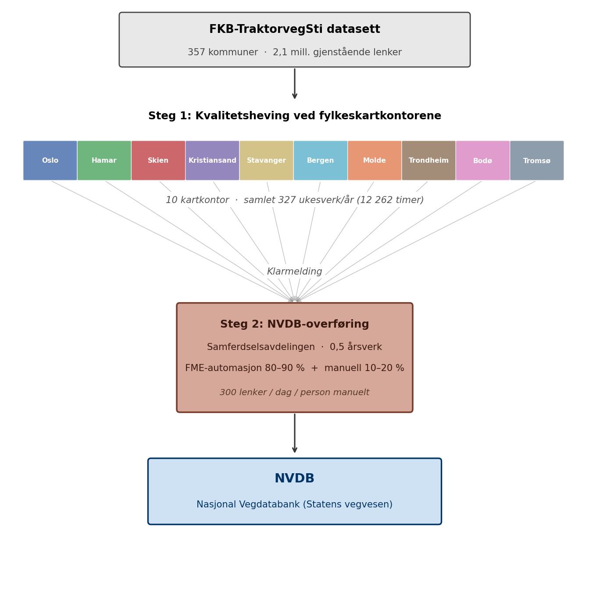

*Figur 1.1 Produksjonskjeden for kvalitetsheving og overføring til NVDB*

Per april 2026 er 62 av 357 kommuner ferdig kvalitetshevet, 48 er påbegynt og 247 er ikke startet. Ingen kommuner er ennå overført til NVDB. Samtidig pågår ordinære Geovekst-kartleggingsprosjekter som låser 152 kommuner i deler av perioden 2026–2027 og hindrer TraktorvegSti-arbeid mens kartleggingen pågår. Kombinasjonen av heterogene ressurser, heterogene jobber, eksterne tidsvinduer og en nedstrøms flaskehals gjør dette til et klassisk ressursallokerings- og produksjonsplanleggingsproblem der riktig fordeling og rekkefølge har vesentlig betydning for total prosjektvarighet.

Denne oppgaven utvikler et planleggingsgrunnlag for kvalitetshevingen og bruker en hybrid analysemodell som kombinerer en regelbasert heuristikk, en MIP-formulering og Monte Carlo-simulering. Målet er å gi Kartverket et tallfestet beslutningsgrunnlag for ressursallokering, sekvensering og forventet totalvarighet under usikkerhet, samt å peke ut hvor i produksjonskjeden en eventuell innsats vil ha størst effekt.

Akademisk plasserer arbeidet seg i skjæringspunktet mellom *resource-constrained project scheduling* (RCPSP) og operasjonsanalyse for offentlig forvaltning. Bidraget er todelt: (i) en empirisk case der en hybrid heuristikk–MIP-tilnærming brukes på et RCPSP med dominerende nedstrøms flaskehals og eksterne tidsvinduer, og (ii) en metodisk illustrasjon av hvordan konvergens mellom uavhengige metoder (en regelbasert heuristikk og en eksakt MIP-formulering) fungerer som validitetssignal når den deterministiske optimaliseringen leverer marginal forbedring i selve målfunksjonen. Monte Carlo-laget på begge planene gjør det mulig å skille mellom hva som er sann modellforskjell og hva som er stokastisk variasjon i resultatene. Studien viser konkret hva som skjer med klassiske RCPSP-funn som «deterministisk optimum ≠ robust optimum» når en nedstrøms ressurs dominerer total prosjektvarighet.

Rapporten er strukturert som følger: kapittel 2 oppsummerer relevant litteratur og kapittel 3 utdyper det teoretiske grunnlaget. Kapittel 4 beskriver casen og kapittel 5 dokumenterer metode og data. Kapittel 6 utvikler modellene, mens kapittel 7 presenterer analyse og resultater. Kapittel 8 drøfter funnene og deres begrensninger, og kapittel 9 konkluderer.

## 1.1 Problemstilling

Hovedproblemstillingen for prosjektet er:

> *Hvordan bør kvalitetshevingen av FKB-TraktorvegSti planlegges og fordeles mellom Kartverkets ti fylkeskartkontor slik at hele datasettet er kvalitetshevet og overført til NVDB med kortest mulig total varighet, gitt heterogen kontorkapasitet, varierende arbeidsmengde per kommune, eksterne Geovekst-låseperioder og en nedstrøms NVDB-overføring med begrenset manuell bemanning?*

Problemstillingen er operasjonell. Den ber ikke bare om en beskrivelse av arbeidet, men om et tallfestet plangrunnlag som Kartverket kan bruke som beslutningsstøtte for prioritering, kapasitetsdisponering og forventningsstyring overfor egne avdelinger og samarbeidspartnere.

## 1.2 Delproblemer

Hovedproblemstillingen brytes ned i fire delproblemer som strukturerer analysen:

1. **Fordeling og sekvensering.** Hvordan bør de 295 gjenstående kommunene fordeles og sekvenseres mellom kartkontorene for å minimere total prosjektvarighet, gitt dagens geografiske tildeling som referanse og full omfordelingsfrihet som alternativ?
2. **Robusthet mot usikkerhet.** Hvor robust er en gitt plan mot usikkerhet i sentrale parametre, særlig FME-automasjonsgrad i NVDB-overføringen, manuell produksjonstakt og tidsbruk per kommune?
3. **Flaskehalsidentifisering.** Bestemmes total varighet av kartkontor-fasen, NVDB-overføringen, eller en kombinasjon, og hvordan endrer dette seg under ulike scenarioer for FME-automasjon og kapasitetsforstyrrelser?
4. **Effekt av tiltak.** Hvilke tiltak gir størst effekt på total varighet: balansering mellom kartkontorene, økt manuell NVDB-bemanning eller videre FME-utvikling?

## 1.3 Avgrensinger

Følgende er bevisst avgrenset bort fra prosjektet:

- **Selve NVDB-overføringen** ligger formelt utenfor fylkeskartkontorenes ansvarsområde og dermed utenfor prosjektets primære omfang. Den er likevel modellert som nedstrøms ressurs i analysen, ettersom den har vesentlig effekt på når kvalitetshevet data faktisk er tilgjengelig i NVDB. Resultatene fra NVDB-modelleringen er ment som beslutningsgrunnlag, ikke som detaljplan for samferdselsavdelingens egne aktiviteter.
- **Individuell effektivitet** mellom saksbehandlere innen samme kontor modelleres ikke. Kapasitet aggregeres på kontor- og avdelingsnivå.
- **Endringer i Geovekst-prosjekter underveis.** Låseperiodene behandles som faste i analysen. Vesentlige endringer som måtte komme i 2026 eller 2027 vil kreve en ny kjøring av modellen med oppdaterte data.
- **Selve produksjonsløypen for kvalitetsheving.** Hvilke trinn som inngår i kvalitetshevingsarbeidet, og hvordan disse utføres, antas gitt og uendret. Prosjektet adresserer planlegging av arbeidet, ikke utforming av selve arbeidsprosessen.
- **Kostnadsanalyse i kroner.** Prosjektet måler varighet og ressursbruk i tid (timer, ukesverk, år), ikke i økonomi. Forretningscaset er begrunnet i effektivisering av tidsbruk, ikke i direkte økonomisk gevinstmåling.

## 1.4 Antagelser

Modellen bygger på to grunnleggende rammeantakelser om problemets struktur:

- **Kommunevis bearbeiding.** Hver kommune behandles som en udelelig enhet og må ferdigstilles før den klarmeldes til NVDB-overføring. Dette samsvarer med Kartverkets faktiske arbeidsmodell.
- **Konstant Geovekst-låseperiode.** Låste kommuner blir tilgjengelige umiddelbart etter låseperiodens slutt og forblir tilgjengelige i resten av planhorisonten.

I tillegg gjelder følgende modell-spesifikke antagelser (utdypet i kapittel 5):

- **Konstant årlig kapasitet** i ukesverk for hvert kontor (37,5 t/uke). Sykefravær og konkurrerende oppgaver antas allerede trukket fra i kontorenes oppgitte tall; ferieuttak håndteres via 245/260-faktoren (jf. 5.1.2). Antas tilsvarende for senere år.
- **245 produktive dager/år** ved kartkontorene (260 kalenderdager × 245/260 ≈ 0,9423 for å fange ferieuttak); NVDB beholder egen kalenderkonvensjon (jf. 5.1.2).
- **Tidsbruk-formel** `Ber_Tidbruk_Min = Km_Kurve × 0,9035 + ArealLand_Km² × 0,6510` med empirisk spredning som inngår i Monte Carlo (jf. 5.2.3).
- **NVDB som ren flaskehals nedstrøms.** FME uendelig rask, bemanning 0,5 årsverk, manuell takt 300 lenker/dag/person, automasjon varieres scenariomessig (85 %, 90 %, 96 %; 96 % er hypotetisk, ikke en prognose, jf. 5.1.4 og 5.1.5).

---

# 2.0 Litteratur

Problemstillingen i denne oppgaven kombinerer flere etablerte fagområder: ressursallokering og scheduling med tidsvinduer, hybride løsningsmetoder som kombinerer heuristikk og eksakt optimering, samt usikkerhetsanalyse basert på Monte Carlo-simulering og bootstrap. Dette kapittelet katalogiserer kildegrunnlaget for metoden: hvilke verk som er brukt og hva hver bidrar med. Den teoretiske utledningen og koblingen til problemstillingen følger i kapittel 3.

## 2.1 Scheduling og ressursallokering med tidsvinduer

Pinedo (2016) er et standardverk innen scheduling-teori og dekker både klassiske formuleringer (parallelle maskiner, release- og due-datoer) og utvidelser som tidsvinduer og ressursbegrensninger. Verket gir det teoretiske rammeverket for å formulere TraktorvegSti-problemet som et ressursallokerings- og sekvenseringsproblem der de 10 kartkontorene tilsvarer parallelle ressurser med varierende kapasitet.

Hartmann og Briskorn (2010) gir en oversiktsartikkel over det ressursbegrensede prosjektplanleggingsproblemet (Resource-Constrained Project Scheduling Problem, RCPSP) og dets utvidelser. Artikkelen etablerer en klassifikasjon som er direkte overførbar til Kartverkets problemstilling: kommuner som aktiviteter, kartkontor som ressurser, Geovekst-låsninger som tidsvinduer, og NVDB-overføringen som en nedstrøms kapasitetsbegrensning.

Graham (1969) etablerer den klassiske ytelsesgarantien for prioritetsregel-heuristikker på parallelle maskiner og introduserer Longest Processing Time-regelen (LPT) med en verste-tilfelle-grense uttrykt som funksjon av antall maskiner. Verket gir det tallfestede referansepunktet som brukes i 3.1 til å vurdere den regelbaserte heuristikken i denne oppgaven.

## 2.2 Hybride løsningsmetoder

Puchinger og Raidl (2005) presenterer en taksonomi over kombinasjoner av metaheuristikker og eksakte algoritmer i kombinatorisk optimering. Forfatterne beskriver ulike måter heuristiske og eksakte metoder kan utfylle hverandre, for eksempel ved at en heuristikk genererer en referanseløsning som videre forbedres av en eksakt metode. Denne tilnærmingen ligger til grunn for metodevalget i oppgaven, der en regelbasert heuristikk gir en referanse som sammenlignes med en MIP-modell med full omfordelingsfrihet.

## 2.3 Monte Carlo-simulering og usikkerhetsanalyse

Vose (2008) er et bredt brukt standardverk for kvantitativ risikoanalyse og dekker Monte Carlo-metoden anvendt i planleggingskontekst. Boken omhandler valg av sannsynlighetsfordelinger, sampling-strategier, hensiktsmessig antall iterasjoner, samt tolkning av persentiler og konfidensintervall, alle aspekter som er relevante for usikkerhetsanalysen i denne oppgaven.

## 2.4 Bootstrap og empirisk resampling

Efron og Tibshirani (1993) presenterer bootstrap-metoden som en statistisk teknikk for å estimere usikkerhet basert på empiriske fordelinger. Verket begrunner resampling med tilbakelegging som en gyldig metode når underliggende sannsynlighetsfordeling er ukjent. I denne oppgaven anvendes prinsippet ved å trekke verdier for tidsbruk per kilometer TVS-lenke fra en empirisk fordeling basert på 58 historiske kartbladmålinger, heller enn å forutsette en parametrisk fordelingsform.

---

# 3.0 Teori

Mens kapittel 2 katalogiserte kildegrunnlaget for metoden, utdyper dette kapittelet teorigrunnlaget og kobler det til problemstillingen: hvilke begreper, garantier og antagelser fra litteraturen som ligger til grunn for modellvalgene i kapittel 5 og 6.

## 3.1 Scheduling-rammeverk og kompleksitet

Klassisk scheduling på parallelle maskiner formuleres etter Pinedos (2016) tre-felts-notasjon $\alpha \,|\, \beta \,|\, \gamma$, der $\alpha$ angir maskinmiljøet, $\beta$ angir bibetingelser, og $\gamma$ angir målfunksjonen. Klassen $P_m \,\|\, C_{\max}$ (minimer makespan på $m$ identiske parallelle maskiner uten bibetingelser) er **NP-hard** allerede for $m \geq 2$. NP-hardheten innebærer at eksakte løsninger generelt vokser eksponentielt med problemstørrelsen, og motiverer bruken av heuristikker for store instanser samt eksakt MIP-løsning som referansepunkt.

Graham (1969) viste at en enkel prioritetsregel, Longest Processing Time (LPT), gir en løsning innenfor faktoren $\tfrac{4}{3} - \tfrac{1}{3m}$ av optimum for $P_m \,\|\, C_{\max}$. For $m = 10$ kartkontor gir dette en verste-tilfelle-garanti på $4/3 - 1/30 \approx 1{,}30$, det vil si en heuristisk løsning som høyst kan være 30 % dårligere enn optimum. Garantien forutsetter identiske maskiner og ingen bibetingelser, og svekkes formelt ved heterogen kapasitet og tidsvinduer. Den fungerer likevel som en nyttig referanseramme: hvis empirisk avvik mellom LPT og en eksakt løsning er vesentlig mindre enn 30 %, er det rimelig å anta at heuristikken er nær optimum også i den utvidete settingen.

Hartmann og Briskorn (2010) plasserer det generaliserte problemet i Resource-Constrained Project Scheduling Problem-familien (RCPSP), der aktiviteter konsumerer ressurser med begrenset kapasitet og kan være underlagt presedensrelasjoner og tidsvinduer. Klassen omfatter scheduling med tilgjengelighetsdatoer ($r_j$), leveringsfrister ($d_j$) og forbudte intervaller, alle direkte relevante for TVS-prosjektet. Geovekst-låseperiodene fungerer som forbudte intervaller hvor en aktivitet (kvalitetsheving av en kommune) ikke kan utføres, og NVDB-overføringen er en *nedstrøms ressurs* med fast kapasitet som kobler ferdigstillelsen av hver kommune til prosjektets totale varighet. Den hybride heuristikk-MIP-løsningen i denne oppgaven plasserer seg dermed i RCPSP-familien med tidsvinduer og to-stegs-flyt.

## 3.2 Hybride løsningsmetoder

Heuristikker gir gode løsninger raskt, men uten optimalitetsgaranti, og uten en uavhengig referanse er det vanskelig å vurdere kvaliteten. Hybride metoder adresserer dette ved å kombinere heuristikkens hastighet med eksakt-løserens kvalitetsgaranti.

Puchinger og Raidl (2005) klassifiserer kombinasjoner av metaheuristikker og eksakte algoritmer i to hovedtyper: *kollaborative* (heuristikk og eksakt-løser kjøres sekvensielt eller parallelt og utveksler informasjon), og *integrative* (én metode er innebygd i den andre, for eksempel heuristikk som varm-start for branch-and-bound). Denne oppgaven anvender en sekvensiell kollaborativ tilnærming: heuristikken gir en referanse som tjener både som rask tilnærming og som målestokk for MIP-modellen, mens MIP-modellen (løst med CBC via PuLP) validerer at heuristikkens løsning ligger nær matematisk optimum.

Designet gir to verdier som ingen av metodene alene leverer. Heuristikken alene gir ingen kvalitetssikring, og MIP-modellen alene har skaleringsbegrensninger ved store horisonter (85 %-scenarioet ender *Not Solved* ved 30-minutters tidsgrense). Når begge metodene gir nær identisk makespan på et helt ulikt løsningsgrunnlag, er dette et sterkt validitetssignal: konvergens mellom uavhengige metoder reduserer risikoen for at et resultat er en artefakt av en bestemt modellantagelse.

## 3.3 Usikkerhetsanalyse: Monte Carlo og bootstrap

Deterministiske modellresultater bygger på antagelser om input-parametere. Når noen av disse er beheftet med usikkerhet (som tidsbruk per kilometer TVS-lenke, manuell NVDB-takt og FME-automasjonsgrad), kan ikke modellutfallet leses som et eksakt punktestimat. Vose (2008) beskriver hvordan Monte Carlo-simulering propagerer slik usikkerhet gjennom en deterministisk modell ved å trekke mange tilfeldige verdier fra antatte sannsynlighetsfordelinger, kjøre modellen for hver trekning, og bruke den empiriske fordelingen av resultater til å beskrive usikkerheten i utfallet.

Antall iterasjoner $N$ velges slik at percentilene konvergerer. Ved 500 iterasjoner ligger Monte Carlo-feilen på P5-, P50- og P95-percentiler vanligvis innen et par prosent av sann verdi for fordelinger av den størrelsen som er aktuelle her, og ytterligere iterasjoner gir avtakende presisjonsgevinst per kjøretidskostnad. Dette er rasjonalet bak prosjektets 500-iterasjons-design.

For sampling fra empiriske data brukes ofte **bootstrap**, presentert av Efron og Tibshirani (1993). Bootstrap er en ikke-parametrisk teknikk som tilnærmer en usikker parameters fordeling ved å resample med tilbakelegging fra et empirisk datasett. Metoden er gyldig når dataene anses som representative for populasjonen og observasjonene er statistisk uavhengige. Det parametriske alternativet, å anta en bestemt fordelingsform (normal, lognormal, etc.), er upraktisk når den underliggende fordelingen er ukjent eller åpenbart ikke-normal. I denne oppgaven bootstrappes MIN/KM (tidsbruk per kilometer TVS-lenke) fra 58 historiske kartbladmålinger nettopp av denne grunn: den empiriske fordelingen er sterkt skjev (range 0,10–3,44, std 0,55, snitt 0,9035) og det finnes ikke grunnlag for å anta en bestemt parametrisk form.

Begge teknikkene har klare antagelser. Monte Carlo forutsetter at de stokastiske kildene er korrekt spesifisert; bootstrap forutsetter at sample er representativt for populasjonen. Disse antagelsene og deres begrensninger drøftes nærmere i 8.4.

---

# 4.0 Casebeskrivelse

Mens kapittel 2 og 3 etablerte det metodiske og teoretiske rammeverket, beskriver dette kapittelet selve casen: datasettet, produksjonskjeden og den organisatoriske strukturen som skal planlegges.

## 4.1 FKB-TraktorvegSti og kvalitetsheving

FKB-TraktorvegSti er et nasjonalt datasett som inneholder traktorveger og stier i hele Norge. Datasettet forvaltes av Statens Kartverk og er en del av Felles Kartdatabase (FKB). Etter kvalitetsheving skal datasettet implementeres i NVDB (Nasjonal vegdatabank), slik at traktorveger og stier inngår sammen med øvrige veger i et nasjonalt vegnettverk for kjørende, gående og syklende.

Kvalitetshevingen innebærer manuell redigering av hver enkelt kommune: kontroll av topologi, stedfesting, fjerning av ikke-gjenfinnbare objekter og tilpasning av attributter slik at dataene møter NVDB-kravene. Arbeidet utføres av fylkeskartkontorene.

## 4.2 Produksjonskjeden

Produksjonen har to sekvensielle steg:

```
Kartkontor (kvalitetsheving) ──► Samferdselsavdelingen (NVDB-overføring via FME)
```

**Steg 1: Kvalitetsheving.** Utføres ved 10 fylkeskartkontor. Hver kommune behandles som en udelelig enhet og må ferdigstilles før den kan sendes videre. Kapasiteten varierer mellom kontorene (se figur 4.1 og 4.2).

**Steg 2: NVDB-overføring.** Utføres av to personer i 25 % stillingsandel hver (0,5 årsverk) i samferdselsavdelingen. 80–90 % av objektene legges inn automatisk via FME-rutiner, mens resterende 10–20 % må håndteres manuelt. Manuell produksjonstakt er ca. 300 lenker per person per dag (samferdselsavdelingens punktestimat).

## 4.3 De 10 fylkeskartkontorene

Kartverket har 10 fylkeskartkontor som hver i dag har ansvar for sine fylker, og hver kommune kvalitetsheves av sitt ansvarlige kartkontor. Denne geografiske tildelingen er prosjektets utgangspunkt, men ikke en fastlåst begrensning: ett av hovedspørsmålene i analysen er om total varighet kan reduseres ved å omfordele kommuner mellom kontor, slik at kontor med god kapasitet avlaster kontor med høy arbeidsbelastning.

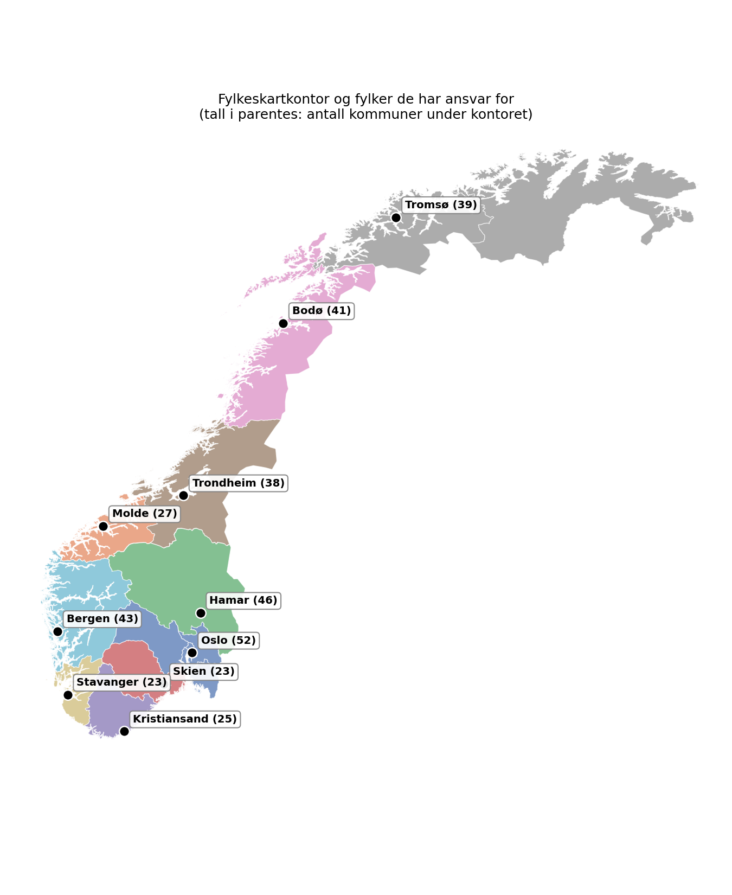

*Figur 4.1 Fylkeskartkontorenes ansvarsområder og antall kommuner per kontor*

Kontorene har svært ulik arbeidsbelastning og kapasitet. Oslo har 52 kommuner under sitt ansvar, mens Stavanger og Skien har 23 hver. Årlig kapasitet (uttrykt i ukesverk disponibelt for TVS-prosjektet i 2026) varierer fra 22 ukesverk (Bodø) til 52 ukesverk (Trondheim). Figur 4.2 (venstre) sammenligner årlig kapasitet i timer med estimert total arbeidsmengde per kontor, mens høyre panel viser estimert varighet i år ved full kapasitetsutnyttelse uten Geovekst-låsning. Mismatchen mellom kapasitet og arbeid er en hovedmotivasjon for å vurdere omfordeling av kommuner mellom kontor.

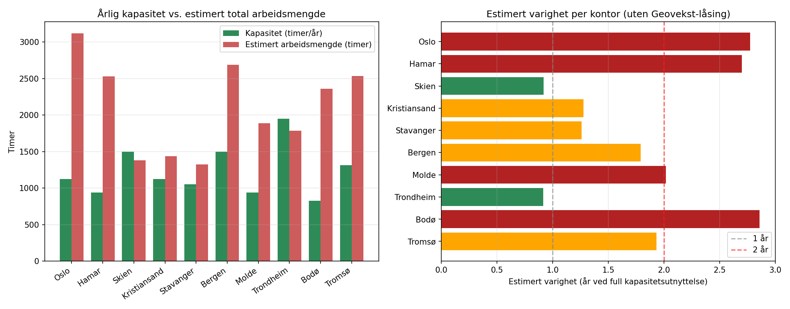

*Figur 4.2 Årlig kapasitet vs. estimert arbeidsmengde og estimert varighet per kartkontor*

## 4.4 Fremdrift per april 2026

Av 357 kommuner er 62 ferdig kvalitetshevet, 48 påbegynt og 247 ikke startet. Ingen kommuner er ennå overført til NVDB. Fremdriften er ulikt fordelt mellom kontorene: figur 4.3 viser antall kommuner per status for hvert kartkontor.

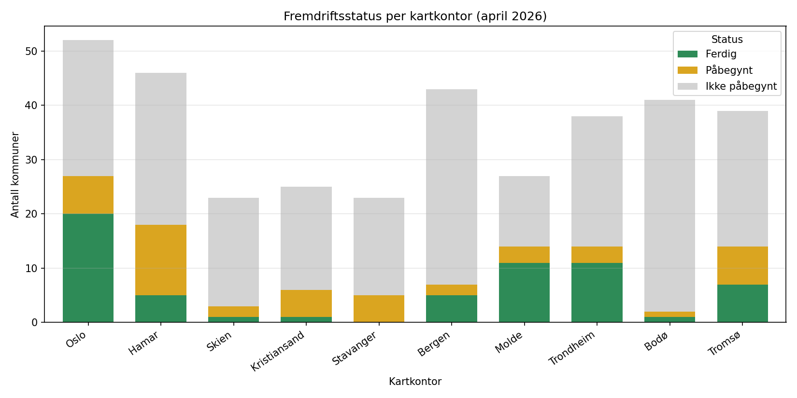

*Figur 4.3 Fremdriftsstatus per kartkontor per april 2026*

## 4.5 Geovekst-låsing

Parallelt med TVS-prosjektet pågår ordinære Geovekst-kartleggingsprosjekter i flere kommuner. Under kartleggingsperiodene er kommunene låst for TVS-kvalitetsheving fordi dataene er under endring. I april 2026 er 152 kommuner berørt av slike låsninger, og låseperiodene strekker seg fra januar 2026 til juni 2027. Heatmap-cellen i figur 4.4 angir antall unike kommuner under hvert kontor som er i aktiv låseperiode den aktuelle måneden. De fleste låsningene er konsentrert om sommer og høst 2026, med enkelte prosjekter som fortsetter inn i 2027. Planleggingen må hensynta at låste kommuner ikke kan behandles før låseperioden er over.

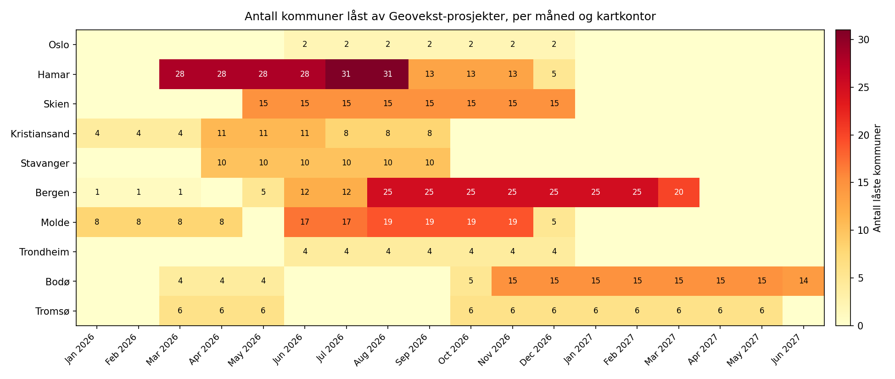

*Figur 4.4 Antall kommuner låst av Geovekst-prosjekter per måned og kartkontor*

## 4.6 Hvorfor dette er et planleggingsproblem

Problemet kombinerer klassiske elementer fra ressursallokering og produksjonsplanlegging:

- **Heterogene ressurser:** Kontorene har ulik kapasitet og ulike tidsestimater per kommune.
- **Heterogene jobber:** Kommunene varierer sterkt i størrelse (fra under 100 til over 35 000 lenker, se figur 4.5).
- **Tidsvinduer:** Geovekst-låsninger gjør deler av arbeidet utilgjengelig i perioder.
- **Nedstrøms flaskehals:** NVDB-overføringen har lav manuell kapasitet og blir trolig flaskehalsen i kjeden.
- **Målkonflikter:** Minimere total varighet, utnytte kapasitet, og unngå arbeid i låseperioder; disse kan trekke i ulike retninger.

Figur 4.5 (venstre) viser et histogram over antall lenker per kommune, med markert median og gjennomsnitt. Median er betydelig lavere enn snittet, noe som bekrefter en høyreskjev fordeling. Pareto-kurven (høyre) viser at arbeidet er moderat konsentrert: de største 54 % av kommunene står for 80 % av de samlede lenkene. Fordelingen er høyreskjev, men ikke ekstrem (Pareto-konsentrasjonen er svakere enn klassisk 80/20). Dette har likevel betydning for prioritering i heuristikken: å starte med de største kommunene kan gi rask reduksjon i gjenstående arbeid.

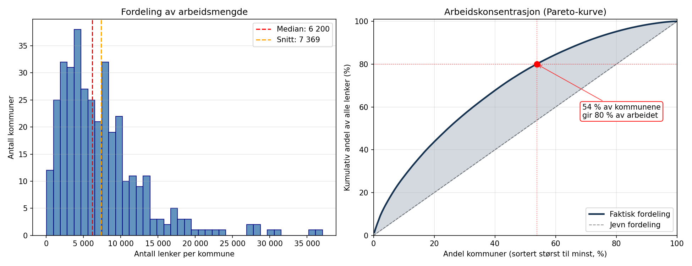

*Figur 4.5 Fordeling av arbeidsmengde per kommune og Pareto-kurve for arbeidskonsentrasjon*

---

# 5.0 Metode og data

Kapittel 4 viste at TVS-prosjektet er et planleggingsproblem med heterogene ressurser, eksterne tidsvinduer og en nedstrøms flaskehals. Dette kapittelet beskriver hvordan problemet er angrepet metodisk, og hvilket datagrunnlag analysen hviler på.

## 5.1 Metode

Problemet er et kombinert *ressursallokeringsproblem* (tilordne 295 aktive kommuner til 10 kartkontor) og *produksjonsplanleggingsproblem* (bestemme rekkefølge og timing over en flerårsperiode), med eksterne tidsvinduer fra Geovekst-kartleggingsprosjekter. Løsningsmetoden er bevisst tredelt for å balansere tre behov: implementerbar referanse, matematisk garantert optimalitet, og kvantifisert usikkerhet.

### 5.1.1 Tredelt hybrid tilnærming

**Steg 1: Regelbasert heuristikk** (`heuristikk.py`). Simulerer prosessen dag-for-dag med deterministiske prioriteringsregler (størst først innen hvert kontor, låste kommuner sist) og gir en rask, tolkbar referanse. Samme simulator brukes både for referanseresultater og som motor for Monte Carlo.

**Steg 2: MIP-optimering** (`mip_modell.py`). Formulerer problemet som et blandet heltallsproblem med månedlig tidsdiskretisering og løser det med CBC-solveren (open source). MIP har full frihet til omfordeling mellom kontor og gir en beviselig nær-optimal løsning på makespan. MIP-modellen brukes ikke bare som konkurrent til heuristikken, men som en *uavhengig verifikasjon*: samsvar mellom to helt ulike metoder er en styrke for modellens validitet.

**Steg 3: Monte Carlo-analyse** (`monte_carlo.py`, `monte_carlo_mip.py`). Kvantifiserer hvordan usikkerhet i sentrale parametre propageres til totalvarighet. 500 iterasjoner × tre NVDB-scenarioer × to plantyper (heuristikk og MIP) gir 3 000 simulerte prosjektforløp, der hver iterasjon trekker uavhengige verdier fra tre stokastiske kilder (se 5.1.6).

Valget av ML-basert metode (regresjon på ferdigtid per kommune) ble tidlig vurdert og forkastet, primært fordi kun 62 av 357 kommuner har fullført kartkontor-fasen, og fordi faktisk tidsbruk ikke er registrert for disse. Treningsgrunnlaget er for lite og for usikkert til å gi meningsfylte prediksjoner på 295 uferdige kommuner. De 62 ferdige brukes i stedet til sanity-sjekk av den deterministiske formelen for beregnet tidsbruk (5.2.3).

### 5.1.2 Kalenderkonvensjon og kapasitet

Simuleringen omfatter 260 kalenderdager (mandag–fredag) per år. Kartkontorene leverer imidlertid bare ca. 245 produktive dager/år: personalet tar ferie spredt utover året, og selv om sommervikarer bidrar med noe produksjon i sommerukene, kompenserer de ikke fullt ut. Kartkontor-kapasitet skaleres derfor med faktoren 245/260 ≈ 0,9423. Heuristikken bruker daglig kapasitet $\kappa_j = K_j \cdot 37{,}5 \cdot (245/260) / 260$ timer, og MIP månedlig kapasitet $K_j \cdot 37{,}5 \cdot (245/260) / 12$. `Kapasitet_Ukesverk` tolkes som nominell årlig kapasitet (uten ferieuttak), og 245-faktoren bringer total levert arbeid per år til $K_j \cdot 37{,}5 \cdot (245/260)$ timer.

Tallet 245 er forankret i opplysninger fra oppdragsgiver om at faktiske produktive dager ligger rundt dette nivået. Effekten på resultatene er liten: makespan er uendret i alle tre NVDB-scenarioer (NVDB dominerer flaskehalsen), mens kartkontor-fasen forlenges marginalt (medianvarigheten i Monte Carlo går fra 503 til 510 dager, +1,4 %). Den matematiske minimumsgrensen for kartkontor-fasen øker tilsvarende kapasitetskuttet (~6 %), men Geovekst-låseperiodene absorberer mye av kuttet i de faktiske simuleringene.

NVDB-overføringen beholder modellens 260-dagers kalenderkonvensjon ($\mu = \text{kapasitet per dag} \cdot 260/12$ lenker per måned i MIP). Samferdselsavdelingen opererer selv med 240 arbeidsdager/år. Kjøres modellen med deres 240-dagers konvensjon i stedet for prosjektets 260-dagers, gir det 7,22 år for 90 %-scenarioet mot modellens 6,72 år ved 260 dager (ren skalering 7,22 × 240/260 ≈ 6,67, og modellens 6,72 ligger 0,05 år over dette pga. pre-ferdige kommuner og oppstart). Dette dokumenterte 240/260-gapet er beholdt som drøftelsespoeng. Modellens relative resultater (sammenligning mellom scenarioer, sensitivitet på kapasitet, usikkerhetsbånd) er upåvirket av denne kalenderkonvensjonen; kun absolutt NVDB-varighet skifter proporsjonalt og er kjent.

### 5.1.3 MIP-modellens målfunksjon

MIP-modellen har en vektet lex-opt-målfunksjon med tre nivåer:

$$
\min\; W_1 \cdot \text{makespan} + W_2 \cdot \text{kartkontor-ferdigtid} + \text{inertia}
$$

der $W_1 \gg W_2 \cdot \max(\text{kartkontor-ferdigtid}) + \max(\text{inertia})$ og $W_2 \gg \max(\text{inertia})$. Prioritet 1 er total varighet (NVDB-fasen), prioritet 2 er komprimering av kartkontor-fasen, prioritet 3 er å beholde ansvarskontor-tildeling ved like løsninger. Dette gir en enkeltpass-løsning som kombinerer effektivitet med matematisk korrekthet. Metoden er raskere og mer stabil enn sekvensiell lex-opt, og gir identiske makespan-resultater. Inertia-termen er essensiell for å hindre MIP i å omfordele kommuner "gratis" som ikke bidrar til målfunksjonen.

### 5.1.4 NVDB-kapasitetsformel og dens struktur

Daglig NVDB-kapasitet modelleres som

$$
\mu = \frac{\text{årsverk} \cdot \text{manuell takt}}{1 - \text{automasjonsgrad}}
$$

Formelen hviler på antagelsen at FME-prosessen er uendelig rask og at den manuelle etterbehandlingen er eneste flaskehals. Formelens struktur gir stor følsomhet nær automasjonsgrad = 1 (f.eks. 1 000 vs. 15 000 lenker/dag ved 85 % vs. 99 %). Dette betyr at konklusjonen "automasjonsgrad er dominerende usikkerhetskilde" delvis følger *analytisk* fra formelen, ikke bare empirisk. Følgevirkningen er behandlet i 8.4.

Manuell takt er satt til **300 lenker/person/dag** etter kalibrering mot samferdselsavdelingens oppgitte parametere. Monte Carlo-modellen sampler rundt 300 med ±25 (Uniform 275–325) som representerer måleusikkerhet. Stillingsbemanning er 0,5 årsverk (2 personer × 25 % stillingsandel) og holdes konstant på tvers av scenarioer.

### 5.1.5 Scenariodesign

Tre NVDB-scenarioer undersøkes, differensiert på FME-automasjonsgrad som er den viktigste usikre variabelen:

*Tabell 5.1 NVDB-scenarioer differensiert på FME-automasjonsgrad*

| FME-automasjon | NVDB-kapasitet (lenker/dag) | Rasjonale                                                                    |
| :------------: | :-------------------------: | ---------------------------------------------------------------------------- |
|      85 %      |            1 000            | Konservativ midtverdi fra samferdselsavdelingens oppgitte intervall 80–90 % |
|      90 %      |            1 500            | Samferdselsavdelingens oppgitte parametere (kalibreringspunkt)               |
|      96 %      |            3 750            | Optimistisk øvre grense, bakoverregnet for å treffe et 2-års-mål         |

Samferdselsavdelingen opererer selv kun med 80–90 %. 96 %-scenarioet er dermed ikke deres tall, men en hypotetisk målsetning bakoverregnet fra et 2-års-mål: gitt fast manuell kapasitet (0,5 årsverk × 300 lenker/dag) er ~96 % det laveste automasjonsnivået som via NVDB-formelen i 5.1.4 holder de gjenstående ~2,1 mill. lenkene innenfor 2 år. Modellens punktestimat på ~2,7 år (kap. 7.1, jf. tabell 7.1) ligger over 2 fordi 96 % er rundet ned fra ~96,3 % og fordi modellens 260-dagers konvensjon avviker fra samferdselsavdelingens 240 (jf. 5.1.2). Dette gir Kartverket et argument for FME-investering: å nå fra 85 % til 96 % automasjonsgrad reduserer total prosjektvarighet til omtrent en fjerdedel (fra ~10 til ~2,7 år).

### 5.1.6 Monte Carlo-modellen

Tre stokastiske kilder samples per iterasjon:

1. **MIN/KM per kommune.** Bootstrap med tilbakelegging fra empirisk fordeling av 58 kartbladmålinger (MIN/KM = 0,10–3,44, gjennomsnitt 0,9035, std 0,55). Sampling er uavhengig mellom kommuner; reell geografisk korrelasjon (topografi, terreng) er ikke modellert, noe som overestimerer per-kontor-variansen og underestimerer aggregert nivå (dette er en bevisst forenkling, drøftet i 8.4).
2. **Manuell takt.** Uniform(275, 325), sentrert på samferdselsavdelingens punktestimat 300. Representerer måleusikkerhet, ikke reell spredning i erfaringsdata.
3. **Automasjonsgrad.** Normal(scenariopunkt, std = 0,03), klippet til [0,5; 0,99]. Standardavviket 0,03 (3 prosentpoeng) reflekterer realistisk måleusikkerhet på FME-automasjon ved ulike kommunegeografier. Den tidligere verdien std = 0,01 ga scenarioer som ikke overlappet hverandre, og dette var et *designvalg*, ikke et empirisk funn.

Grunnpakke-tillegget (0,6510 min/km²) holdes konstant i Monte Carlo. Areal-koeffisienten er ikke identifiserbar fra kalibreringsdataene (alle 58 kartblader har identisk areal, 7,68 km²) og har dermed ingen empirisk spredning å bootstrape fra. Konsekvensen er at usikkerhetsintervallene i Monte Carlo representerer måleusikkerhet i MIN/KM, manuell NVDB-takt og automasjonsgrad, men ikke usikkerhet knyttet til grunnpakke-leddet. Dette drøftes som forbehold i 8.2.

### 5.1.7 Validitet og reliabilitet

Modellens troverdighet vurderes langs tre dimensjoner: *intern validitet* (om modellen måler det den foregir å måle), *ekstern validitet* (om resultatene lar seg generalisere), og *reliabilitet* (om analysen er reproduserbar).

**Intern validitet** er adressert gjennom tre virkemidler. *Triangulering*: heuristikken og MIP-modellen er to algoritmisk uavhengige tilnærminger til samme problem, og samsvar mellom dem styrker tilliten til at de fanger problemet riktig. Heuristikkens makespan ligger innenfor 2,2 % av MIP-modellens i alle tre scenarioer (kap. 7.1). *Kalibrering mot oppgitte parametere*: modellens 90 %-punktestimat på 6,72 år konvergerer mot samferdselsavdelingens direkte regnestykke på samme inputparametere (7,22 år), der gapet utelukkende skyldes ulik kalenderkonvensjon (240 vs. 260 dager, jf. 5.1.2 og 8.1). *Sensitivitetsanalyser* langs tre uavhengige akser, kapasitet (S0–S5, kap. 7.4), tidbruk-skalering (×1,5 og ×2,0, kap. 8.2) og AUTOMASJON_STD (fire nivåer, kap. 8.4), bekrefter at hovedfunnet om NVDB-flaskehalsen er robust på tvers av store endringer i inputantagelser (med *robust* menes her at den kvalitative slutningen overlever variasjon, ikke at punktestimatet er uendret).

**Ekstern validitet** er forsiktig. Modelleringsrammen, med heuristikk for tolkbar referanse, MIP for verifikasjon og Monte Carlo for risikokvantifisering, er overførbar til andre planleggingsproblemer med tilsvarende strukturelle kjennetegn: regionale ressurser med varierende kapasitet, eksterne tidsvinduer som låser deler av arbeidsmengden, og en dominerende nedstrøms flaskehals. Hovedfunnene fra dette caset (NVDB-flaskehalsen og at deterministisk optimum er praktisk robust) er knyttet til denne strukturen og generaliserer ikke uten videre til problemer uten dominerende nedstrøms-fase. Tidbruk-formelens kalibreringsgrunnlag har i tillegg en kjent skjevhet (jf. 8.2): de 62 ferdige kommunene som brukes i sanity-sjekken er ikke representative for de 295 gjenstående, noe som begrenser overførbarheten av absolutte kommuneestimater.

**Reliabilitet** sikres ved at hele analysepipelinen er deterministisk og reproduserbar. Rådata, behandlede CSV-er og kjørbare Python-skript er samlet i prosjektmappen. Stokastiske kjøringer (Monte Carlo) reproduseres med faste tilfeldig-tall-frø i `monte_carlo.py`. Eksterne avhengigheter (Python 3.13, PuLP 3.3, CBC 2.10.3, pandas, numpy, geopandas) er dokumentert i 6.4, slik at en uavhengig leser kan rekjøre modellen. Datavasken er instrumentert med to sanity-sjekk-skript (`sanity_check_data.py` og `sanity_check_mip.py`) som flagger kjente inkonsistenser i rådata og avvik mellom MIP-modellens output og bibetingelsene.

### 5.1.8 Etiske vurderinger

Studien behandler ingen personopplysninger. Alle data er aggregert per kommune (lenker, kurvelengde, status) eller per kartkontor (kapasitet, tidbruk-intervaller). Personvernforordningen (GDPR) er dermed ikke relevant, og prosjektet er ikke meldepliktig til Sikt eller REK (jf. egenerklæringen i frontmatter). Kartverket har som oppdragsgiver gitt samtykke til at reelle produksjons- og kapasitetstall fra samferdselsavdelingen og de 10 fylkeskartkontorene brukes som datagrunnlag i en åpen studentrapport.

## 5.2 Data

### 5.2.1 Datakilder

Rådataene er hentet fra fire hovedkilder:

*Tabell 5.2 Rådatakilder for analysen*

| Datasett                               | Kilde                                  | Innhold                                                                                      |
| -------------------------------------- | -------------------------------------- | -------------------------------------------------------------------------------------------- |
| Fremdriftsstatus per kommune           | Samferdselsavdelingens PowerBI-rapport | Status per kommune (Ferdig / Påbegynt / Ikke påbegynt)                                     |
| Arbeidsmengde per kommune              | Samferdselsavdelingens PowerBI-rapport | Antall lenker per kommune                                                                    |
| Grunndata for kvalitetsheving          | Et fylkeskartkontor                    | Kommunemapping, kurvelengde i km, beregnet tidsbruk og dagsverk                              |
| Datainnsamling fra fylkeskartkontorene | 10 fylkeskartkontor                    | Kapasitet (ukesverk), min/maks tidsbruk per kommune og Geovekst-prosjekter med låseperioder |

Datainnsamlingen fra kartkontorene ble gjennomført våren 2026 via et felles Excel-skjema med ett ark per kontor. Materialet er ufullstendig på flere punkter. Agder og Rogaland leverte ingen data; Geovekst-prosjekter for disse to kontorene ble innhentet av forfatter selv og ligger i to supplerende CSV-filer, mens kapasitet, tidbruk og låseperioder utenfor Geovekst er estimerte. Oslo og Bodø leverte Geovekst-prosjekter, men kapasitet og tidbruk er estimerte; Oslos opprinnelige tall ble vurdert som urealistisk lave i dialog med oppdragsgiver og er erstattet (se 5.2.2). Konsekvenser av disse estimerte input-tallene er drøftet i 8.3.

### 5.2.2 Datarensing

Rådataene hadde flere kvalitetsproblemer som måtte håndteres:

- **Feil fylkesinformasjon:** Feltet for fylkesnummer i grunndatasettet var forskjøvet og inkonsistent. Fylkestilhørighet utledes derfor fra de to første sifrene i kommunenummeret.
- **Ulike formater på låseperioder:** Tekstverdiene varierte fra datorange (f.eks. "august 2026 – mars 2027") til antall måneder ("7"). Alle standardiseres til start- og sluttdato, og ukjente formater tildeles perioden mai–desember 2026 som konservativt estimat.
- **Arbeidsmengde i ulike enheter:** Arbeidsmengde angis som antall lenker (ikke kilometer), ettersom produksjonstakten oppgis i lenker per person per dag.
- **Oslo-kontorets kapasitetstall justert:** De opprinnelige tallene fra Oslo (kapasitet 20 ukesverk, tidsbruk 20–60 timer per kommune) ble vurdert som urealistisk lave i dialog med oppdragsgiver. Etter avtale er disse oppjustert til 30 ukesverk og 30–90 timer per kommune i `vask_og_strukturer.py` (`KAPASITET_OVERRIDE`).

Datarensingen er implementert i `004 data/scripts/vask_og_strukturer.py` og produserer seks behandlede datasett.

### 5.2.3 Formel for beregnet tidsbruk per kommune

Den beregnede tidsbruken per kommune (`Ber_Tidbruk_Min` i rådatasettet) er ikke en empirisk måling, men en avledet størrelse beregnet ved følgende lineære formel:

$$
\text{Ber\_Tidbruk\_Min} = \text{Km\_Kurve} \times 0{,}9035 + \text{ArealLand\_Km}^2 \times 0{,}6510
$$

Koeffisientene kommer fra Tidbruk-fanen i grunndatasettet og dokumenterer hvordan Kartverket estimerer ressursbehov for kvalitetsheving av TVS-data:

- **0,9035 min/km lenke:** empirisk gjennomsnitt av målt tidsbruk per kilometer TVS-lenke, utledet fra registreringer av faktisk tidsbruk på 58 kartblader.
- **0,6510 min/km² landareal:** standardtillegg for kommunens landareal ("grunnpakke"), som fanger opp arbeid som ikke skalerer direkte med lenkelengde (nettverkskontroll, topologisk kontroll, arkivarbeid m.m.).

Formelen er verifisert numerisk ved at det rekalkulerte Ber_Tidbruk_Min avviker med median 0,2 minutter og maksimalt om lag 0,5 minutter fra oppgitt verdi for alle 357 kommuner. De 58 kartbladmålingene viser samtidig betydelig spredning i MIN/KM: fra 0,10 til 3,44 med standardavvik 0,55, omtrent 60 % av gjennomsnittet. Dette betyr at `Ber_Tidbruk_Min` er et punktestimat basert på en gjennomsnittssats, og reell tidsbruk per kommune kan avvike betydelig. Denne empiriske variasjonen danner grunnlag for usikkerhetsvurdering i modellen.

### 5.2.4 Behandlede datasett

*Tabell 5.3 Behandlede datasett produsert av datavasken*

| Datasett             | Rader | Innhold                                                                                                                    |
| -------------------- | ----- | -------------------------------------------------------------------------------------------------------------------------- |
| Master-datasett      | 357   | Én rad per kommune: kommunenr, kartkontor, status, antall lenker, gjenstående lenker, beregnet tidsbruk, Geovekst-status |
| Kapasitet per kontor | 10    | Én rad per kartkontor: årlig kapasitet (ukesverk), min/maks tidsbruk per kommune, aggregerte nøkkeltall                 |
| Geovekst-prosjekter  | 173   | Én rad per kommune-prosjekt-par: prosjektkode, kommune, kartkontor, status, låseperiode (start/slutt)                    |
| NVDB-scenarioer      | 3     | Tre scenarioer for NVDB-overføring med varierende automasjonsgrad (85 %, 90 %, 96 %)                                      |
| Tidbruk-kalibrering  | 58    | Én rad per kartblad med faktisk målt tidsbruk (MIN, LENGTH, MIN/KM, MIN/KM²)                                            |
| Tidbruk-konstanter   | 2     | Koeffisientene 0,9035 min/km og 0,6510 min/km² som brukes i formelen for Ber_Tidbruk_Min                                  |

### 5.2.5 Nøkkeltall og deskriptiv statistikk

*Tabell 5.4 Nøkkeltall for datasettet*

| Størrelse                        | Verdi                       |
| --------------------------------- | --------------------------- |
| Antall kommuner                   | 357                         |
| Antall kartkontor                 | 10                          |
| Totalt antall lenker              | 2 630 964                   |
| Gjenstående lenker (april 2026)  | 2 138 104                   |
| Total årlig kapasitet kartkontor | 327 ukesverk (≈ 12 263 timer) |
| Kommuner låst av Geovekst        | 152                         |
| Geovekst kommune-prosjekt-par     | 173                         |

Fordelingen av antall lenker per kommune er sterkt høyreskjev (figur 4.5): medianen er langt lavere enn gjennomsnittet, og noen få store kommuner (f.eks. Oslo, Bergen, Trondheim) inneholder en uforholdsmessig stor andel av totalen. Dette har betydning for modelleringen, ettersom små og store kommuner bør behandles ulikt i prioriteringen.

Arbeidsbelastningen varierer sterkt mellom kontorene, og også innad i hvert enkelt kontor. I figur 5.1 representerer hver horisontal søyle ett kontors samlede gjenstående arbeid, og hvert segment er én kommune sortert fra størst til minst. Enkelte kontor (som Bergen, Trondheim og Tromsø) har et fåtall svært store kommuner som dominerer arbeidsmengden, mens andre (som Hamar og Oslo) har en jevnere fordeling av små og mellomstore kommuner.

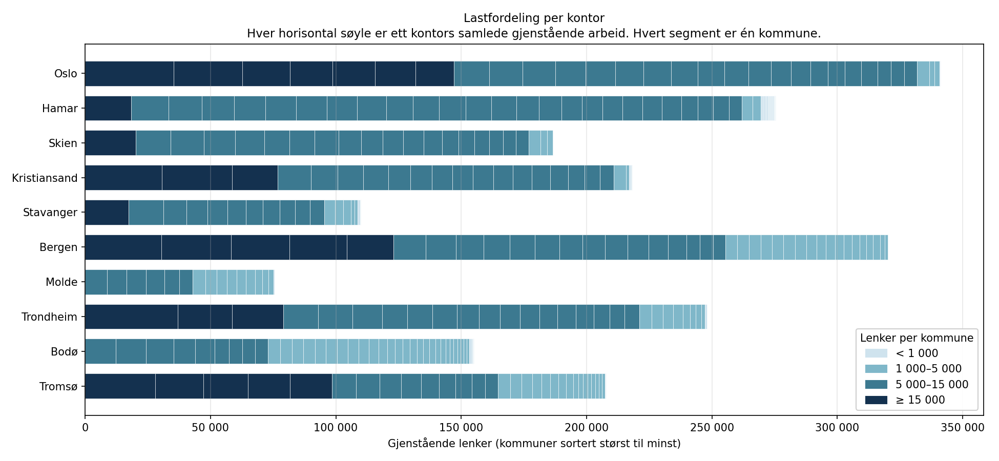

*Figur 5.1 Lastfordeling per kartkontor, hvert segment er én kommune*

### 5.2.6 Antagelser og begrensninger

- Kapasitet oppgitt i ukesverk for 2026 antas å gjelde også for etterfølgende år i modellen.
- Individuell effektivitet per saksbehandler er ikke modellert; kapasiteten behandles som en aggregert ressurs per kontor.
- Samferdselsavdelingens oppgitte parametere (300 lenker/dag/person manuelt, 0,5 årsverk, 240 arbeidsdager/år, 90 % automasjon) gir ved direkte beregning en varighet på 7,22 år. Kalibreringen mot disse parametrene fastsetter manuell takt til 300 lenker/dag og gir 90 %-scenarioet som referansepunkt. Avvik mellom 80 % og 96 % automasjon håndteres via scenarioanalyse; måleusikkerhet innad i hvert scenario via Monte Carlo.
- Kommune-til-kontor-tildelingen er en beslutningsvariabel i optimeringsmodellen. Ansvarlig kartkontor i master-datasettet angir dagens geografiske tildeling og brukes som referanse som den optimerte omfordelingen sammenlignes mot.

---

# 6.0 Modellering

Mens kapittel 5 beskrev metodisk strategi og datagrunnlag, gir dette kapittelet den formelle modell-spesifikasjonen: heuristikkens algoritme og MIP-modellens matematiske formulering.

## 6.1 Heuristikk

Den regelbaserte heuristikken tjener som referanse og som validert simuleringsmotor for Monte Carlo-analyse og MIP-evaluering. Den simulerer dag-for-dag (260 kalenderdager mandag–fredag per år, hvorav 245 er produktive, jf. 5.1.2) over STARTDATO 1. mai 2026.

**Steg 1: Initiell tilstand.** For hver kommune *i* beregnes gjenværende timebehov som

$$
t_i = \frac{\tau_i}{60} \cdot \frac{\ell^{\text{rest}}_i}{\ell_i}
$$

der $\tau_i$ er beregnet tidsbruk i minutter (fra formel 5.2.3), $\ell^{\text{rest}}_i$ er gjenstående lenker og $\ell_i$ er totale lenker. Kommuner med status "Ferdig" (62 stk.) plasseres direkte i NVDB-kø fra STARTDATO.

**Steg 2: Prioriteringskø per kontor.** Kommuner tildeles ansvarlig kartkontor basert på fylkestilhørighet (referanse; omfordeling utforskes i MIP). Innenfor hvert kontor sorteres kommuner etter:

1. Låst på STARTDATO → plasseres sist
2. Ikke-låste → størst først (flest gjenværende timer)
3. Låste → tidligste opplåsingsdato først

Regel 2 er en Longest Processing Time-heuristikk (Graham, 1969), som for parallell scheduling uten bibetingelser har en verste-tilfelle-garanti på 4/3 av optimum. Låseperioder fra Geovekst-prosjekter gir ytterligere tidsvindu-bibetingelser som teoretisk kan svekke denne garantien, men MIP-resultatene i 7.1 bekrefter at heuristikken er nær-optimal i praksis (<2,2 % fra MIP på makespan).

**Steg 3: Dag-for-dag-simulering.** For hver arbeidsdag:

- Hvert kontor arbeider på første ikke-låste kommune i køen med daglig kapasitet $\kappa_j = K_j \cdot 37{,}5 \cdot (245/260) / 260$ timer (der $K_j$ er oppgitt kapasitet i ukesverk, 260 er antall kalenderdager mandag–fredag per år, og 245/260-faktoren reflekterer at kontorene gjennomsnittlig leverer som om de hadde ca. 245 produktive dager pga. ferieuttak, jf. 5.1.2). Når en kommune når 0 gjenværende timer, flyttes den til NVDB-køen.
- Hvis dagen er etter NVDB-startdato, drenerer NVDB-køen med scenariets kapasitet (1 000 / 1 500 / 3 750 lenker/dag for hhv. 85 %, 90 % og 96 %-scenarioet etter kalibrering mot samferdselsavdelingens tall, jf. 5.1.4).

**Bevisste forenklinger.** Heuristikken modellerer ikke ferier/pauser, individuell effektivitet eller oppstartskostnad ved kommuneskifte. Ansvarskontor-tildelingen er status quo (referanse); omfordeling er en kjernebeslutning som undersøkes i MIP. Prioritetskøen fastsettes én gang ved simuleringsstart og revurderes ikke når låseperioder utløper; dette er en bevisst myopisk forenkling som MIP-modellen ikke deler, fordi MIP ser over hele horisonten. NVDB-køen bygges i rekkefølgen kommunene blir ferdige på kartkontoret (FCFS); store kommuner tar lengst tid og havner dermed implisitt bakerst i NVDB-overføringen. Samferdselsavdelingen kan teoretisk prioritere annerledes, men reell NVDB-rekkefølge er utenfor prosjektets omfang.

## 6.2 MIP-formulering

Den matematiske optimeringsmodellen er formulert som et blandet heltallsproblem (MILP) med tidsindeksering på månedsnivå. Modellen minimerer totalvarighet fra STARTDATO til siste kommune er overført til NVDB.

### 6.2.1 Sett og parametre

- $I$ = aktive kommuner (ikke pre-ferdige), $|I| = 295$
- $J$ = kartkontor, $|J| = 10$
- $T$ = tidshorisont i måneder (144 for 85 %-scenarioet, 96 for 90 %, 54 for 96 %; valgt med buffer over forventet makespan)
- $\tau_i$ = timebehov på kartkontor for kommune *i*
- $\ell_i$ = antall lenker som skal overføres til NVDB
- $\kappa_j$ = månedlig kartkontor-kapasitet for kontor *j*: $K_j \cdot 37{,}5 \cdot (245/260) / 12$ timer/måned (tilsvarer heuristikkens daglige kapasitet × 260/12; 245/260-faktoren reflekterer produktive dager, se 5.1.2)
- $L_{it} \in \{0,1\}$ = 1 hvis kommune *i* kan behandles i måned *t* (0 hvis Geovekst-låst)
- $\mu$ = månedlig NVDB-kapasitet (lenker)
- $L^{pre}$ = lenker fra 62 pre-ferdige kommuner (tilgjengelig i NVDB-kø fra $t=0$)

### 6.2.2 Beslutningsvariabler

- $y_{ij} \in \{0,1\}$: kommune *i* tildeles kontor *j*
- $w_{ijt} \geq 0$: timer brukt på $(i, j)$ i måned *t*
- $z_{it} \in \{0,1\}$: kommune *i* er ferdig på kartkontor innen måned *t*
- $D_t \geq 0$: lenker overført til NVDB i måned *t*
- $Q_t \in \{0,1\}$: 1 hvis ikke all NVDB-overføring er ferdig innen måned *t*

### 6.2.3 Bibindelser

Hver aktive kommune tildeles nøyaktig ett kontor:

$$
\sum_{j \in J} y_{ij} = 1, \quad \forall i \in I \tag{1}
$$

Totale timer leveres:

$$
\sum_{j \in J} \sum_{t \in T} w_{ijt} = \tau_i, \quad \forall i \in I \tag{2}
$$

Månedlig kontor-kapasitet:

$$
\sum_{i \in I} w_{ijt} \leq \kappa_j, \quad \forall j \in J, t \in T \tag{3}
$$

Arbeid skjer kun på tildelt kontor (aggregert over tid):

$$
\sum_{t \in T} w_{ijt} \leq \tau_i \cdot y_{ij}, \quad \forall i \in I, j \in J \tag{4}
$$

Ingen arbeid under låseperioder:

$$
\sum_{j \in J} w_{ijt} = 0, \quad \forall i, t \text{ med } L_{it} = 0 \tag{5}
$$

Kommune ferdig-indikator:

$$
\tau_i \cdot z_{it} \leq \sum_{j \in J} \sum_{s \leq t} w_{ijs}, \quad \forall i, t \tag{6}
$$

Monotoni av ferdig-status:

$$
z_{it} \geq z_{i,t-1}, \quad \forall i, t > 0 \tag{7}
$$

NVDB-kapasitet per måned (null før NVDB-startdato):

$$
D_t \leq \mu, \quad \forall t \geq t_0^{NVDB}; \quad D_t = 0, \quad \forall t < t_0^{NVDB} \tag{8}
$$

NVDB kan ikke overføre mer enn tilgjengelig (pre-ferdige + ferdige fra kartkontor):

$$
\sum_{s \leq t} D_s \leq L^{pre} + \sum_{i \in I} \ell_i \cdot z_{it}, \quad \forall t \tag{9}
$$

All NVDB-overføring fullført innen horisonten:

$$
\sum_{t \in T} D_t = L^{pre} + \sum_{i \in I} \ell_i \tag{10}
$$

Makespan-indikator (lineariseringsteknikk):

$$
L^{tot} - \sum_{s \leq t} D_s \leq L^{tot} \cdot Q_t, \quad \forall t \tag{11}
$$

der $L^{tot} = L^{pre} + \sum_i \ell_i$. Monotoni for makespan-indikatoren:

$$
Q_t \leq Q_{t-1}, \quad \forall t > 0 \tag{12}
$$

Sammen sikrer (11) og (12) at $Q_t = 1$ så lenge NVDB ikke er ferdig, og at $Q_t = 0$ for alle $t$ etter at all overføring er fullført.

### 6.2.4 Målfunksjon og lex-opt

Modellen minimerer primært makespan $M = \sum_t Q_t$ (antall måneder før NVDB er ferdig). Men makespan-minimering alene ga en degenerert "just-in-time"-løsning der kartkontor-arbeid ble spredt over hele NVDB-perioden, matematisk optimal men upraktisk.

For å finne en **realistisk** optimal plan brukes en leksikografisk målfunksjon som én-pass vektet sum:

$$
\min \; W_1 \cdot M + W_2 \cdot \sum_{i \in I} \sum_{t \in T} \tau_i (1 - z_{it}) + \sum_{i \in I} (1 - y_{i, \text{ans}(i)})
$$

der:

- Første ledd (primær): makespan
- Andre ledd (sekundær): sum av $\tau_i \times$ (antall måneder ikke ferdig), straffer sen kartkontor-ferdigstilling
- Tredje ledd (tertiær inertia): straffer omfordeling fra ansvarlig kartkontor, tie-breaker mot degenererte løsninger

Vektene $W_1 \approx 10^{10}$, $W_2 \approx 10^3$ sikrer at primær > sekundær > tertiær. Denne strukturen gir én solver-runde og unngår numeriske feil fra separate lex-opt-runder.

### 6.2.5 Post-processing: per-kommune NVDB-plan

MIP-modellen modellerer NVDB-overføringen som aggregert variabel $D_t$ (lenker overført i måned *t*), ikke per kommune. Dette holder modellstørrelsen håndterbar for CBC-solveren. For presentasjon i CSV og figurer rekonstrueres en per-kommune NVDB-plan ved FIFO-prinsippet: kommuner sorteres etter når de blir ledige fra kartkontoret, med størst først som tie-breaker ved like måneder, og $D_t$ drenerer kommuner i den rekkefølgen. Dette er en post-processing-operasjon som ikke påvirker MIP-målfunksjonen, men gjør det mulig å sammenligne MIP-planen per kommune med heuristikk-planen. Samferdselsavdelingen kan i praksis prioritere annerledes (f.eks. etter vegklasse eller regional relevans); FIFO-antagelsen er dermed en forenkling som ikke skal tolkes som en anbefalt prioriteringsregel.

## 6.3 Sensitivitetsanalyse

To former for sensitivitet utforskes:

**NVDB-parametere (Monte Carlo).** 500 iterasjoner per scenario med tre stokastiske kilder: MIN/KM per kommune (bootstrap fra 58 empiriske kartbladmålinger), manuell takt (Uniform 275–325 lenker/dag/person sentrert på samferdselsavdelingens punktestimat 300) og automasjonsgrad (Normal rundt scenariopunktet, std 0,03 som realistisk måleusikkerhet på ±3 prosentpoeng). Monte Carlo kjøres på både heuristikkens og MIP-s plan for direkte sammenligning.

**Kapasitetsvariasjoner.** Seks varianter på kontor-kapasitet løses i MIP for hvert NVDB-scenario: S0_Baseline (nominell), S1_Trondheim50 (Trondheim −50 %), S2_Alle_pluss20 (alle +20 %), S3_Omfordeling (små kontor +50 %, store −20 %), S4_Alle_minus15 (alle −15 %) og S5_Alle_minus50 (alle −50 %, ekstremtest for å fremprovosere kartkontor-bundet regime). Dette kartlegger MIP-modellens robusthet og identifiserer scenarioer der omfordeling blir nødvendig.

## 6.4 Implementeringsdetaljer

Heuristikken (`heuristikk.py`) og Monte Carlo-motoren (`monte_carlo.py`) er implementert i Python 3.13 med pandas og numpy. MIP-modellen (`mip_modell.py`) bruker PuLP 3.3 med CBC som solver (versjon 2.10.3, gratis og innebygd i PuLP). Solver-tidsgrensen er satt til 30 minutter per scenario med relativ MIP-gap-toleranse 0,1 %; løsningsstatus per scenario rapporteres i tabell 7.1, og hva *Not Solved* betyr for tolkningen drøftes samlet i 8.5.

---

# 7.0 Analyse og resultater

Kapittel 6 etablerte modellene; dette kapittelet kjører dem på det reelle datagrunnlaget, presenterer hva resultatene viser, og oppsummerer hovedfunnene til slutt.

## 7.1 MIP vs. heuristikk: makespan

Tabell 7.1 sammenligner total prosjektvarighet for heuristikken og MIP-modellen over de tre NVDB-scenarioene. MIP-modellen bruker vektet målfunksjon med tre lex-nivåer: makespan, kartkontor-ferdigtid og inertia (bevar ansvarskontor-tildelingen ved like løsninger). 90 % og 96 %-scenarioet løser *Optimal* innen henholdsvis 16 og 10 minutter; 85 %-scenarioet ender som *Not Solved* ved 30-minutters tidsgrense, men returnerer en gyldig IP-feasible løsning der makespan likevel er robust. Hva «Not Solved»-statusen betyr for tolkningen av tallene drøftes samlet i 8.5. Forskjellen i status mellom scenarioene reflekterer at lavere NVDB-kapasitet gir lengre horisont (T = 144 vs 96 vs 54 måneder) og dermed flere variabler.

*Tabell 7.1 Makespan per metode og NVDB-scenario*

| Scenario | Heuristikk (år) | MIP (år) |   Differanse   | MIP-status |
| -------- | :--------------: | :-------: | :------------: | :--------: |
| 85 %     |      10,08      |   10,17   | +0,09 (+0,9 %) | Not Solved |
| 90 %     |       6,72       |   6,75   | +0,03 (+0,4 %) |  Optimal  |
| 96 %     |       2,69       |   2,75   | +0,06 (+2,2 %) |  Optimal  |

Alle differansene er under 2,5 % og skyldes MIP-modellens månedlige tidsoppløsning (hver måned avrundes opp ved kollisjon med NVDB-drenering). I praksis gir de to metodene *tilnærmet identisk makespan*. Dette er et positivt funn: **MIP bekrefter at heuristikkens ansvarskontor-tildeling er nær-optimal for makespan**, snarere enn å gi en reell forbedring. MIP-modellens bidrag er altså todelt: den leverer en uavhengig verifikasjon av heuristikken, og den leverer en komprimert kartkontor-ferdigprofil via lex-opt-prioritet (se 7.2). Figur 7.1 visualiserer resultatene.

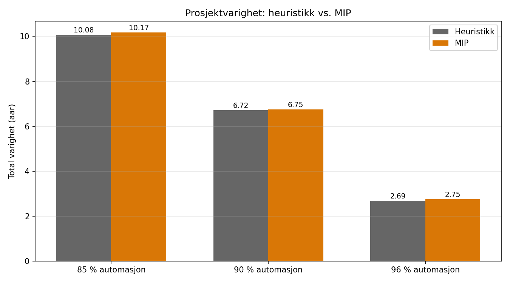

*Figur 7.1 Total varighet heuristikk vs MIP per NVDB-scenario*

Bak makespan-tallene ligger NVDB-køens utvikling over tid (figur 7.2). Pre-ferdige kommuner gir en initiell kø-topp idet NVDB-overføringen starter; toppen bygges deretter ned i takt med den daglige overføringskapasiteten i hvert scenario. Forskjellen mellom 85 %-, 90 %- og 96 %-scenarioene framkommer som tre tydelig adskilte nedbygningskurver. Figur 7.3 viser samme historie kumulativt for både lenker og kommuner, og illustrerer hvor mye raskere full overføring er ferdig ved høyere FME-automasjon.

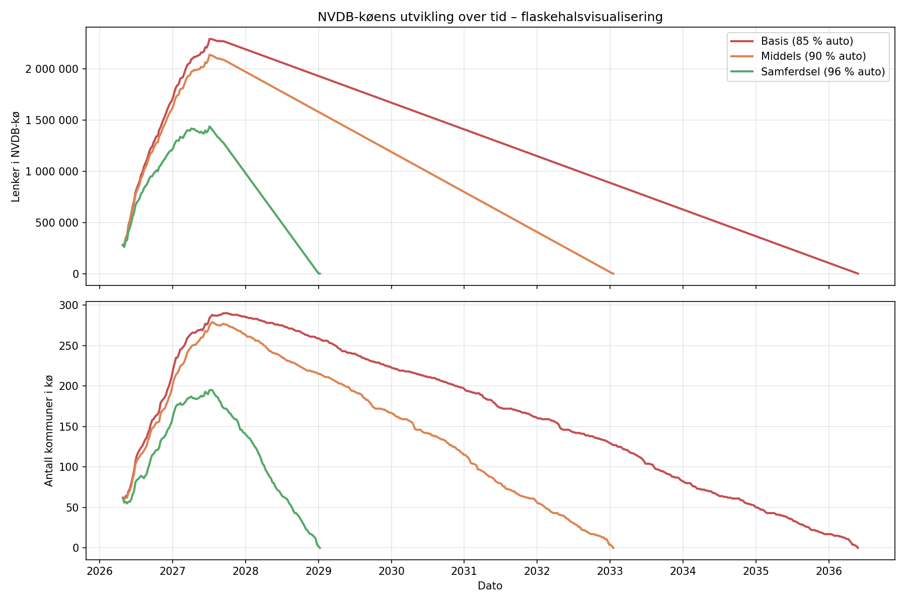

*Figur 7.2 NVDB-køens utvikling over tid for alle tre scenarioer*

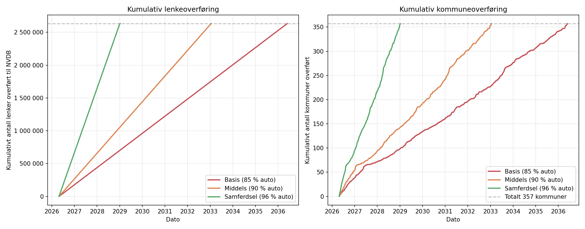

*Figur 7.3 Kumulativ NVDB-overføring av lenker og kommuner per scenario*

## 7.2 Kartkontor-ferdigstilling

Heuristikken og MIP gir samme totalvarighet, men forskjellig profil for når kartkontor-arbeidet er ferdig. Figur 7.4 viser fordelingen: heuristikken ferdigstiller alle kommuner på kartkontoret innen ca. 16,5 måneder (medianverdi 4–5 måneder), mens MIP-planen (med den vektede målfunksjonen som straffer sen kartkontor-ferdigtid) komprimerer kartkontor-arbeidet ytterligere til innen 10–11 måneder (median 4 måneder). Begge er realistiske fra et ressursforvaltningssynspunkt: NVDB-delen alene tar 2,7–10,2 år avhengig av automasjonsgrad, så kartkontorene har kapasitet til å levere alt materiale lenge før NVDB er ferdig. Monte Carlo på MIP-assignment bekrefter dette kvantitativt: kartkontor-ferdigstillelsens median flyttes fra 510 dager (heuristikk) ned til 409–452 dager på MIP-planen (85 %-scenarioet 452, 90 % 445, 96 % 409), altså omtrent to til tre måneder raskere avhengig av scenario. Dette er en konkret organisatorisk gevinst som ikke reduserer total prosjektvarighet, men som frigjør saksbehandlere til andre oppgaver tidligere.

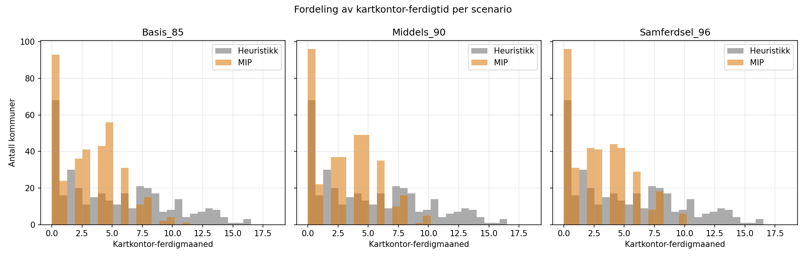

*Figur 7.4 Fordeling av kartkontor-ferdigmåned heuristikk vs MIP per NVDB-scenario*

Figur 7.5 viser kartkontorenes kumulative fremdrift over tid for referanseheuristikken. Hver kurve starter med et innledende sprang som dekker de 62 kommunene som allerede er ferdige før prosjekt-start (1. mai 2026), og leverer deretter resten i jevn takt. Kontorenes innbyrdes profil reflekterer både kapasitetsstørrelse og hvor sterkt Geovekst-låsninger trekker fremdriften ned i deler av perioden.

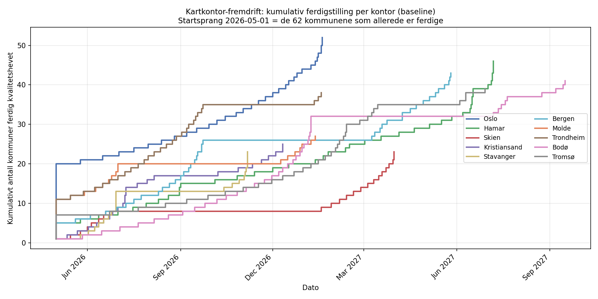

*Figur 7.5 Kumulativ kartkontor-ferdigstilling per kontor (heuristikk-referanse)*

## 7.3 Omfordeling mellom kontor

MIP-modellen har full frihet til å reassigne kommuner mellom kartkontor, men inertia-tie-breakeren favoriserer ansvarskontor-tildelingen i tilfeller hvor flere løsninger gir samme makespan. Resultatet (figur 7.6) viser at 27–71 kommuner flyttes avhengig av scenario, men disse er hovedsakelig tie-breakere for kartkontor-ferdigtid: ingen kommuner *må* omfordeles for å oppnå optimal makespan. Antallet varierer mellom 27 (85 %-scenarioet) og 71 (96 %) på tvers av scenarioene; mønsteret reflekterer i hovedsak at vektet objektiv har flere likeverdige incumbenter, og CBC kan velge ulike kombinasjoner per scenario. Diagonalen dominerer i matrisen (kommuner blir i hovedsak værende på ansvarlig kartkontor), noe som bekrefter at status quo-tildelingen er nær-optimal. Det er verdt å merke at modellen regner omfordeling som "gratis": den reelle organisatoriske kostnaden av at en kommune flyttes fra sitt geografiske fylkeskartkontor til et annet (arbeidskjennskap, kommunikasjon, kartverksprosesser) er ikke modellert og drøftes i 8.3.

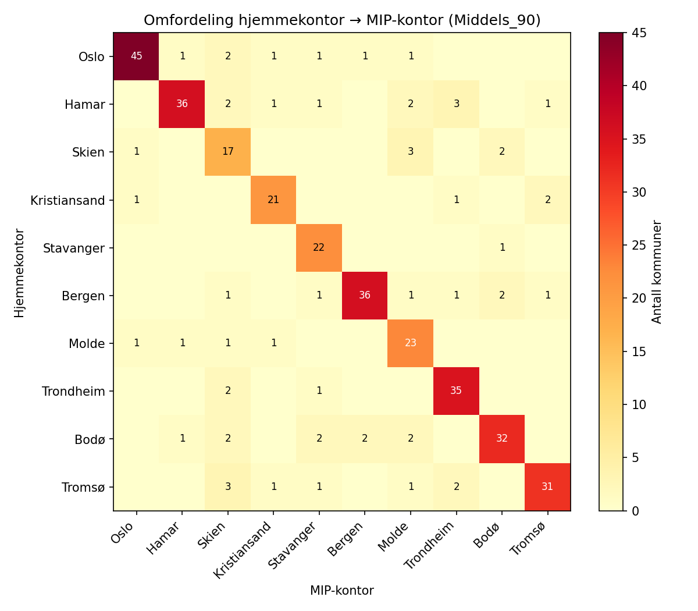

*Figur 7.6 Omfordeling fra ansvarlig kartkontor til MIP-kontor for 90 %-scenarioet*

## 7.4 Kapasitets-sensitivitet

Figur 7.7 og 7.9 viser resultatet av sensitivitetsanalysen der kapasitet ved ett eller flere kontor endres. Seks varianter ble undersøkt: referanse (S0), Trondheim −50 % (S1), alle +20 % (S2), små +50 % og store −20 % (S3), alle −15 % (S4), og ekstremvarianten alle −50 % (S5).

**Hovedfunn**: makespan er *identisk* i alle varianter for alle NVDB-scenarioer (10,17 / 6,75 / 2,75 år). Selv ved halvert Trondheim-kapasitet (S1), strukturell omfordeling (S3) eller halvert total kapasitet (S5) forblir total prosjektvarighet uendret. Dette skyldes at kartkontorene har kapasitet til å fullføre arbeidet lenge før NVDB rekker å drenere køen, og NVDB-kapasiteten er ikke berørt av kartkontor-kapasitetsendringer.

Også kartkontor-ferdigmåneden er lite sensitiv til de undersøkte kapasitetsvariasjonene. I S0–S4 holder den seg i området 10–11 måneder; bare i S5_Alle_minus50 forskyves den til 14 måneder (matematisk nedre grense 14,4). Hovedårsaken er at låseperiodene fra Geovekst-prosjektene tvinger kontorene til å vente på mange kommuner uansett, slik at kontorene har romslig ledig tid å fordele arbeidet på innenfor den tiden NVDB-overføringen uansett tar.

Av CBC-solverens 18 kjøringer løste 9 *Optimal* innen 30-minuttersgrensen; de resterende 9 endte med *Not Solved* (drøftes samlet i 8.5). S5_Alle_minus50 gir en konkret indikasjon på hvor kartkontor-fasen begynner å nærme seg det kapasitetsbundne regimet: ferdigmåned 14 mot matematisk minimum 14,4, og ytterligere kutt under 50 % kapasitet ville med høy sannsynlighet tippe over i kartkontor-bundet regime.

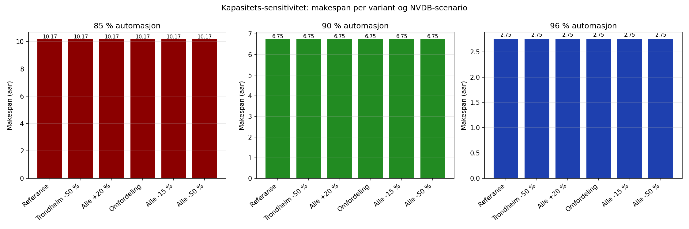

*Figur 7.7 Makespan per kapasitetsvariant og NVDB-scenario*

Figur 7.8 viser kapasitetsutnyttelsen per kartkontor og uke i referanseheuristikken. Mørke felt viser uker hvor kontoret jobber tilnærmet for fullt; lyse felt indikerer ledig kapasitet. Det lyse mønsteret rundt sommer–høst 2026 reflekterer Geovekst-låseperiodene som blokkerer mange kommuner samtidig, slik at kontorene har ufrivillig ledig kapasitet i disse periodene. Det er denne ufrivillig ledige kapasiteten som absorberer kapasitetskuttene i sensitivitetsanalysen.

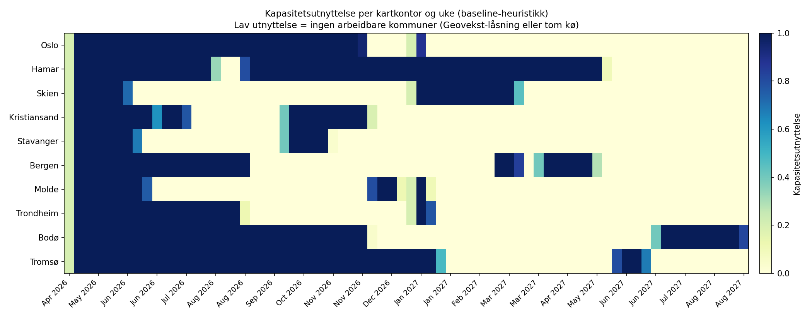

*Figur 7.8 Kapasitetsutnyttelse per kartkontor og uke (heuristikk-referanse)*

Antallet omfordelte kommuner varierer mellom variantene (figur 7.9), noe som reflekterer MIP-modellens tilpasning av lokalt arbeid når kapasiteten endres. Dette gir et verdifullt beredskapsverktøy: dersom et kontor får redusert kapasitet, viser MIP hvilke kommuner som bør omfordeles til andre kontor for å holde de respektive køene i balanse, selv om makespan ikke endres. Hovedbudskapet til Kartverket er klart: **kartkontor-fasen er robust mot rimelige kapasitetsforstyrrelser, og flaskehalsen er entydig NVDB-overføringen**.

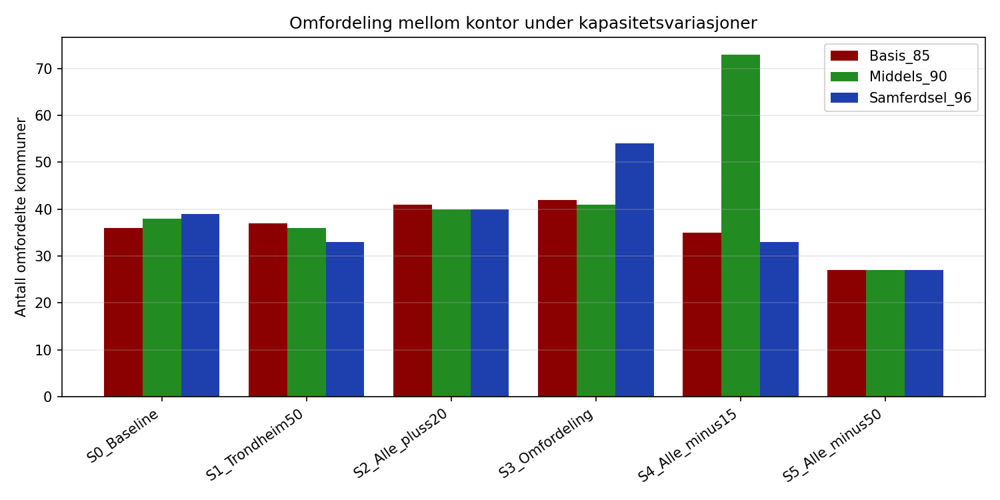

*Figur 7.9 Antall omfordelte kommuner per kapasitetsvariant og NVDB-scenario*

## 7.5 Usikkerhetsanalyse

Monte Carlo-simuleringen (500 iterasjoner per scenario × tre stokastiske kilder) kjøres både med heuristikkens ansvarskontor-tildeling og med MIP-ens optimerte tildeling som fast plan. Totalvarighet-båndene er overlappende og nær identiske (tabell 7.2). For 85 %- og 90 %-scenarioet gir de to planene *identiske* percentiler (P5 / P50 / P95). For 96 %-scenarioet er P5 marginalt bedre på MIP-planen (1,10 år vs 1,38), mens P50 og P95 er like. Dette viser at de to tildelingsregimene er omtrent likeverdige når det gjelder robusthet mot modellens stokastiske kilder, siden NVDB-overføringen dominerer varigheten i alle iterasjoner. Kartkontor-fasen blir derimot merkbart raskere på MIP-planen (P50 kartkontor-varighet 409–452 dager mot heuristikkens 510 dager) som en konsekvens av MIPens mer aktive omfordeling. Denne forskjellen er skjult i total varighet fordi NVDB-slakken absorberer den, men er reell fra et organisatorisk synspunkt.

*Tabell 7.2 Usikkerhetsbånd totalvarighet (P5 / P50 / P95, år) for MIP-plan og heuristikk-plan*

| Scenario |       MIP-plan       |   Heuristikk-plan   |
| -------- | :------------------: | :------------------: |
| 85 %     | 6,46 / 10,01 / 13,28 | 6,46 / 10,01 / 13,28 |
| 90 %     |  3,25 / 6,67 / 9,91  |  3,25 / 6,67 / 9,91  |
| 96 %     |  1,10 / 2,36 / 5,88  |  1,38 / 2,36 / 5,88  |

Figur 7.10 visualiserer Monte Carlo-fordelingen av NVDB-overføringen som et fanchart, der det skyggelagte området angir P5–P95-båndet og medianlinjen viser sentralverdien. Båndets bredde reflekterer hvor mye automasjonsgrad og manuell takt sammen varierer på tvers av iterasjonene. Figur 7.11 viser fordelingen av total prosjektvarighet per scenario som histogrammer, og figur 7.12 viser hvordan medianverdi for NVDB-ferdigdato per kommune varierer på tvers av kartkontorene.

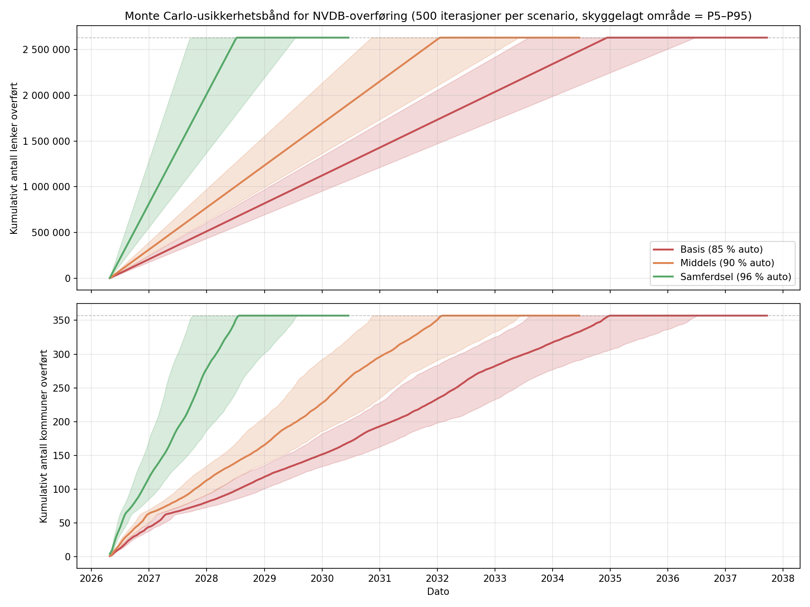

*Figur 7.10 Monte Carlo-usikkerhetsbånd for NVDB-overføring (P5–P95)*

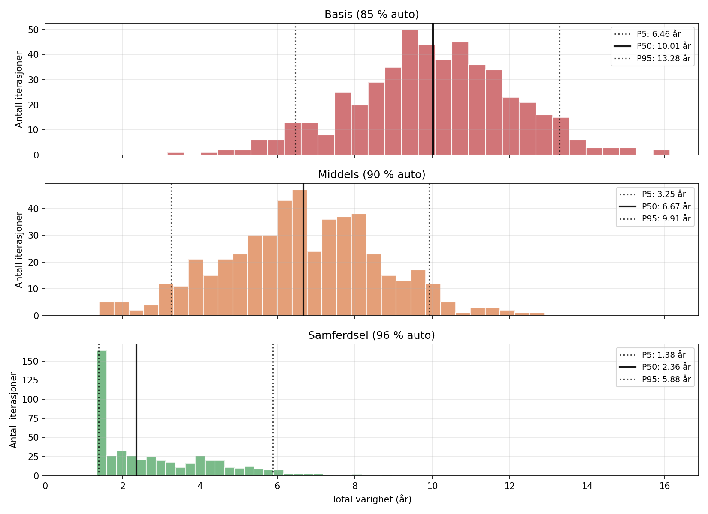

*Figur 7.11 Fordeling av total prosjektvarighet per scenario (500 iterasjoner)*

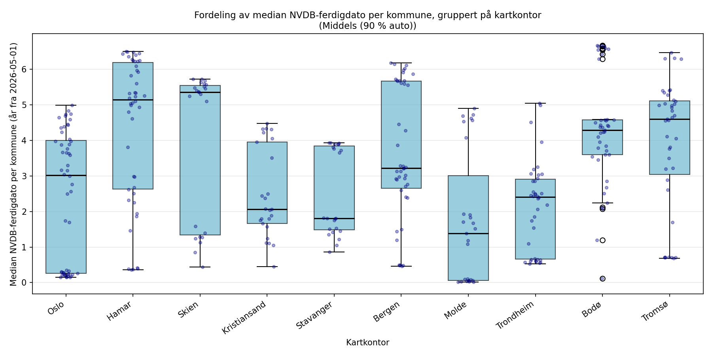

*Figur 7.12 Spredning i median NVDB-ferdigdato per kommune, gruppert på kartkontor (90 %-scenarioet)*

Den dominerende usikkerhetskilden er automasjonsgraden i FME-overføringen (jf. figur 7.10–7.12). Med den kalibrerte måleusikkerheten (AUTOMASJON_STD = 0,03) overlapper scenariobåndene realistisk: P95 for 96 %-scenarioet (5,88 år) ligger over P5 for 90 % (3,25 år), og P95 for 90 % (9,91 år) ligger over P5 for 85 % (6,46 år). Dette speiler den faktiske usikkerheten i hvor mye FME-automasjonen kan presses. *Valget av automasjonsgrad forblir den viktigste strategiske faktoren* for totalvarigheten, men usikkerhetsintervallene viser at det er betydelig spillerom innenfor hvert scenario også, og at god FME-utvikling kan forskyve punktestimatet betydelig.

## 7.6 Oppsummering av hovedfunn

Analysen gir tre sentrale funn på tvers av delproblemene.

**NVDB-overføringen er flaskehalsen, ikke kartkontor-fasen.** Total varighet bestemmes nesten utelukkende av automasjonsgrad og manuell NVDB-kapasitet (jf. 7.1, 7.4). Kartkontorene fullfører innen 10–17 måneder i alle scenarioer, mens NVDB-fasen alene krever 2,7–10,2 år ved deterministisk punktestimat. Modellens 90 %-estimat på 6,72 år er kvantitativt konsistent med direkte beregning av samferdselsavdelingens parametere (7,22 år ved 240 dager/år; gapet er 240-vs-260-dagers kalenderkonvensjon, jf. 5.1.2).

**MIP-modellen verifiserer heuristikkens makespan og viser at kartkontor-fasen kunne vært kortere.** Differansen i makespan er under 2,2 % i alle scenarioer (jf. tabell 7.1), og de 27–71 omfordelingene er tie-breakers, ikke nødvendige for makespan (jf. 7.3). MIPs reelle gevinst er en mer komprimert kartkontor-ferdigprofil (Monte Carlo P50 ned fra 510 til 409–452 dager, jf. 7.2 og 7.5), en organisatorisk verdi som ikke endrer totalvarigheten.

**Resultatet er robust mot rimelige forstyrrelser.** Identisk makespan på tvers av seks kapasitetsvarianter (jf. 7.4) og overlappende Monte Carlo-bånd på tvers av automasjonsgrad-scenarioene (jf. 7.5) viser at konklusjonen ikke avhenger av finkalibrering av kartkontor-kapasitet. Variansen *innad* i hvert scenario (faktor 2,0–4,3× fra P5 til P95) er sammenlignbar med variansen *mellom* scenarioene (faktor 3,7× mellom 85 / 90 / 96 %-punktestimater), noe som plasserer automasjonsgrad som en strategisk variabel, ikke en enkeltverdi.

---

# 8.0 Diskusjon

Resultatene fra kapittel 7 reiser flere spørsmål som krever drøftelse: om modellens gyldighet, dens begrensninger, og hva tallene faktisk betyr i praksis.

## 8.1 Hovedbudskapet til Kartverket

Modellen leverer et klart og robust hovedbudskap: **NVDB-overføringen er flaskehalsen, ikke kartkontor-fasen**. Mekanismen er strukturell: NVDB-formelen μ = (årsverk × manuell takt) / (1 − automasjonsgrad) (jf. 5.1.4) gjør at den manuelle restandelen av lenkene må passere ett team på 0,5 årsverk uansett hvor effektivt FME håndterer resten, mens kartkontor-arbeidet fordeles på 10 parallelle kontor med samlet 327 ukesverk/år. Én sekvensiell flaskehals nedstrøms står mot 10 parallelle kapasitetspunkter oppstrøms, og asymmetrien sikrer at NVDB-tiden dominerer i alle realistiske automasjonsregimer. Dette holder uansett hvilket av de tre scenarioene som realiseres (85 og 90 % er samferdselsavdelingens egne arbeidsanslag; 96 % er en hypotetisk øvre grense bakoverregnet mot et 2-årsmål, ikke en prognose, jf. 5.1.5), og uansett rimelige kapasitetsforstyrrelser på kartkontorene. Total prosjektvarighet bestemmes av hvor effektiv FME-automasjonen blir og hvor mye manuell kapasitet samferdselsavdelingen kan sette av til prosjektet. Kartverkets ressurser bør derfor primært settes inn på FME-utvikling og på å øke den manuelle bemanningen utover 0,5 årsverk, ikke på å balansere eller utvide fylkeskartkontorene.

Kalibreringen mot samferdselsavdelingens oppgitte parametere (300 lenker/dag, 240 arbeidsdager/år, 90 % automasjon, 0,5 årsverk; → 7,22 år ved direkte beregning) viser at modellens punktestimat for 90 %-scenarioet (6,72 år med prosjektets 260-dagers konvensjon) er kvantitativt konsistent med dette tallgrunnlaget. Gapet på 0,5 år skyldes hovedsakelig den ulike kalenderkonvensjonen (ren skalering 7,22 × 240/260 ≈ 6,67), og resterende 0,05 år går til modelldetaljer som pre-ferdige kommuner og oppstart, ikke modell-feil. Modellen er altså *kvantitativt konsistent med samferdselsavdelingens tallgrunnlag*.

## 8.2 Tidbruk-formelens identifiserbarhet

Alle timer-estimater bygger på formelen `Ber_Tidbruk_Min = Km_Kurve × 0,9035 + ArealLand_Km² × 0,6510`, med koeffisienter hentet fra Tidbruk-fanen i grunndatasettet. En uavhengig validering avdekket tre forbehold.

**Koeffisientene er ikke OLS-estimert.** De 58 kalibrerings-kartbladene har identisk areal (7,68 km²), slik at areal-leddet ikke kan identifiseres separat fra lengde-leddet. Koeffisienten 0,9035 er gjennomsnittlig MIN/KM, ikke en regresjonskoeffisient; 0,6510 har uklart empirisk opphav. OLS på samme data gir β_lengde = 0,84 og β_areal = 0,09 (ikke signifikant).

**Systematisk underestimering mot kontorenes oppgitte tidsbruk.** I datainnsamlingsskjemaet anga hvert kontor en typisk minimum og maksimum tidsbruk per kommune (jf. 5.2.1, kolonnene `Min_Tidsbruk_Timer` og `Max_Tidsbruk_Timer` i `kapasitet_kontorer.csv`). Formelen gir kommune-estimater som faller under kontorets oppgitte minimum i 8 av 10 kontor. Mest ekstremt er Molde, der ingen av de 27 kommunene rekker opp i kontorets oppgitte minimum på 40 timer per kommune (median formel-estimat: 12 timer; spennet er 2–39 timer).

**Cherry-picking av ferdige kommuner.** De 62 ferdige kommunene har median estimat 667 minutter; de 295 gjenstående 1 336 minutter. Gjenstående arbeid er systematisk dobbelt så tungt per kommune som det allerede gjorte.

Samlet kan formelen underestimere reell tidsbruk med faktor opptil ~2. For å teste om hovedkonklusjonen (NVDB-flaskehalsen) overlever en slik skalering er heuristikken og Monte Carlo kjørt for alle tre NVDB-scenarioer med skaleringsfaktor 1,5 og 2,0 på `Ber_Tidbruk_Min` (`heuristikk_tidbruk_sensitivitet.py`, `monte_carlo_tidbruk_sensitivitet.py`).

*Tabell 8.1 Kartkontor- og NVDB-varighet ved skalering av tidbruk-formelen*

| Skala           | Kartkontor P50 (mnd) | 85 % P50/P95 (år) | 90 % P50/P95 (år) | 96 % P50/P95 (år) |
| --------------- | -------------------- | ------------------ | ------------------ | ------------------ |
| 1,0 (referanse) | 16,8                 | 10,01 / 13,28      | 6,67 / 9,91        | 2,36 / 5,88        |
| 1,5             | 21,1                 | 10,01 / 13,28      | 6,67 / 9,93        | 2,68 / 5,86        |
| 2,0             | 28,2                 | 10,01 / 13,28      | 6,67 / 9,93        | 2,75 / 5,86        |

Kartkontor-fasen vokser proporsjonalt med skala (Monte Carlo P50: 16,8 → 21,1 → 28,2 måneder), men **total varighet (NVDB-makespan) er praktisk talt uendret** for 85 %- og 90 %-scenarioet i alle tre kjøringer. Bare for 96 %-scenarioet, der NVDB er minst flaskehals, presses P5 opp fra 1,38 til 2,15 år ved skala 2, fordi kartkontor-tiden begynner å bestemme ferdigdatoen i de raskeste iterasjonene. Hovedbudskapet "NVDB er flaskehalsen" overlever altså en dobling av tidbruk-formelen for de to mest realistiske scenarioene, mens det svekkes marginalt i det optimistiske 96 %-scenarioet.

MIP-modellen er ikke kjørt med skalert tidbruk. Siden uniform skalering bevarer relativ rangering mellom kommuner, antas omfordelingsstrategien å være kvalitativt uendret; den marginale forskjellen mellom MIP og heuristikk på makespan (<2,2 %) gjør at en MIP-rekjøring uansett ikke ville rokket ved konklusjonen om NVDB-dominans.

## 8.3 Hva modellen ikke fanger

**Omfordeling som "gratis"-operasjon.** MIP-modellen flytter 27–71 kommuner mellom kartkontor uten kostnad. I virkeligheten har omfordeling organisatoriske kostnader: lokalkunnskap om veinett og terreng, innarbeidete arbeidsprosesser, og at Geovekst-prosjekter ofte involverer regionale samarbeid. En omfordelt kommune krever typisk 1–2 dagers oppstartsarbeid for nytt kontor. Ettersom omfordelingene i modellen er tie-breakers og ikke nødvendige for makespan, kan Kartverket med fordel velge å ikke implementere dem og heller beholde den geografiske tildelingen; **ingen tid går tapt**.

**Myopisk prioritering i heuristikken.** Heuristikken fastsetter rekkefølgen i hvert kontors kø én gang ved simuleringsstart (1. mai 2026) og revurderer ikke når Geovekst-låseperioder utløper. I teorien kan en kommune som låses opp senere være mer hensiktsmessig å ta først dersom den er stor eller har korrelerte kommuner i samme region. MIP-modellen deler ikke denne forenklingen; den ser over hele horisonten. Og *likevel* gir MIP-modellen tilnærmet identisk makespan som heuristikken. Dette støtter hypotesen om at heuristikkens myopiske regel er adekvat for dette spesifikke problemet, men begrensningen bør anerkjennes for generaliserbarhet.

**Konstant NVDB-kapasitet.** Modellen behandler samferdselsavdelingens kapasitet som et fast tall gjennom hele horisonten, uten ferier, sykefravær, opplæring eller opprampning. I virkeligheten vil kapasiteten variere med ~15 % sesongmessig (sommerferie) og potensielt mer ved personalendringer. Dette betyr at modellens punktestimater må tolkes som "gjennomsnitt over arbeidsdager som ligner nominelle", ikke som absolutte prognoser. Monte Carlo-analysen fanger ikke denne temporale variabiliteten.

**Individuell effektivitet.** Både kartkontor- og NVDB-kapasitet aggregeres per kontor eller avdeling. Reelle produktivitetsforskjeller mellom saksbehandlere på ±30 % er ikke modellert. I et relativt homogent prosjekt med tydelige arbeidsprosesser vil dette jevne seg ut over 295 kommuner, men i spissperioder kan det gi lokal ujevnhet i framdrift.

**Estimerte input-tall for fire kontor.** Agder, Rogaland, Oslo og Bodø har estimerte verdier for kapasitet og tidbruk per kommune; Agder og Rogaland har i tillegg estimerte låseperioder for Geovekst-prosjektene sine, som er hentet fra separate kilder (jf. 5.2.1). De strukturelle hovedfunnene (NVDB-flaskehals og makespan-robusthet mot kapasitetsforstyrrelser) er lite følsomme for kapasitet på enkeltkontor, jf. kapasitets-sensitivitetsanalysen i 7.4 der seks ulike kapasitetsvarianter ga identisk makespan. Tallene for kartkontor-fasens varighet på de fire estimerte kontorene må likevel leses som indikative.

## 8.4 Usikkerhetsanalysens antagelser

**Bootstrap av MIN/KM uten korrelasjon.** Monte Carlo trekker MIN/KM uavhengig for hver kommune fra en empirisk fordeling basert på 58 kartbladmålinger. Reell geografisk korrelasjon (nabokommuner har ofte lignende terreng og dermed lignende tidsbruk per km) er ikke modellert. Konsekvensen er at modellen *overestimerer* per-kontor-variansen (nabo-kommuner får uavhengige verdier i stedet for korrelerte) og *underestimerer* aggregert variasjon (ekstreme regioner med samme terreng blir gjennomsnittet bort). Kartblader er i tillegg geografiske enheter som kan dekke flere kommuner; MIN/KM-variansen er dermed kartblad-nivå-varians, ikke kommune-nivå. For totalvarighet (som dominerer alle usikkerhetsintervaller) har dette liten effekt pga. lov om store tall; for per-kontor-ferdigtid er effekten nevneverdig og tolkes med forsiktighet.

**Uavhengighet mellom stokastiske kilder.** Manuell takt, automasjonsgrad og MIN/KM samples uavhengig. I virkeligheten kan det tenkes sammenhenger (f.eks. at høy automasjonsgrad korrelerer med en viss manuell takt-regime), men i mangel av data antas uavhengighet.

**Formel-avhengig følsomhet.** NVDB-kapasitetsformelen $\mu = A/(1-a)$ divergerer nær $a = 1$. Modellen klipper automasjon til [0,5; 0,99], men i intervallet 95–99 % vokser sensitiviteten raskt. Konklusjonen "automasjonsgrad er dominerende usikkerhetskilde" er delvis en *analytisk konsekvens* av formelens struktur, ikke et empirisk funn. En alternativ modell der FME-prosessen også har en øvre kapasitetsgrense (mvh. maskin- og sanitetsbegrensninger) ville dempet dette, men krever data som ikke er tilgjengelig.

**Sensitivitet for automasjonsgrad-standardavviket.** Standardavviket på 0,03 brukt i Monte Carlo er et designvalg, ikke en empirisk størrelse. For å kvantifisere designvalget er Monte Carlo rekjørt med std ∈ {0,01; 0,02; 0,03; 0,05} for alle tre scenarioer (`monte_carlo_automasjon_sensitivitet.py`).

*Tabell 8.2 P5/P50/P95-bånd for total varighet ved varierende standardavvik på automasjonsgrad*

| Std  | 85 % P5/P50/P95 (år) | 90 % P5/P50/P95 (år) | 96 % P5/P50/P95 (år) |
| ---- | --------------------- | --------------------- | --------------------- |
| 0,01 | 8,75 / 10,09 / 11,39  | 5,45 / 6,72 / 7,87    | 1,51 / 2,66 / 3,75    |
| 0,02 | 7,60 / 10,10 / 12,29  | 4,31 / 6,67 / 8,85    | 1,38 / 2,66 / 4,81    |
| 0,03 | 6,46 / 10,01 / 13,28  | 3,20 / 6,67 / 9,93    | 1,38 / 2,68 / 5,86    |
| 0,05 | 4,22 / 10,01 / 15,38  | 1,41 / 6,65 / 12,03   | 1,37 / 2,70 / 8,06    |

Tabellens std = 0,03-rad er fra denne sensitivitetsjobben og avviker marginalt fra hoved-Monte Carlo-tallene i 7.5 (P95 9,93 vs 9,91 for 90 %-scenarioet; P50 2,68 vs 2,36 for 96 %-scenarioet) pga. ulik tilfeldig-tall-seed mellom kjøringene; avvikene ligger innenfor stokastisk variasjon ved 500 iterasjoner og påvirker ikke de kvalitative funnene.

Median (P50) er praktisk talt uendret på tvers av std-verdier; det betyr at standardavviket ikke flytter sentraltendensen, kun haleformen. P5–P95-båndet utvider seg derimot monotont: ved std = 0,01 er båndet 2,6 år bredt for 85 %-scenarioet, mens det er 11,2 år ved std = 0,05. Konsekvensen for scenario-overlapping er tydelig: ved std = 0,01 ligger P5–P95-båndene helt adskilt (90 %-scenarioet P95 = 7,87 < 85 %-scenarioet P5 = 8,75), mens ved std ≥ 0,02 begynner båndene å overlappe. Verdien 0,03 ligger som et rimelig kompromiss mellom et urealistisk "skarpt" scenarioskille (std = 0,01, som ville framstilt designet av tre punkter i automasjonsgrad som skarpere bevisst enn det er) og en for vid haleestimering (std = 0,05) der P95 for 96 %-scenarioet vokser til 8 år, utenfor det realistiske spennet samferdselsavdelingen selv anslår.

**Deterministisk rammeverk utenfor de tre stokastiske kildene.** Monte Carlo varierer kun MIN/KM, manuell NVDB-takt og automasjonsgrad. Geovekst-låseperioder, kartkontor-kapasitet og fremdriftsstatus (62 ferdig, 48 påbegynt) holdes konstante i alle 500 iterasjoner. I virkeligheten kan Geovekst-prosjekter forsinkes eller fremskyndes, og kapasiteten kan variere fra år til år med personalomsetning og konkurrerende oppgaver. Usikkerhetsintervallene P5–P95 reflekterer derfor stokastikk i tre av flere mulige dimensjoner, og reell usikkerhet i absolutt varighet er bredere enn tallene antyder. Kapasitets-sensitivitetsanalysen i 7.4 dekker deler av dette gapet ved å kjøre deterministiske varianter (S0–S5), men en kombinert stokastisk-deterministisk analyse er utenfor prosjektets omfang.

## 8.5 Modellens metodologiske begrensninger

**MIP som "forbedring", nyansert.** MIP er marginalt verre enn heuristikken på makespan (+0,4–2,2 %) pga. månedlig vs. daglig tidsoppløsning. Den riktige tolkningen er at MIP leverer to andre verdier: (i) *uavhengig verifikasjon* av at heuristikkens ansvarskontor-tildeling er nær-optimal, et sterkt validitetssignal når to ulike metoder konvergerer, og (ii) *komprimert kartkontor-ferdigprofil*: MIP-planen gir kartkontor-fasen ferdig 2–3 måneder før heuristikken (P50 Monte Carlo: 409–452 dager vs 510). Ingen av disse reduserer totalvarigheten, men begge har organisatorisk verdi.

**Kapasitets-sensitivitetens lave kontrast.** Den deterministiske kapasitets-sensitiviteten (S0–S5) viser identisk makespan på tvers av alle seks varianter, og kartkontor-ferdigtiden er stabil (10–11 måneder i S0–S4, 14 måneder i S5 med halvert kapasitet). Mekanismen er den ledige kapasiteten som oppstår i Geovekst-prosjektenes låseperioder (synlig i figur 7.8, omtalt i 7.4): med 152 kommuner blokkert av pågående Geovekst-prosjekter i deler av 2026 har kontorene allerede ufrivillig ledig kapasitet, slik at et kapasitetskutt får mindre praktisk effekt enn ukesverk-tallene alene tilsier. For Kartverket betyr dette at dagens plan er *mer* robust mot kapasitetsreduksjon enn nominelle kapasitetstall skulle indikere.

**Solver-status og hva «Not Solved» betyr for tolkningen.** MIP-modellen kjøres med 30-minutters tidsgrense i CBC. Totalt 21 MIP-kjøringer er gjennomført, 3 hovedscenarioer (kap. 7.1) og 18 kapasitetsvarianter (kap. 7.4), og fordelingen er 11 *Optimal* og 10 *Not Solved*. *Not Solved* betyr ikke at løsningen er ugyldig: CBC returnerer en gyldig IP-feasible incumbent ved timeout, men har ikke bevist optimalitet. De Not Solved-kjøringene er 85 %-hovedscenarioet (T = 144 mnd, drøyt 38 min faktisk kjøretid pga. CBC-overshoot på siste B&B-node) og 9 kapasitetsvarianter med lav kapasitet eller stor horisont. Tre konsekvenser for tolkning:

- **Makespan er robust på tvers av status.** Makespan er big-M-koblet til Q-variablene som styres av NVDB-drenering, og endrer seg ikke når kartkontor-tildelingen forskyves marginalt mellom likeverdige incumbenter. Tallene i tabell 7.1 og figur 7.7 er derfor robuste også for Not Solved-kjøringene.
- **Omfordelings- og kartkontor-ferdigtall har lavere konfidens i Not Solved-variantene.** Disse kan være suboptimale uten at det er bevist; presise sammenligninger mellom varianter bør begrenses til ratio-nivå, ikke desimaler.
- **S5_Alle_minus50 spesielt:** rapportert kartkontor-ferdigmåned 14 mot matematisk minimum 14,4; plausibel IP-feasible løsning, men bør leses som nær-optimal ved timeout, ikke bevist optimum.

**Validering mot ferdige kommuner.** Kartverket registrerer ikke faktisk tidsbruk per kommune ved TVS-kvalitetsheving, og tidbruk-formelen er derfor ikke validert mot ground truth (jf. 8.2). Et oppfølgingstiltak ville være å registrere tidsbruk for de gjenstående 295 kommunene slik at modellen kan kalibreres underveis.

## 8.6 Praktiske implikasjoner

**Oppfølgings-anbefalinger til Kartverket:**

1. **Invester i FME-automasjon.** Å øke automasjonsgraden fra 85 % til 90 % reduserer varigheten fra 10 til 6,7 år (33 % raskere). Videre til 96 % mer enn halverer igjen (6,7 → 2,7 år).
2. **Grundigere kvalitetsheving ved kartkontorene reduserer manuell NVDB-belastning.** Hvert ikke-gjenfinnbart objekt, topologi-feil eller attributtfeil som ryddes opp før klarmelding, blir et objekt færre i samferdselsavdelingens manuelle kø. Kartkontorenes innsats påvirker dermed ikke bare deres egen fase, men også den nedstrøms flaskehalsen. Det er en parallell vei til høyere effektiv automasjonsgrad: å gi FME renere input snarere enn å forbedre selve algoritmen.
3. **Øk NVDB-bemanningen utover 0,5 årsverk.** Dette er det enkleste grep for å redusere varigheten proporsjonalt. 1,0 årsverk halverer tiden.
4. **Behold geografisk kartkontor-tildeling.** MIP viser at omfordeling ikke er nødvendig. Spar organisatorisk kostnad ved å ikke flytte kommuner mellom kontor.
5. **Forbered for kapasitetsvariasjon.** Figur 7.9 viser MIP-modellens anbefalte omfordelinger dersom et kontor mister kapasitet. Dette kan brukes som beredskapsplan.
6. **Registrer faktisk tidsbruk per kommune.** Modellen er i dag kalibrert på 58 kartbladmålinger, ikke på kommunenivå, og cherry-picking-funnet i 8.2 viser at de 62 ferdige kommunene ikke er representative for resten. Kontinuerlig tidsregistrering for de 295 gjenstående vil gi grunnlag for underveis-kalibrering og tidligst mulig deteksjon av om formelen underestimerer reell belastning.

**Modellen som beslutningsstøtte.** Den hybride tilnærmingen gir Kartverket tre ulike lesninger av problemet: heuristikken som tolkbar basisprognose, MIP-modellen som matematisk verifikasjon og beredskapsverktøy, og Monte Carlo som risikokvantifisering. Modelleringsrammen er gjenkjennbar i andre Kartverk-prosjekter med lignende struktur (ressursallokering + tidsvinduer + sekvensielle avhengigheter).

## 8.7 Implikasjoner for teori og metode

Studien tilfører to observasjoner til den anvendte RCPSP-litteraturen. **Den første** gjelder MIPs merverdi når heuristikken er nær optimum. Hartmann og Briskorn (2010) klassifiserer eksakte og heuristiske RCPSP-løsere langs aksen «optimalitetsgaranti vs. skalerbarhet»; resultatene her viser at MIPs nytte i praktiske case ikke nødvendigvis er forbedring av målfunksjonen, men *uavhengig verifikasjon* av at en transparent heuristikk er nær-optimal. Heuristikkens makespan kommer innenfor 0,4–2,2 % av MIPs (kap. 7.1), og forskjellen skyldes nesten utelukkende MIP-modellens månedlige tidsoppløsning mot heuristikkens daglige. Dette tyder på at månedlig granularitet i MIP-formuleringer for tilsvarende problemer er et bevisst designvalg som handler om solverkompleksitet, ikke modellfeil, og at heuristikker med daglig oppløsning kan utkonkurrere MIP på selve metrikken, samtidig som MIP fortsatt rettferdiggjøres som verifikasjons- og beredskapsverktøy.

**Den andre** gjelder forholdet mellom deterministisk optimering og stokastisk robusthet når en nedstrøms ressurs er dominerende flaskehals. En klassisk innvending mot MIP-løsninger på scheduling-problemer er at deterministisk optimum sjelden er robust under usikkerhet (Vose, 2008). I dette caset finner Monte Carlo-simulering på MIP-planen og på heuristikk-planen *identiske* P5/P50/P95-percentiler for 85 %- og 90 %-scenarioet, og kun marginal forskjell på 96 % P5 (1,10 mot 1,38 år); funnet «deterministisk optimum ≠ robust optimum» forsvinner i praksis. Forklaringen er strukturell: når NVDB-fasen drenerer 6,7–10,2 år av en 10–17 måneders kartkontor-buffer (kap. 7.6), kollapser usikkerheten i kartkontor-tildelingen mot null på den totale tidslinjen. Implikasjonen for liknende problemer (der oppstrøms ressursallokering møter en dominerende, sekvensiell nedstrøms-fase) er at *valg av planleggingsmetode* (heuristikk vs. MIP) får mindre betydning enn investering i selve flaskehalsen. Resultatet er kompatibelt med Pinedos (2016) generelle observasjon om at flaskehalsidentifisering ofte gir mer enn lokal optimering.

---

# 9.0 Konklusjon

Kapittel 8 drøftet modellens gyldighet, begrensninger og hva tallene betyr i praksis. Dette avsluttende kapittelet samler hovedfunnene og de praktiske implikasjonene for Kartverket.

Hovedfunnet i analysen er at NVDB-overføringen, ikke kartkontor-fasen, bestemmer total prosjektvarighet. Ved realistisk automasjon (90 % og 85 %) tar prosjektet 6,7–10 år; ved optimistisk automasjon (96 %) drøyt 2,7 år. Kartkontorene har derimot kapasitet til å fullføre arbeidet på under halvannet år (MIP-modellens optimum 10–11 måneder, heuristikkens Monte Carlo P50 ~17 måneder) i alle tre NVDB-scenarioer. Monte Carlo-analysen viser betydelig usikkerhet rundt hvert punktestimat (for 90 %-scenarioet spenner P5–P95-båndet 3,2–9,9 år), hovedsakelig fordi små endringer i automasjonsgrad gir store utslag på NVDB-overføringskapasiteten når automasjonen er høy. Resultatet er robust mot kapasitetsforstyrrelser ved kartkontorene (identisk makespan i alle seks varianter S0–S5), mot dobling av tidbruk-formelen, og mot ulike antagelser om automasjonsgradens spredning.

Modellens 90 %-punktestimat (6,72 år, deterministisk heuristikk) er kvantitativt konsistent med samferdselsavdelingens 7,22-års-beregning (kalenderkonvensjons-gap, jf. 8.1). Samferdselsavdelingen har samtidig en uttalt ambisjon om at jobben skal være ferdig på ca. 2 år. Gapet mellom prognose og ambisjon (ca. 5 år) er den sentrale beslutningsutfordringen, og motiverer de praktiske grepene som følger.

Tre grep peker seg ut. Investeringer i FME-automasjon gir størst effekt: å løfte automasjonsgraden fra 85 til 90 % reduserer varigheten med en tredjedel, og videre til 96 % mer enn halverer den igjen. Grundigere kvalitetsheving ved kartkontorene gir samme retning av effekt: hvert ikke-gjenfinnbart objekt eller topologi-feil som ryddes opp før klarmelding, blir et objekt færre i samferdselsavdelingens manuelle kø. Økt manuell NVDB-bemanning utover 0,5 årsverk gir proporsjonal reduksjon. Modellen viser at ingen enkeltgrep alene kan lukke ambisjonsgapet; alle tre må kombineres dersom 2-års-målet skal være innen rekkevidde. Omfordeling av kommuner mellom kartkontor er derimot ikke nødvendig for å redusere total varighet: forskjellen mellom heuristikkens og MIP-modellens makespan er under 2,2 % i alle scenarioer, og MIP bekrefter at den geografiske ansvarstildelingen er nær-optimal for makespan.

Modellens viktigste begrensning ligger i tidbruk-formelen, der koeffisientene 0,9035 min/km og 0,6510 min/km² ikke er regresjonsestimerte og kan underestimere reell tidsbruk med faktor opptil 2× (jf. 8.2). Sensitivitetsanalysen viser at hovedbudskapet om NVDB-flaskehalsen overlever en slik skalering for de to mest realistiske scenarioene, men 96 %-scenarioet får P5 presset opp fra 1,38 til 2,15 år ved skala 2,0.

Det viktigste oppfølgingstiltaket er kontinuerlig tidsregistrering for de 295 gjenstående kommunene, slik at modellen kan kalibreres underveis. De 62 ferdige kommunene er gjennomsnittlig halvparten så tunge per kommune som de 295 som gjenstår, og er derfor ikke representative for resten av arbeidsmengden. Modellrammen, med heuristikk for tolkbar referanse, MIP for verifikasjon og Monte Carlo for risikokvantifisering, er overførbar til andre Kartverk-prosjekter med tilsvarende struktur: ressursallokering på tvers av regionale kontor, tidsvinduer fra eksterne avhengigheter, og en sekvensiell nedstrøms-prosess. Sett som metodisk case bidrar studien med en illustrasjon av hvordan en hybrid heuristikk–MIP-tilnærming med Monte Carlo-overbygg fungerer på et RCPSP med dominerende nedstrøms flaskehals, der MIPs rolle blir verifikasjon og beredskap snarere enn målfunksjon-forbedring, og der klassiske usikkerhetsfunn («deterministisk optimum ≠ robust optimum») kollapser strukturelt. Videre arbeid bør undersøke hvor robust dette mønsteret er på tvers av RCPSP-varianter med ulik grad av flaskehals-dominans, samt systematisk teste avveiingen mellom MIPs tidsoppløsning og solverkompleksitet. I dette caset ga månedlig oppløsning en konsistent, men marginal +0,4–2,2 %-svekkelse mot daglig heuristikk, men det er åpent om finere oppløsning er verdt den eksponentielle solver-kostnaden.

---

# 10.0 Bibliografi

Efron, B., & Tibshirani, R. J. (1993). *An introduction to the bootstrap*. Chapman & Hall/CRC.

Graham, R. L. (1969). Bounds on multiprocessor timing anomalies. *SIAM Journal on Applied Mathematics, 17*(2), 416–429. https://doi.org/10.1137/0117039

Hartmann, S., & Briskorn, D. (2010). A survey of variants and extensions of the resource-constrained project scheduling problem. *European Journal of Operational Research, 207*(1), 1–14. https://doi.org/10.1016/j.ejor.2009.11.005

Pinedo, M. L. (2016). *Scheduling: Theory, algorithms, and systems* (5. utg.). Springer.

Puchinger, J., & Raidl, G. R. (2005). Combining metaheuristics and exact algorithms in combinatorial optimization: A survey and classification. I J. Mira & J. R. Álvarez (Red.), *Artificial intelligence and knowledge engineering applications: A bioinspired approach* (Lecture Notes in Computer Science, bind 3562, s. 41–53). Springer.

Vose, D. (2008). *Risk analysis: A quantitative guide* (3. utg.). John Wiley & Sons.

---

# 11.0 Vedlegg
